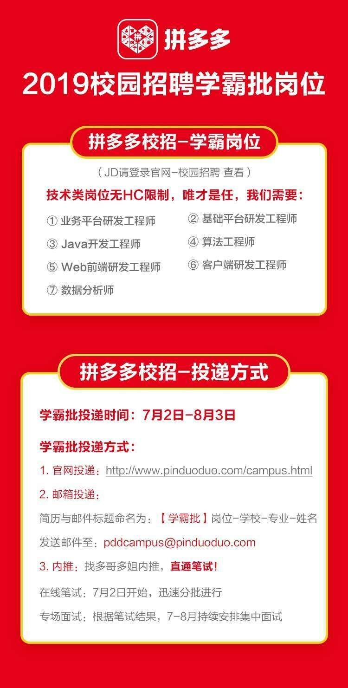

# AutumnRecruit2018
# 2018年秋季招聘准备

* [1 准备计划](#1)
    * [1.1 目标](#1.1)
* [2 内容](#2内容)
    * [2.1 算法](#2.1)
    * [2.2 操作系统](#2.2)
    * [2.3 计算机网络](#2.3)
    * [2.4 Java](#2.4)
    * [2.5 分布式](#2.5)
    * [2.6 工具](#2.6)
        * [2.6.1 git](#2.6.1)
        * [2.6.2 docker](#2.6.2)  
        * [2.6.3 linux](#2.6.3)
    * [2.7 深度学习](#2.7)
    * [2.8 区块链](#2.8)
    * [2.9 数据结构](#2.9)
    * [2.10 设计模式](#2.10)
* [3 信息](#3)

## 1 准备计划
### 1.1 目标
工作准备找与大数据处理有关的职位，研究生期间基本上做的也是相关工作。为此需要数量掌握的技能如上面目录中的内容。其中深度学习和区块链仅作为兴趣了解。本文部分内容引用了另一位作者在Github上整理的复习内容，更加全面，对此表示特别感谢！[CyC2018/Interview-Notebook](https://github.com/CyC2018/Interview-Notebook)

## 2 内容
### 2.1 算法
> [剑指offer题解(java版)](articles/altorighm/剑指offer.md)

> 企业笔试题目

> [算法面试经验](articles/algorithm/interview.md)

### 2.3 计算机网络
> [计算机网络面经汇总](articles/network/interview.md)

### 2.4 Java
> Java基础

* [基础](articles/java/basic.md)
* [数据结构](articles/java/datastructure.md)
* 

> [Effective Java](articles/java/effectivejava.md)  

> [Apache Lucene](articles/lucene.md)

### 2.5 分布式
> [Distribution](articles/distribution.md)

> [Zookeeper](articles/Zookeeper.md)

> [Kafka](articles/Kafka.md)

> [Hbase](articles/Hbase.md)

> [Storm](articles/Storm.md)

> [Kubernetes](articles/Kubernetes.md)

### 2.6 工具
> [git](tools/git.md)

> docker 

> [linux](articles/linux/linux.md)

> 
## 3 信息

### 目前已经公布的公司招聘计划

1. 拼多多 学霸批(内推)  简历投递时间：7月2日-8月3日  
[招聘信息地址](https://mp.weixin.qq.com/s?__biz=MzI3MzQzMDEwNw==&mid=2247484279&idx=1&sn=ea88bdbcc4c2a7d063c6f13e2be2041f&chksm=eb222043dc55a955e42b1bbe07a1b7ef1fde0421f3873bd3fae1cfa872c505b6a4afbb59efcc&mpshare=1&scene=23&srcid=0702ucJuM0Mv4pxz5v56dNYL#rd)

2. 阿里巴巴 内推  截止日期：7月27日 
[招聘信息地址](https://www.jianshu.com/p/50ec6fd13e9c?utm_campaign=hugo&utm_medium=reader_share&utm_content=note&utm_source=weixin-timeline&from=timeline&isappinstalled=0)

3. 京东 提前批 截止日期：8月30日
    Java 开发工程师
    1. 2019 年毕业，计算机软件、数学、物理等相关专业本科及以上学历
    2. 具有非常强的责任心，能够承担压力做事细心，参与独立系统的设计、开发、维护工作
    3. 了解 web 前端开发的基础知识，会面向对象程序设计（OOP）与基本的设计模式，了解linux 及基本的操作命令
    4. 具有良好的算法基础及系统分析能力
    5. 认真细致，踏实勤奋，具有较好的团队协作精神和沟通能力

    简历投递地址：liuyumeng3@jd.com

### 2017年互联网公司秋季招聘时间参考

1. 阿里巴巴 内推时间：7月18日*8月18日 网申时间：7月18日*9月6日
2. 腾讯网申时间：7月14日*9月2日
3. 百度 内推时间：7月12日*7月30日 网申时间：9月14日截止
4. 网易有道 网申时间：8月1日（全岗）
5. 滴滴 网申时间：8月31日*10月30日
6. 京东 网申时间：8月1日*9月4日
7. IBM 网申时间：8月29日*10月20日
8. 今日头条 网申时间：8月8日*9月30日
9. 搜狐 网申时间：8月25日起
10. 携程 内推时间：7月27日*8月29日 网申时间：8月22日*10月9日
11. 新美大 内推时间：9月7日之前 网申时间：8月22日*10月9日
12. 58同城 网申时间：11月开始
13. 小米 网申时间：9月5日*9月27日
14. 新浪 网申时间：9月起
15. 爱奇艺 网申时间：8月10日*9月30日
16. 去哪儿网 网申时间：8月1日*10月9日

### 复习计划

2018.7.8
* 简历内容复习
    * Storm, HBase, Lucene, Kafka, 分布式
    * 计算机网络
    * 操作系统
    * 深度学习
* 算法
* 基础知识
* Linux
