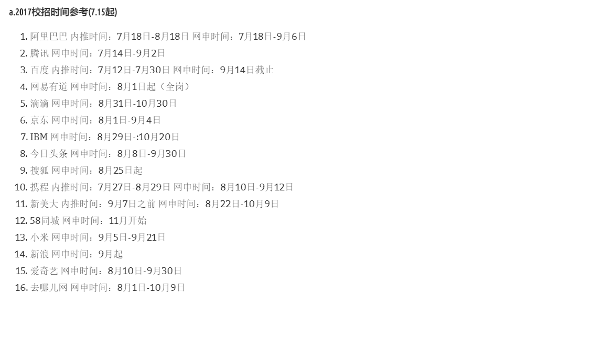

# AutumnRecruit2018
# 个人2018年秋季招聘准备

- [1 准备计划](#1-准备计划)
    - [目标](#目标)
- [2 内容](#2-内容)
    - [算法](#算法)
    - [操作系统](#操作系统)
    - [计算机网络](#计算机网络)
    - [Java](#Java)
    - [分布式](分布式)
    - [工具](工具)
        - [git](#git)
        - [docker](#docker)  
        - [linux shell](#linux_shell)
- [3 信息](#3-信息)

## 1 准备计划
**目标**   
工作准备找与大数据处理有关的职位，研究生期间基本上做的也是相关工作。为此需要数量掌握的技能如上面目录中的内容。

## 2 内容
### 算法
> [剑指offer题解(java版)](articles/剑指offer.md)

### 分布式
> [Zookeeper](articles/Zookeeper.md)

> [Kafka](articles/Kafka.md)

> [Hbase](articles/Hbase.md)

> [Storm](articles/Storm.md)

> [HDFS](articles/HDFS.md)

> [Kubernetes](articles/Kubernetes.md)

### 工具
> git

> docker 


> linux shell

* 添加用户
    ```bash
    $ sudo adduser username
    ```

* 给用户添加sudo权限
    ```bash
    $ sudo  usermod -aG sudo username
    ```

> 
## 3 信息

### 目前已经公布的公司招聘计划


### 2017年互联网公司秋季招聘时间参考
