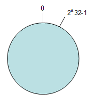

# 一致性hash算法
## 背景
举个例子，有5台服务器，编号分别是0(A)，1(B)，2(C)，3(D)，4(E)  ，正常情况下,假设用户数据hash值为12，那么对应的数据应该缓存在12%5=2号服务器上，假设编号为3的服务器此时挂掉，那么将其移除后就得到一个新的0(A)，1(B)，2(C)，3(E)(注：这里的编号3其实就是原来的4号服务器)服务器列表，此时用户来取数据，同样hash值为12,rehash后的得到的机器编号12%4=0号服务器，可见，此时用户到0号服务器去找数据明显就找不到，出现了cache不命中现象，如果不命中此时应用会从后台数据库重新读取数据再cache到0号服务器上，如果大量用户出现这种情况，那么后果不堪设想。同样，增加一台缓存服务器，也会导致同样的后果。

## 过程
1. 环形Hash空间
按照常用的hash算法来将对应的key哈希到一个具有2^32个桶的空间中，即0~(2^32)-1的数字空间中。可以将这些数字头尾相连，想象成一个闭合的环形。如下图:

  

2. 把数据通过一定的hash算法处理后映射到环上
现在将object1、object2、object3、object4四个对象通过特定的Hash函数计算出对应的key值，然后散列到Hash环上。如下图：
    Hash(object1) = key1；
    Hash(object2) = key2；
    Hash(object3) = key3；
    Hash(object4) = key4；

  

3. 将机器通过hash算法映射到环上
在采用一致性哈希算法的分布式集群中将新的机器加入，其原理是通过使用与对象存储一样的Hash算法将机器也映射到环中（一般情况下对机器的hash计算是采用机器的IP或者机器唯一的别名作为输入值），然后以顺时针的方向计算，将所有对象存储到离自己最近的机器中。
假设现在有NODE1，NODE2，NODE3三台机器，通过Hash算法得到对应的KEY值，映射到环中，其示意图如下：
    Hash(NODE1) = KEY1;
    Hash(NODE2) = KEY2;
    Hash(NODE3) = KEY3;

  

4. 机器的删除与添加
    普通hash求余算法最为不妥的地方就是在有机器的添加或者删除之后会照成大量的对象存储位置失效，这样就大大的不满足单调性了。下面来分析一下一致性哈希算法是如何处理的。
    1. 节点（机器）的删除
    以上面的分布为例，如果NODE2出现故障被删除了，那么按照顺时针迁移的方法，object3将会被迁移到NODE3中，这样仅仅是object3的映射位置发生了变化，其它的对象没有任何的改动。如下图：
    

  
    2. 节点（机器）的添加 
    如果往集群中添加一个新的节点NODE4，通过对应的哈希算法得到KEY4，并映射到环中，如下图：
    

  

5. 平衡性
    根据上面的图解分析，**一致性哈希算法满足了单调性和负载均衡的特性以及一般hash算法的分散性，但这还并不能当做其被广泛应用的原由，因为还缺少了平衡性。下面将分析一致性哈希算法是如何满足平衡性的。**
    hash算法是不保证平衡的，如上面只部署了NODE1和NODE3的情况（NODE2被删除的图），object1存储到了NODE1中，而object2、object3、object4都存储到了NODE3中，这样NODE3节点由于承担了NODE2节点的数据，所以NODE3节点的负载会变高，NODE3节点很容易也宕机，这样依次下去可能造成整个集群都挂了。
    在一致性哈希算法中，为了尽可能的满足平衡性，其引入了虚拟节点。“虚拟节点”（ virtual node ）是实际节点（机器）在 hash 空间的复制品（replica），一实际个节点（机器）对应了若干个“虚拟节点”，这个对应个数也成为“复制个数”，“虚拟节点”在 hash 空间中以hash值排列。即把想象在这个环上有很多“虚拟节点”，数据的存储是沿着环的顺时针方向找一个虚拟节点，每个虚拟节点都会关联到一个真实节点。
    图中的A1、A2、B1、B2、C1、C2、D1、D2都是虚拟节点，机器A负载存储A1、A2的数据，机器B负载存储B1、B2的数据，机器C负载存储C1、C2的数据。由于这些虚拟节点数量很多，均匀分布，因此不会造成“雪崩”现象。
    

  

