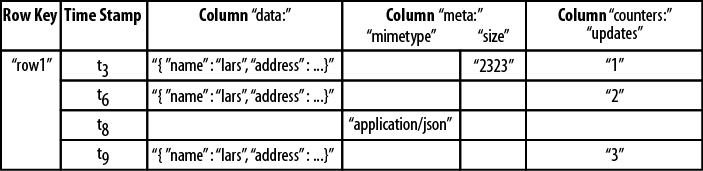
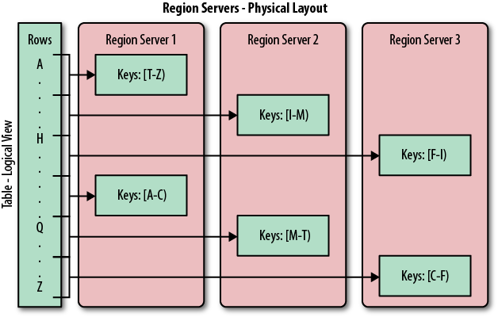
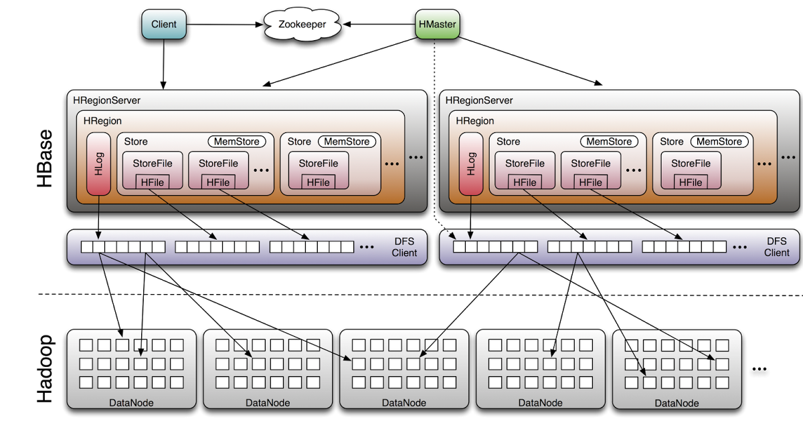
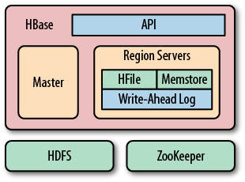
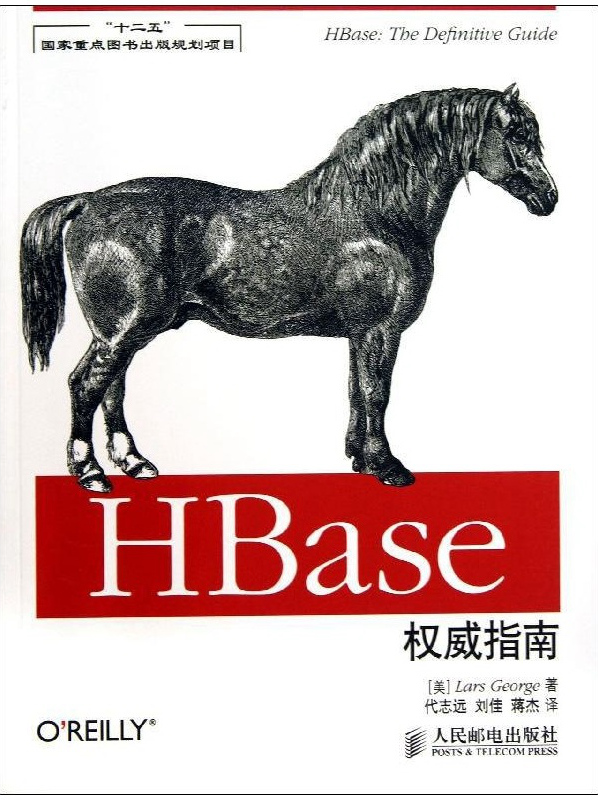
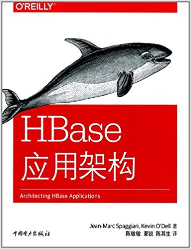

<!-- TOC -->

- [简介](#简介)
    - [相关术语](#相关术语)
    - [背景知识](#背景知识)
- [结构](#结构)
    - [背景](#背景)
    - [表、行、列和单元格](#表行列和单元格)
    - [自动分区](#自动分区)
    - [存储](#存储)
    - [文件合并](#文件合并)
    - [架构](#架构)
        - [树结构比较](#树结构比较)
            - [**查找与排序和合并的性能瓶颈**](#查找与排序和合并的性能瓶颈)
    - [客户端API](#客户端api)
    - [RowKey设计](#rowkey设计)
        - [RowKey的长度原则](#rowkey的长度原则)
        - [RowKey散列原则](#rowkey散列原则)
        - [RowKey唯一原则](#rowkey唯一原则)
        - [什么是热点](#什么是热点)
- [HBase面试](#hbase面试)
- [参考书籍](#参考书籍)

<!-- /TOC -->

# 简介
## 相关术语
**RDBMS(Relational Database Management System)** 关系型管理数据库  
**LAMP(Linux、Apache、MySQL、PHP或Perl、Python)**  
**NoSQL(Not only SQL)** 非关系型数据库

## 背景知识
> 一致性模型 (详见[distribution](./distribution.md)中CAP介绍)
* **严格一致性** 数据的变化是原子的，已经改变即时生效，这是一致性的最高形式
* **顺序一致性** 每个客户端看到的数据依照他们操作执行的顺序而变化
* **因果一致性** 客户端以因果关系顺序观察到数据的变化
* **最终一致性** 在没有更新数据的一段时间里，系统将通过广播保证副本之间的数据一致性
* **弱一致性** 在没有做出保证的情况下，所有的更新会通过广播的形式传递，展现给不同客户端的数据顺序可能不一样  
> **CAP定理**  一个分布式系统只能实现一致性、可用性和分区容忍性（或分区容错性）中的两个。

# 结构
## 背景
**GFS(Google File System)** 适合存储少量的大文件，不适合存储成千上万的小文件。文件的元数据信息会存储在主节点的内存中，文件越多主节点的压力越大。
**RDBMS** 在大规模处理中存在缺点

## 表、行、列和单元格  
HBase最基本的单位是列(column)。一列或多列形成一行(row)，并由唯一的行键(row key)来确定存储。反过来，一个表(table)中有若干行，其中每列有**多个版本**，在每一个单元格(cell)中存储了不同的值。  
所有行键按照**字典序**进行排序存储

<div align="center"></div>

以下两图表示单元格被写入的时间戳tn可视化了时间组件，圣墟显示了这些值被插入的不同时间。
<div align="center"></div>
<div align="center"></div>


## 自动分区
HBase扩展和负载均衡的基本单元成为**region**，region本质上是以行键排序的
连续存储的区间。如果region太大，系统会把他们进行拆分，相反的，就把多个region进行合并，以减少存储文件数量。  
一张表初始的时候只有一个region，用户开始向表中插入数据时，系统会检查这个region的大小，确保其不超过配置的最大值。如果超过了这个限制，系统会在中间键(middle key)处将这个region拆分成两个大致相等的子region。  
每一个region只能有一个服务器加载，每一台服务器可以加载多个region。如下图：   
<div align="center"></div>

## 存储
* 数据存储在存储文件(store file)中，成为HFile，HFile中存储的是经过排序的键值映射结构。文件内部有连续的块组成，块的索引信息存储在文件尾部。当打开HFile并加载到内存中时，索引信息会优先加载到内存中，每个块默认大小是64K，可以配置。  
* 可以通过HFile的块索引进行二分查找，确定可能包含给定键的块，然后读取磁盘找到实际要找的键。  
* 每次更新数据的时候，都会先将数据记录在提交日志(commit log)中，在HBase中这叫做(write-ahead log, WAL)，然后才会将这些数据写入内存中的memstore中。一旦内存中保存的写入数据累计大小超过了一个给定的最大值(可配置)，系统就会将这些数据移出内存作为HFile刷写到磁盘(HDFS)中。数据flush结束之后，会丢弃对应的WAL，只保留未持久化到磁盘中的日志。  
* 在系统将数据移除memstore写入磁盘的过程中，可以不必阻塞系统的读写，通过滚动内存中的memstore就能达到这个目的。即用新的memstore获取更新的数据，旧的memstore刷写成HFile。(memstore中的数据已经按照行键排序完成了，所以HFile不必在进行排序操作)
* 因为存储文件是不可被改变的，所以删除某一条数据是通过添加删除标记(delete marker, 又称墓碑标记)。在检索过程中，这些删除标记掩盖了实际值，客户端读不到实际值。
* 最终的结果是memstore和磁盘文件两部分数据结果的合并。

## 文件合并
memstore刷写会产生越来越多的HFile，通过管家机制将多个文件合并为一个较大的文件。
* minor合并(minor compaction)  
minor是将多个HFile合并为一个HFile，只是一个多路归并的过程。HFile都是经过归类的，合并会很快，只受磁盘IO的影响。

* major压缩合并(majar compaction)  
major是将一个region中一个列族的若干HFile重写为一个新HFile，与minor相比，major会扫描所有键值对，顺序重写全部数据，过滤掉有删除标记以及超过版本号限制的数据。

<div align="center"></div>


## 架构
> HBase3个主要组件：客户端库、一台主服务器(master)、多台region服务器。
<div align="center"></div>

* **Master server**  
负责跨region server的全局region的负载均衡，将繁忙的region server中的region移到负载较轻的region server中。不参与数据存储或检索服务，仅提供负载均衡和集群管理，因此是轻量级服务器。提供元数据的管理操作，如建表和创建列族。

* **Region server**   
负责region的读写请求，提供拆分超过配置大小region的接口。客户端直接与region server通信，处理所有数据相关操作。

### 树结构比较
* [从B树、B+树、B*树谈到R 树](https://www.cnblogs.com/hdk1993/p/5840599.html)  
    * B+树优点  
        * B+树能够通过主键对记录进行高效插入、查找和删除，并且提供高效的范围扫描功能。
        * B+树叶节点相互连接并且按主键有序，扫描时避免了耗时的遍历树操作。
        <div align="center"></div>  

    * B+树缺点  
        * 页表在磁盘中不一定是相邻的，范围查询可能跨页表的时候，效率很低。
        * 不适合太多修改的操作。


* LSM树(Log-Structured Merge Tree) 
    * 过程  
        * 数据首先存储在日志文件中，并且完全有序，当文件被修改，对应的更新会先保存在内存中加速查询。
        * 内存空间到一定大小，LSM会把数据有序的写到磁盘中，内存的老数据会被丢弃
        * 小文件多了之后，后台线程会自动将小文件 聚合成大文件。
        * 删除添加标记，并不是实际的从磁盘中删除。
    * 优点
        * 存储文件组织与B树类似，不过其为磁盘顺序读取做了优化，所有节点都是满的并且按页存储。系统将现有的页与内存刷写数据混合在一起进行管理，指导数据达到容量。  

        <div align="center"></div>  

        * 查询时先查找内存，在查找磁盘。
        * 查询次数在可预测的范围内，成本透明。
    * 缺点
        为了提高读性能牺牲了部分写性能。

> B树和LSM树的主要区别在于他们的结构如何利用硬件，特别是磁盘。

#### **查找与排序和合并的性能瓶颈**
* RDBMS中B树和B+树工作速度受制于磁盘寻道速度，每次查找需要访问磁盘log(N)次。
* LSM使用存储的连续传输能力，并以一定的传输速率排序和合并文件，需要执行log(updates)次操作。

## 客户端API
* 若需要频繁的修改某一行，put操作时设置rawlock，防止其他客户端访问这些行。
* put为RPC操作，不适合短时间发送大量请求。可以使用缓冲区(writer buffer)，缓冲区收集put操作，然后一次调用RPC。使用方法是将autoflush设为false。
    ```java
    table.setAutoFlush(false);
    ...
    flushCommits();
    //or
    setWriteBufferSize();
    ```

## RowKey设计
HBase是三维有序存储的，通过rowkey（行键），column key（column family和qualifier）和TimeStamp（时间戳）这个三个维度可以对HBase中的数据进行快速定位。

HBase中rowkey可以唯一标识一行记录，在HBase查询的时候，有两种方式：
* 通过get方式，指定rowkey获取唯一一条记录
* 通过scan方式，设置startRow和stopRow参数进行范围匹配
* 全表扫描，即直接扫描整张表中所有行记录

### RowKey的长度原则
rowkey是一个二进制码流，可以是任意字符串，最大长度 64kb ，实际应用中一般为10-100bytes，以 byte[] 形式保存，一般设计成定长。

建议越短越好，不要超过16个字节，原因如下：

* 数据的持久化文件HFile中是按照KeyValue存储的，如果rowkey过长，比如超过100字节，1000w行数据，光rowkey就要占用100*1000w=10亿个字节，将近1G数据，这样会极大影响HFile的存储效率；
* MemStore将缓存部分数据到内存，如果rowkey字段过长，内存的有效利用率就会降低，系统不能缓存更多的数据，这样会降低检索效率。
* 目前操作系统都是64位系统，内存8字节对齐，控制在16个字节，8字节的整数倍利用了操作系统的最佳特性。

### RowKey散列原则
如果rowkey按照时间戳的方式递增，__不要将时间放在二进制码的前面__，建议将rowkey的高位作为散列字段，由程序随机生成，低位放时间字段，这样将提高数据均衡分布在每个RegionServer，以实现负载均衡的几率。如果没有散列字段，首字段直接是时间信息，所有的数据都会集中在一个RegionServer上，这样在数据检索的时候负载会集中在个别的RegionServer上，造成热点问题，会降低查询效率。
### RowKey唯一原则
必须在设计上保证其唯一性，rowkey是按照字典顺序排序存储的，因此，设计rowkey的时候，要充分利用这个排序的特点，将经常读取的数据存储到一块，将最近可能会被访问的数据放到一块。

### 什么是热点
HBase中的行是按照rowkey的字典顺序排序的，这种设计优化了scan操作，可以将相关的行以及会被一起读取的行存取在临近位置，便于scan。然而糟糕的rowkey设计是热点的源头。 热点发生在大量的client直接访问集群的一个或极少数个节点（访问可能是读，写或者其他操作）。大量访问会使热点region所在的单个机器超出自身承受能力，引起性能下降甚至region不可用，这也会影响同一个RegionServer上的其他region，由于主机无法服务其他region的请求。 设计良好的数据访问模式以使集群被充分，均衡的利用。

为了避免写热点，设计rowkey使得不同行在同一个region，但是在更多数据情况下，数据应该被写入集群的多个region，而不是一个。

下面是一些常见的避免热点的方法以及它们的优缺点：
* 加盐
    这里所说的加盐不是密码学中的加盐，而是在rowkey的前面增加随机数，具体就是给rowkey分配一个随机前缀以使得它和之前的rowkey的开头不同。分配的前缀种类数量应该和你想使用数据分散到不同的region的数量一致。加盐之后的rowkey就会根据随机生成的前缀分散到各个region上，以避免热点。

* 哈希
    哈希会使同一行永远用一个前缀加盐。哈希也可以使负载分散到整个集群，但是读却是可以预测的。使用确定的哈希可以让客户端重构完整的rowkey，可以使用get操作准确获取某一个行数据

* 反转
    第三种防止热点的方法时反转固定长度或者数字格式的rowkey。这样可以使得rowkey中经常改变的部分（最没有意义的部分）放在前面。这样可以有效的随机rowkey，但是牺牲了rowkey的有序性。

    反转rowkey的例子以手机号为rowkey，可以将手机号反转后的字符串作为rowkey，这样的就避免了以手机号那样比较固定开头导致热点问题

* 时间戳反转
    一个常见的数据处理问题是快速获取数据的最近版本，使用反转的时间戳作为rowkey的一部分对这个问题十分有用，可以用 Long.Max_Value - timestamp 追加到key的末尾，例如 [key][reverse_timestamp] , [key] 的最新值可以通过scan [key]获得[key]的第一条记录，因为HBase中rowkey是有序的，第一条记录是最后录入的数据。

    比如需要保存一个用户的操作记录，按照操作时间倒序排序，在设计rowkey的时候，可以这样设计

    [userId反转][Long.Max_Value - timestamp]，在查询用户的所有操作记录数据的时候，直接指定反转后的userId，startRow是[userId反转][000000000000],stopRow是[userId反转][Long.Max_Value - timestamp]

    如果需要查询某段时间的操作记录，startRow是[user反转][Long.Max_Value - 起始时间]，stopRow是[userId反转][Long.Max_Value - 结束时间]

其他一些建议

* 尽量减少行和列的大小在HBase中，value永远和它的key一起传输的。当具体的值在系统间传输时，它的rowkey，列名，时间戳也会一起传输。如果你的rowkey和列名很大，甚至可以和具体的值相比较，那么你将会遇到一些有趣的问题。HBase storefiles中的索引（有助于随机访问）最终占据了HBase分配的大量内存，因为具体的值和它的key很大。可以增加block大小使得storefiles索引再更大的时间间隔增加，或者修改表的模式以减小rowkey和列名的大小。压缩也有助于更大的索引。

* 列族尽可能越短越好，最好是一个字符

* 冗长的属性名虽然可读性好，但是更短的属性名存储在HBase中会更好


# HBase面试
* HBase特点是什么
    * 分布式列式存储的数据库，数据存储在HDFS中，依靠Zookeeper进行管理
    * 适合存储半结构化或非结构化数据,小文件数据
    * cell不存储null值
    * 表中包含rowkey，时间戳和列族，可以保存数据的历史版本
    * 主从架构，HMater是主节点，HRegionServer是从节点
* HBase的Rowkey设计原则
    * 唯一性原则
    * 长度原则
        建议16个字节
        * 如果太长会占用更多HFile和Memstore空间，影响查询效率。
        * 64位系统，内存8字节对其，更好地发挥系统性能
    * 散列原则
        如果需要时间戳，需要放在rowkey的后面，前面加入散列值，防止出现热点问题，影响写入和查询效率。
* scan和get的功能以及实现的异同
    * get
    获取指定行的记录
    * scan
        1. 设置缓存，以空间换时间
        2. start row和end row范围扫描
        3. setFilter
* scan对象的setCache和setBatch方法的使用
    * setCache
    每次rpc请求的次数，
    * setCache
    每次的column size，有些row特别大，所以要分批发给client

* 如何解决region设置太大或太小带来的冲突

* 以start.sh为起点，Hbase启动的流程是什么

* 每天百亿数据，如何保证数据的存储正确和在规定的时间里全部录入完毕，不残留数据
    要求
    * 百亿数据：证明数据量非常大
    * 存入HBase：证明是跟HBase的写入数据有关
    * 保证数据的正确：要设计正确的数据结构保证正确性
    * 在规定时间内完成：对存入速度是有要求的
    分析
    * Bulkload(直接生成HFile)
    * rowkey设计


# 参考书籍  
* 《HBase权威指南》  
    <div align="center"></div>

* 《HBase应用架构》   
    <div align="center"></div>