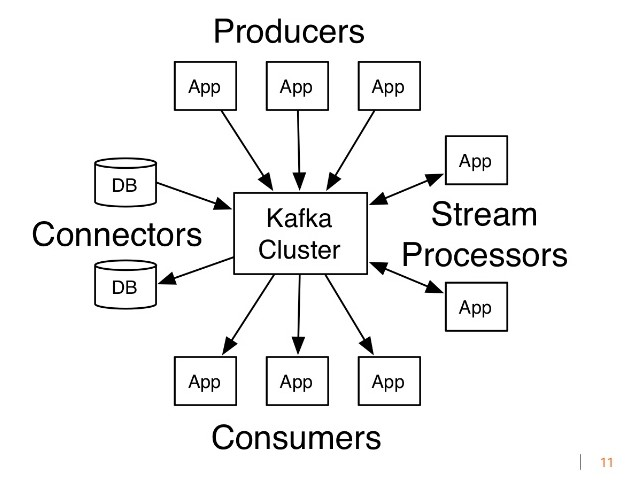
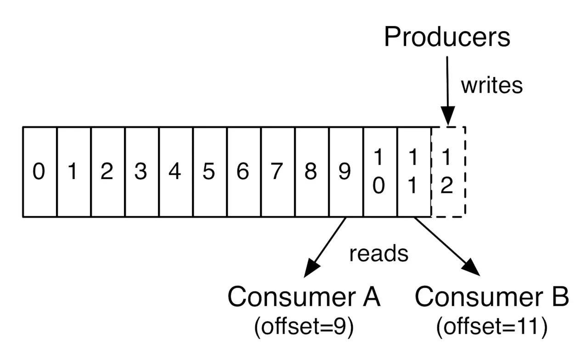
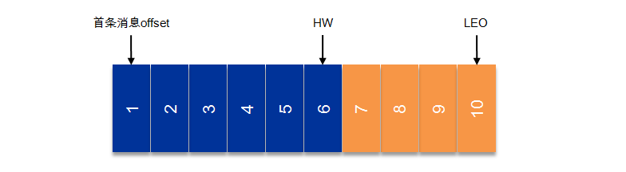
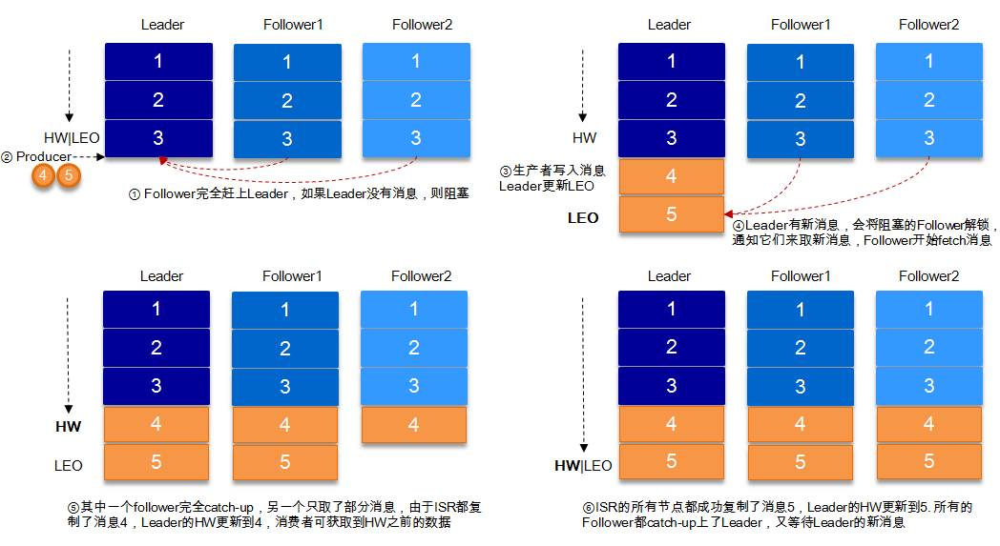
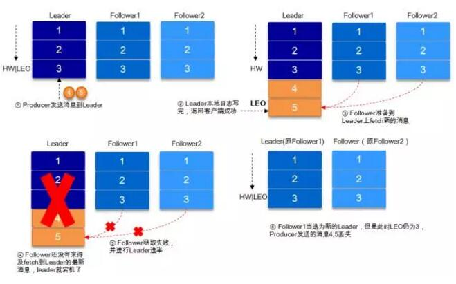
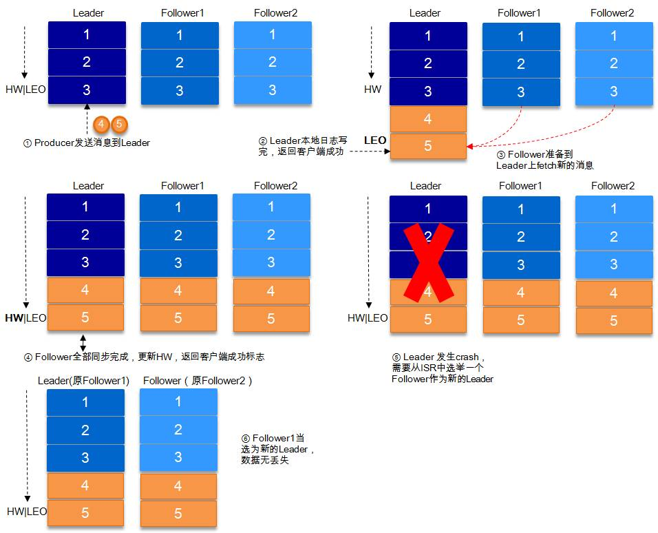
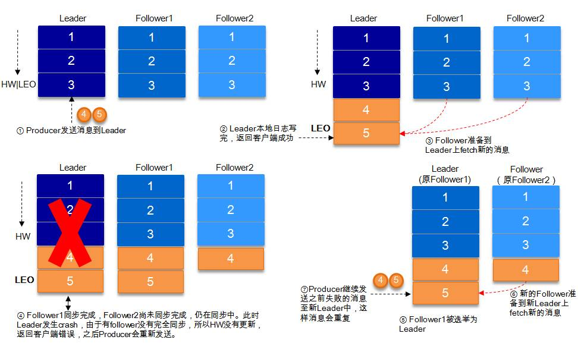
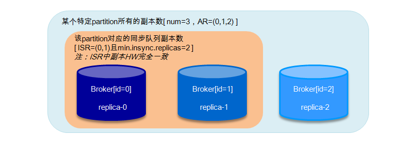
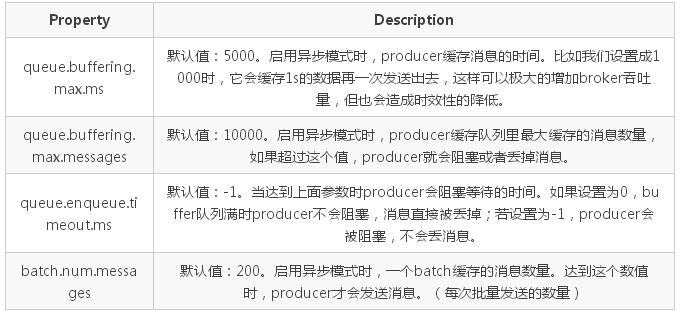

# Kafka
<!-- TOC -->

- [Kafka](#kafka)
    - [基本概念](#基本概念)
    - [核心接口](#核心接口)
    - [Topics](#topics)
        - [顺序](#顺序)
    - [Distribution](#distribution)
    - [Geo-Replication](#geo-replication)
    - [Producers](#producers)
    - [Consumers](#consumers)
    - [Guarantees](#guarantees)
    - [Kafka as a Messaging System](#kafka-as-a-messaging-system)
        - [消息队列](#消息队列)
        - [发布/订阅](#发布订阅)
    - [Kafka as a Storage System](#kafka-as-a-storage-system)
    - [Kafka for Stream Processing](#kafka-for-stream-processing)
    - [存储原理](#存储原理)
        - [概念总结](#概念总结)
        - [partition](#partition)
            - [segment中的文件](#segment中的文件)
            - [message文件](#message文件)
            - [数据文件的内部实现方法](#数据文件的内部实现方法)
        - [查找](#查找)
            - [问题](#问题)
            - [如何去解决这个问题](#如何去解决这个问题)
            - [通过offset查找message](#通过offset查找message)
        - [总结](#总结)
    - [可靠性分析](#可靠性分析)
        - [概述](#概述)
        - [复制原理和同步方式](#复制原理和同步方式)
        - [ISR](#isr)
        - [数据可靠性和持久性保证](#数据可靠性和持久性保证)
        - [关于HW的进一步探讨](#关于hw的进一步探讨)
        - [leader选举](#leader选举)
            - [可用性和一致性的选择](#可用性和一致性的选择)
        - [Kafka的发送模式](#kafka的发送模式)
        - [高可靠性使用分析](#高可靠性使用分析)
            - [消息可靠性传输](#消息可靠性传输)
            - [消息去重](#消息去重)
            - [高可靠性配置](#高可靠性配置)
    - [总结](#总结-1)
    - [参考](#参考)

<!-- /TOC -->

## 基本概念
* Kafka是运行在一个集群上，所以它可以拥有一个或多个服务节点；
* Kafka集群将消息存储在特定的文件中，对外表现为Topics；
* 每条消息记录都包含一个key,消息内容以及时间戳；

1. Broker:一个单独的Kafka server就是一个Broker,Broker的主要工作就是接收生产者发送来的消息,分配offset,然后将包装过的数据保存到磁盘上;此外,Broker还会接收消费者和其他Broker的请求,根据请求的类型进行相应的处理然后返回响应。多个Broker可以做成一个Cluster(集群)对外提供服务,每个Cluster当中会选出一个Broker来担任Controller,Controller是Kafka集群的指挥中心,其他的Broker则听从Controller指挥实现相应的功能。Controller负责管理分区的状态、管理每个分区的副本状态、监听zookeeper中数据的变化等。Controller也是一主多从的实现,所有的Broker都会监听Controller Leader的状态,当Leader Controller出现了故障的时候就重新选举新的Controller Leader。

2. 消息:消息是Kafka中最基本的消息单元。消息由一串字节组成,其中主要由key和value构成,key和value都是字节数组。key的主要作用是根据一定的策略,将这个消息路由到指定的分区中,这样就可以保证包含同一个key的消息全部写入同一个分区
3. Topic:Topic是用于存储消息的逻辑概念,Topic可以看做是一个消息的集合。每个Topic可以有多个生产者向其中push消息,也可以有多个消费者向其中pull消息。
4. 分区(partition):每一个Topic都可以划分成多个分区(每一个Topic都至少有一个分区),不同的分区会分配在不同的Broker上以对Kafka进行水平扩展从而增加Kafka的并行处理能力。同一个Topic下的不同分区包含的消息是不同的。每一个消息在被添加到分区的时候,都会被分配一个offset,他是消息在此分区中的唯一编号,此外,Kafka通过offset保证消息在分区中的顺序,offset的顺序性不跨分区,也就是说在Kafka的同一个分区中的消息是有序的,不同分区的消息可能不是有序的。
5. Log:分区在逻辑上对应着一个Log,当生产者将消息写入分区的时候,实际上就是写入到了一个Log中。Log是一个逻辑概念,对应的是一个磁盘上的文件夹。Log由多个Segment组成,每一个Segment又对应着一个日志文件和一个索引文件。
6. 副本:Kafka对消息进行了冗余备份,每一个分区都可以有多个副本,每一个副本中包含的消息是相同的(但不保证同一时刻下完全相同)。副本的类型分为Leader和Follower,当分区只有一个副本的时候,该副本属于Leader,没有Follower。Kafka的副本具有一定的同步机制,在每个副本集合中,都会选举出一个副本作为Leader副本,Kafka在不同的场景中会采用不同的选举策略。Kafka中所有的读写请求都由选举出的Leader副本处理,其他的都作为Follower副本,Follower副本仅仅是从Leader副本中把数据拉取到本地之后,同步更新到自己的Log中。

7. ISR集合:ISR集合表示的是目前可用(alive)且消息量与Leader相差不多的副本集合,即整个副本集合的子集。ISR集合中副本所在的节点都与ZK保持着连接,此外,副本的最后一条消息的offset与Leader副本的最后一条消息的offset之间的差值不能超出指定的阈值。每一个分区的Leader副本都维护此分区的ISR集合。如上面所述,Leader副本进行了消息的写请求,Follower副本会从Leader上拉取写入的消息,第二个过程中会存在Follower副本中的消息数量少于Leader副本的状态,只要差值少于指定的阈值,那么此时的副本集合就是ISR集合。

## 核心接口
* Producer API允许了应用可以向Kafka中的topics发布消息；
* Consumer API允许了应用可以订阅Kafka中的topics,并消费消息；
* Streams API允许应用可以作为消息流的处理者，比如可以从topicA中消费消息，处理的结果发布到topicB中；
* Connector API提供Kafka与现有的应用或系统适配功能，比如与数据库连接器可以捕获表结构的变化；

## Topics
Topics是一些主题的集合，更通俗的说Topic就像一个消息队列，生产者可以向其写入消息，消费者可以从中读取消息，一个Topic支持多个生产者或消费者同时订阅它，所以其扩展性很好。Topic又可以由一个或多个partition（分区）组成，比如下图：

### 顺序
每个partition中的消息都是有序的，但是partition之间顺序就不能保证了,若topics有多个partition，生产者的消息可以指定或者由系统根据算法分配到指定分区，若你需要所有消息都是有序的，那么你最好只用一个分区。另外partition支持消息位移读取，消息位移有消费者自身管理，比如下图：

由上图可以看出，不同消费者对同一分区的消息读取互不干扰，消费者可以通过设置消息位移（offset）来控制自己想要获取的数据，比如可以从头读取，最新数据读取，重读读取等功能。

关于Topic的分区策略以及与消费者间平衡后续文章会继续深入讲解。

## Distribution
上文说到过，Kafka是一个分布式的消息系统，所以当我们配置了多个Kafka Server节点后，它就拥有分布式的能力，比如容错等，partition会被分布在各个Server节点上，同时它们中间又有一个leader，它会处理所有的读写请求，其他followers会复制leader上的数据信息，一旦当leader因为某些故障而无法提供服务后，就会有一个follower被推举出来成为新的leader来处理这些请求。

## Geo-Replication
异地备份是作为主流分布式系统的基础功能，用于集群中数据的备份和恢复，Kafka利用MirrorMaker来实现这个功能，用户只需简单的进行相应配置即可。

## Producers
Producers作为消息的生产者，可以自己指定将消息发布到订阅Topic中的指定分区，策略可以自己指定，比如语义或者结构类似的消息发布在同一分区，当然也可以由系统循环发布在每一个分区上。

## Consumers
Consumers是一群消费者的集合，可以称之为消费者组，是一种更高层次的的抽象，向Topic订阅消费消息的单位是Consumers，当然它其中也可以只有一个消费者（consumer）。下面是关于consumer的两条原则：
* 假如所有消费者都在同一个消费者组中，那么它们将协同消费订阅Topic的部分消息（根据分区与消费者的数量分配），保存负载平衡；
* 假如所有消费者都在不同的消费者组中，并且订阅了同个Topic，那么它们将可以消费Topic的所有消息；
下面是一个简单的例子，帮助大家理解：

上图中有两个Server节点，有一个Topic被分为四个分区（P0-P4)分别被分配在两个节点上，另外还有两个消费者组（GA，GB），其中GA有两个消费者实例，GB有四个消费者实例。
从图中我们可以看出，首先订阅Topic的单位是消费者组，另外我们发现Topic中的消息根据一定规则将消息推送给具体消费者，主要原则如下：
* 若消费者数小于partition数，且消费者数为一个，那么它就消费所有消息；
* 若消费者数小于partition数，假设消费者数为N，partition数为M，那么每个消费者能消费的分区数为M/N或M/N+1；
* 若消费者数等于partition数，那么每个消费者都会均等分配到一个分区的消息；
* 若消费者数大于partition数，则将会出现部分消费者得不到消息分区，出现空闲的情况；

## Guarantees
kafka作为一个高水准的系统，提供了以下的保证：

* 消息的添加是有序的，生产者越早向订阅的Topic发送的消息，会更早的被添加到Topic中，当然它们可能被分配到不同的分区；
* 消费者在消费Topic分区中的消息时是有序的；
* 对于有N个复制节点的Topic，系统可以最多容忍N-1个节点发生故障，而不丢失任何提交给该Topic的消息；

## Kafka as a Messaging System
说了这么多，前面也讲了消息系统的演变过程，那么Kafka相比其他的消息系统优势具体在哪里？ 传统的消息系统模型主要有两种：消息队列和发布/订阅。
### 消息队列
特性 | 描述
-- | -- 
表现形式 | 一组消费者从消息队列中获取消息，一条消息会被推送给组中的某一个消费者 |
优势 | 水平扩展，可以将消息数据分开处理 |
劣势 | 消息队列不是多用户的，当一条消息记录被一个进程读取后，消息便会丢失 |

### 发布/订阅
特性 | 描述
-- | -- 
表现形式 | 消息会广播发送给所有订阅者 |
优势 | 可以多进程共享消息 |
劣势 | 每个消费者都会获得所有消息，无法通过添加消费进程提高处理效率 |

从上面两个表中可以看出两种传统的消息系统模型的优缺点，所以Kafka在前人的肩膀上进行了优化，吸收他们的优点，主要体现在以下两方面：
* 通过Topic方式来达到消息队列的功能
* 通过消费者组这种方式来达到发布/订阅的功能

## Kafka as a Storage System
存储消息也是消息系统的一大功能，Kafka相对普通的消息队列存储来说，它的表现实在好的太多，首先Kafka支持写入确认，保证消息写入的正确性和连续性，同时Kafka还会对写入磁盘的数据进行复制备份，来实现容错，另外Kafka对磁盘的使用结构是一致的，就说说不管你的服务器目前磁盘存储的消息数据有多少，它添加消息数据的效率是相同的。
Kafka的存储机制很好的支持消费者可以随意控制自身所需要读取的数据，在很多时候你也可以将Kafka作为一个高性能，低延迟的分布式文件系统。

## Kafka for Stream Processing
Kafka作为一个完美主义代表者，光有普通的读写，存储等功能是不够的，它还提供了实时处理消息流的接口。
很多时候原始的数据并不是我们想要的，我们想要的是经过处理后的数据结果，比如通过一天的搜索数据得出当天的搜索热点等，你可以利用Streams API来实现自己想要的功能，比如从输入Topic中获取数据，然后再发布到具体的输出Topic中。
Kafka的流处理可以解决诸如处理无序数据、数据的复杂转换等问题。

## 存储原理
### 概念总结
* Broker：消息中间件处理结点，一个Kafka节点就是一个broker，多个broker可以组成一个Kafka集群；
* Topic：一类消息，例如page view日志、click日志等都可以以topic的形式存在，Kafka集群能够同时负责多个topic的分发；
* Partition：topic物理上的分组，一个topic可以分为多个partition，每个partition是一个有序的队列；
* Segment：每个partition又由多个segment file组成；
* offset：每个partition都由一系列有序的、不可变的消息组成，这些消息被连续的追加到partition中。partition中的每个消息都有一个连续的序列号叫做offset，用于partition唯一标识一条消息；
* message：这个算是kafka文件中最小的存储单位，即是 a commit log。

kafka的message是以topic为基本单位，不同topic之间是相互独立的。每个topic又可分为几个不同的partition，每个partition存储一部的分message。topic与partition的关系如下：

其中，partition是以文件夹的形式存储在具体Broker本机上。

### partition
有了上面的介绍，下面我们开始介绍Topic中partition的数据文件类型。
#### segment中的文件
对于一个partition（在Broker中以文件夹的形式存在），里面又有很多大小相等的segment数据文件（这个文件的具体大小可以在config/server.properties中进行设置），这种特性可以方便old segment file的快速删除。
下面先介绍一下partition中的segment file的组成：

* segment file 组成：由2部分组成，分别为index file和data file，这两个文件是一一对应的，后缀”.index”和”.log”分别表示索引文件和数据文件；
* segment file 命名规则：partition的第一个segment从0开始，后续每个* segment文件名为上一个segment文件最后一条消息的offset,ofsset的数值最大为64位（long类型），20位数字字符长度，没有数字用0填充。如下图所示：

关于segment file中index与data file对应关系图，这里我们选用网上的一个图片，如下所示：

segment的索引文件中存储着大量的元数据，数据文件中存储着大量消息，索引文件中的元数据指向对应数据文件中的message的物理偏移地址。以索引文件中的3，497为例，在数据文件中表示第3个message（在全局partition表示第368772个message），以及该消息的物理偏移地址为497。

注：Partition中的每条message由offset来表示它在这个partition中的偏移量，这个offset并不是该Message在partition中实际存储位置，而是逻辑上的一个值（如上面的3），但它却唯一确定了partition中的一条Message（可以认为offset是partition中Message的id）。

#### message文件
message中的物理结构为：

关键字 | 解释说明
-- | --
8 byte offset | 在parition(分区)内的每条消息都有一个有序的id号，这个id号被称为偏移(offset),它可以唯一确定每条消息在parition(分区)内的位置。即offset表示partiion的第多少message
4 byte message size |message大小
4 byte CRC32 | 用crc32校验message
1 byte “magic” | 表示本次发布Kafka服务程序协议版本号
1 byte “attributes” | 表示为独立版本、或标识压缩类型、或编码类型
4 byte key length | 表示key的长度,当key为-1时，K byte key字段不填
K byte key | 可选
value bytes payload | 表示实际消息数据

#### 数据文件的内部实现方法
Partition数据文件包含了若干上述格式的message，按照offset由小到大排列在一起，它实现的类是FileMessageSet，类图如下：

它的主要方法如下：

* append: 把给定的ByteBufferMessageSet中的Message写入到这个数据文件中。
* searchFor: 从指定的startingPosition开始搜索，找到第一个Message判断其offset是大于或者等于指定的offset，并返回其在文件中的位置Position。它的实现方式是从startingPosition开始读取12个字节，分别是当前MessageSet的offset和size。如果当前offset小于指定的offset，那么将position向后移动LogOverHead+MessageSize（其中LogOverHead为offset+messagesize，为12个字节）。
* read：准确名字应该是slice，它截取其中一部分返回一个新的FileMessageSet。它不保证截取的位置数据的完整性。
* sizeInBytes: 表示这个FileMessageSet占有了多少字节的空间。
* truncateTo: 把这个文件截断，这个方法不保证截断位置的Message的完整性。
* readInto: 从指定的相对位置开始把文件的内容读取到对应的ByteBuffer中。

### 查找
#### 问题
我们首先试想一下，如果对于Kafka的一个topic而言，如果topic的partition中只有一个数据文件的话会怎么样？

* 新数据是添加在文件末尾（调用FileMessageSet的append方法），不论文件数据文件有多大，这个操作永远都是O(1)的。
* 查找某个offset的Message（调用FileMessageSet的searchFor方法）是顺序查找的。因此，如果数据文件很大的话，查找的效率就低。

#### 如何去解决这个问题
由上述我们知道，如果在topic的partition中只有一个数据文件的话，Kafka插入的效率虽然很高，但是查找的效率非常低，那么Kafka在内部是如何解决查找效率的的问题呢？对于这个问题，Kafka有两大法宝：分段和索引。
* 数据文件分段(segment)
    这个是比较好理解的，加入有100条message，它们的offset是从0到99，假设将数据文件分为5端，第一段为0-19，第二段为20-39，依次类推，每段放在一个单独的数据文件里面，数据文件以该段中最小的offset命名。这样在查找指定offset的Message的时候，用二分查找就可以定位到该Message在哪个段中。

* 为数据文件建索引(index)
    数据文件分段使得可以在一个较小的数据文件中查找对应offset的message了，但是这依然需要顺序扫描才能找到对应offset的message。为了进一步提高查找的效率，Kafka为每个分段后的数据文件建立了索引文件，文件名与数据文件的名字是一样的，只是文件扩展名为.index。

    索引文件中包含若干个索引条目，每个条目表示数据文件中一条message的索引。索引包含两个部分（均为4个字节的数字），分别为相对offset和position。

    * 相对offset：因为数据文件分段以后，每个数据文件的起始offset不为0，相对offset表示这条message相对于其所属数据文件中最小的offset的大小。举例，分段后的一个数据文件的offset是从20开始，那么offset为25的message在index文件中的相对offset就是25-20 = 5。存储相对offset可以减小索引文件占用的空间。
    * position：表示该条message在数据文件中的绝对位置。只要打开文件并移动文件指针到这个position就可以读取对应的message了。

    在kafka中，索引文件的实现类为OffsetIndex，它的类图如下
    

    主要的方法有：

    * append方法：添加一对offset和position到index文件中，这里的offset将会被转成相对的offset。
    * lookup：用二分查找的方式去查找小于或等于给定offset的最大的那个offset

#### 通过offset查找message
假如我们想要读取offset=368776的message（见前面的第三个图），需要通过下面2个步骤查找。
* 查找segment file
00000000000000000000.index表示最开始的文件，起始偏移量(offset)为0.第二个文件00000000000000368769.index的消息量起始偏移量为368770 = 368769 + 1.同样，第三个文件00000000000000737337.index的起始偏移量为737338=737337 + 1，其他后续文件依次类推，以起始偏移量命名并排序这些文件，只要根据offset 二分查找文件列表，就可以快速定位到具体文件。
当offset=368776时定位到00000000000000368769.index|log
通过segment file查找message
* 通过第一步定位到segment file，当offset=368776时，依次定位到00000000000000368769.index的元数据物理位置和00000000000000368769.log的物理偏移地址，然后再通过00000000000000368769.log顺序查找直到offset=368776为止。

segment index file并没有为数据文件中的每条message建立索引，而是采取**稀疏索引存储**方式，每隔一定字节的数据建立一条索引，它减少了索引文件大小，通过map可以直接内存操作，稀疏索引为数据文件的每个对应message设置一个元数据指针,它比稠密索引节省了更多的存储空间，但查找起来需要消耗更多的时间。

### 总结
Kafka高效文件存储设计特点：

* Kafka把topic中一个parition大文件分成多个小文件段，通过多个小文件段，就容易定期清除或删除已经消费完文件，减少磁盘占用。
* 通过索引信息可以快速定位message和确定response的最大大小。
* 通过index元数据全部映射到memory，可以避免segment file的IO磁盘操作。
* 通过索引文件稀疏存储，可以大幅降低index文件元数据占用空间大小。

## 可靠性分析
### 概述
Kafka的高可靠性的保障来源于其健壮的**副本（replication）策略**。通过调节其副本相关参数，可以使得Kafka在性能和可靠性之间运转的游刃有余。Kafka从0.8.x版本开始提供partition级别的复制,replication的数量可以在$KAFKA_HOME/config/server.properties中配置（default.replication.refactor）。

Kafka文件存储机制入手在上面已经说明了，从最底层了解Kafka的存储细节，进而对其的存储有个微观的认知。之后通过Kafka复制原理和同步方式来阐述宏观层面的概念。最后从ISR，HW，leader选举以及数据可靠性和持久性保证等等各个维度来丰富对Kafka相关知识点的认知。

### 复制原理和同步方式
Kafka中topic的每个partition有一个预写式的日志文件，虽然partition可以继续细分为若干个segment文件，但是对于上层应用来说可以将partition看成最小的存储单元（一个有多个segment文件拼接的“巨型”文件），每个partition都由一些列有序的、不可变的消息组成，这些消息被连续的追加到partition中。

上图中有两个新名词：HW和LEO。这里先介绍下LEO，LogEndOffset的缩写，表示每个partition的log最后一条Message的位置。HW是HighWatermark的缩写，是指consumer能够看到的此partition的位置，这个涉及到多副本的概念，这里先提及一下，下节再详表。

言归正传，为了提高消息的可靠性，Kafka每个topic的partition有N个副本（replicas），其中N(大于等于1)是topic的复制因子（replica fator）的个数。Kafka通过多副本机制实现故障自动转移，当Kafka集群中一个broker失效情况下仍然保证服务可用。在Kafka中发生复制时确保partition的日志能有序地写到其他节点上，N个replicas中，其中一个replica为leader，其他都为follower, leader处理partition的所有读写请求，与此同时，follower会被动定期地去复制leader上的数据。

如下图所示，Kafka集群中有4个broker, 某topic有3个partition,且复制因子即副本个数也为3：
partition中。

Kafka提供了数据复制算法保证，如果leader发生故障或挂掉，一个新leader被选举并被接受客户端的消息成功写入。Kafka确保从同步副本列表中选举一个副本为leader，或者说follower追赶leader数据。leader负责维护和跟踪ISR(In-Sync Replicas的缩写，表示副本同步队列，具体可参考下节)中所有follower滞后的状态。当producer发送一条消息到broker后，leader写入消息并复制到所有follower。消息提交之后才被成功复制到所有的同步副本。消息复制延迟受最慢的follower限制，重要的是快速检测慢副本，如果follower“落后”太多或者失效，leader将会把它从ISR中删除。

### ISR
上节我们涉及到ISR (In-Sync Replicas)，这个是指副本同步队列。副本数对Kafka的吞吐率是有一定的影响，但极大的增强了可用性。默认情况下Kafka的replica数量为1，即每个partition都有一个唯一的leader，为了确保消息的可靠性，通常应用中将其值(由broker的参数offsets.topic.replication.factor指定)大小设置为大于1，比如3。 所有的副本（replicas）统称为Assigned Replicas，即AR。

ISR是AR中的一个子集，由leader维护ISR列表，follower从leader同步数据有一些延迟（包括延迟时间replica.lag.time.max.ms和延迟条数replica.lag.max.messages两个维度, 当前最新的版本0.10.x中只支持replica.lag.time.max.ms这个维度），任意一个超过阈值都会把follower剔除出ISR, 存入OSR（Outof-Sync Replicas）列表，新加入的follower也会先存放在OSR中。AR=ISR+OSR。

Kafka 0.10.x版本后移除了replica.lag.max.messages参数，只保留了replica.lag.time.max.ms作为ISR中副本管理的参数。为什么这样做呢？replica.lag.max.messages表示当前某个副本落后leaeder的消息数量超过了这个参数的值，那么leader就会把follower从ISR中删除。假设设置replica.lag.max.messages=4，那么如果producer一次传送至broker的消息数量都小于4条时，因为在leader接受到producer发送的消息之后而follower副本开始拉取这些消息之前，follower落后leader的消息数不会超过4条消息，故此没有follower移出ISR，所以这时候replica.lag.max.message的设置似乎是合理的。

但是producer发起瞬时高峰流量，producer一次发送的消息超过4条时，也就是超过replica.lag.max.messages，此时follower都会被认为是与leader副本不同步了，从而被踢出了ISR。但实际上这些follower都是存活状态的且没有性能问题。那么在之后追上leader,并被重新加入了ISR。于是就会出现它们不断地剔出ISR然后重新回归ISR，这无疑增加了无谓的性能损耗。而且这个参数是broker全局的。设置太大了，影响真正“落后”follower的移除；设置的太小了，导致follower的频繁进出。无法给定一个合适的replica.lag.max.messages的值，故此，新版本的Kafka移除了这个参数。

> 注：ISR中包括：leader和follower。

上面一节还涉及到一个概念，即HW。HW俗称高水位，HighWatermark的缩写，取一个partition对应的ISR中最小的LEO作为HW，consumer最多只能消费到HW所在的位置。另外每个replica都有HW,leader和follower各自负责更新自己的HW的状态。对于leader新写入的消息，consumer不能立刻消费，leader会等待该消息被所有ISR中的replicas同步后更新HW，此时消息才能被consumer消费。这样就保证了如果leader所在的broker失效，该消息仍然可以从新选举的leader中获取。对于来自内部broKer的读取请求，没有HW的限制。

下图详细的说明了当producer生产消息至broker后，ISR以及HW和LEO的流转过程：

由此可见，Kafka的复制机制既不是完全的同步复制，也不是单纯的异步复制。事实上，同步复制要求所有能工作的follower都复制完，这条消息才会被commit，这种复制方式极大的影响了吞吐率。而异步复制方式下，follower异步的从leader复制数据，数据只要被leader写入log就被认为已经commit，这种情况下如果follower都还没有复制完，落后于leader时，突然leader宕机，则会丢失数据。而Kafka的这种使用ISR的方式则很好的均衡了确保数据不丢失以及吞吐率。

Kafka的ISR的管理最终都会反馈到Zookeeper节点上。具体位置为：/brokers/topics/[topic]/partitions/[partition]/state。目前有两个地方会对这个Zookeeper的节点进行维护：
* Controller来维护：Kafka集群中的其中一个Broker会被选举为Controller，主要负责Partition管理和副本状态管理，也会执行类似于重分配partition之类的管理任务。在符合某些特定条件下，Controller下的LeaderSelector会选举新的leader，ISR和新的leader_epoch及controller_epoch写入Zookeeper的相关节点中。同时发起LeaderAndIsrRequest通知所有的replicas。

* leader来维护：leader有单独的线程定期检测ISR中follower是否脱离ISR, 如果发现ISR变化，则会将新的ISR的信息返回到Zookeeper的相关节点中。

###  数据可靠性和持久性保证
当producer向leader发送数据时，可以通过request.required.acks参数来设置数据可靠性的级别：
* 1（默认）：这意味着producer在ISR中的leader已成功收到的数据并得到确认后发送下一条message。如果leader宕机了，则会丢失数据。

* 0：这意味着producer无需等待来自broker的确认而继续发送下一批消息。这种情况下数据传输效率最高，但是数据可靠性确是最低的。

* -1：producer需要等待ISR中的所有follower都确认接收到数据后才算一次发送完成，可靠性最高。但是这样也不能保证数据不丢失，比如当ISR中只有leader时（前面ISR那一节讲到，ISR中的成员由于某些情况会增加也会减少，最少就只剩一个leader），这样就变成了acks=1的情况。

如果要提高数据的可靠性，在设置request.required.acks=-1的同时，也要min.insync.replicas这个参数(可以在broker或者topic层面进行设置)的配合，这样才能发挥最大的功效。min.insync.replicas这个参数设定ISR中的最小副本数是多少，默认值为1，当且仅当request.required.acks参数设置为-1时，此参数才生效。如果ISR中的副本数少于min.insync.replicas配置的数量时，客户端会返回异常：org.apache.kafka.common.errors.NotEnoughReplicasExceptoin: Messages are rejected since there are fewer in-sync replicas than required。

接下来对acks=1和-1的两种情况进行详细分析：

1. request.required.acks=1

producer发送数据到leader，leader写本地日志成功，返回客户端成功；此时ISR中的副本还没有来得及拉取该消息，leader就宕机了，那么此次发送的消息就会丢失。

2. request.required.acks=-1

同步（Kafka默认为同步，即producer.type=sync）的发送模式，replication.factor>=2且min.insync.replicas>=2的情况下，不会丢失数据。

有两种典型情况。acks=-1的情况下（如无特殊说明，以下acks都表示为参数request.required.acks），数据发送到leader, ISR的follower全部完成数据同步后，leader此时挂掉，那么会选举出新的leader，数据不会丢失。

acks=-1的情况下，数据发送到leader后 ，部分ISR的副本同步，leader此时挂掉。比如follower1h和follower2都有可能变成新的leader, producer端会得到返回异常，producer端会重新发送数据，数据可能会重复。

当然上图中如果在leader crash的时候，follower2还没有同步到任何数据，而且follower2被选举为新的leader的话，这样消息就不会重复。

> 注：Kafka只处理fail/recover问题,不处理Byzantine问题。

### 关于HW的进一步探讨
考虑上图（即acks=-1,部分ISR副本同步）中的另一种情况，如果在Leader挂掉的时候，follower1同步了消息4,5，follower2同步了消息4，与此同时follower2被选举为leader，那么此时follower1中的多出的消息5该做如何处理呢？

这里就需要HW的协同配合了。如前所述，一个partition中的ISR列表中，leader的HW是所有ISR列表里副本中最小的那个的LEO。类似于木桶原理，水位取决于最低那块短板。

> 当ISR中的个副本的LEO不一致时，如果此时leader挂掉，选举新的leader时并不是按照LEO的高低进行选举，而是按照ISR中的顺序选举。

### leader选举
一条消息只有被ISR中的所有follower都从leader复制过去才会被认为已提交。这样就避免了部分数据被写进了leader，还没来得及被任何follower复制就宕机了，而造成数据丢失。而对于producer而言，它可以选择是否等待消息commit，这可以通过request.required.acks来设置。这种机制确保了只要ISR中有一个或者以上的follower，一条被commit的消息就不会丢失。

有一个很重要的问题是当leader宕机了，怎样在follower中选举出新的leader，因为follower可能落后很多或者直接crash了，所以必须确保选择“最新”的follower作为新的leader。一个基本的原则就是，如果leader不在了，新的leader必须拥有原来的leader commit的所有消息。这就需要做一个折中，如果leader在表名一个消息被commit前等待更多的follower确认，那么在它挂掉之后就有更多的follower可以成为新的leader，但这也会造成吞吐率的下降。

leader选举的算法非常多，比如Zookeeper的Zab、Raft以及Viewstamped Replication。而Kafka所使用的leader选举算法更像是微软的PacificA算法。

Kafka在Zookeeper中为每一个partition动态的维护了一个ISR，这个ISR里的所有replica都跟上了leader，只有ISR里的成员才能有被选为leader的可能（unclean.leader.election.enable=false）。在这种模式下，对于f+1个副本，一个Kafka topic能在保证不丢失已经commit消息的前提下容忍f个副本的失败，在大多数使用场景下，这种模式是十分有利的。事实上，为了容忍f个副本的失败，“少数服从多数”的方式和ISR在commit前需要等待的副本的数量是一样的，但是ISR需要的总的副本的个数几乎是“少数服从多数”的方式的一半。

#### 可用性和一致性的选择
上文提到，在ISR中至少有一个follower时，Kafka可以确保已经commit的数据不丢失，但如果某一个partition的所有replica都挂了，就无法保证数据不丢失了。这种情况下有两种可行的方案：

* 等待ISR中任意一个replica“活”过来，并且选它作为leader
* 选择第一个“活”过来的replica（并不一定是在ISR中）作为leader

这就需要在可用性和一致性当中作出一个简单的抉择。如果一定要等待ISR中的replica“活”过来，那不可用的时间就可能会相对较长。而且如果ISR中所有的replica都无法“活”过来了，或者数据丢失了，这个partition将永远不可用。选择第一个“活”过来的replica作为leader,而这个replica不是ISR中的replica,那即使它并不保障已经包含了所有已commit的消息，它也会成为leader而作为consumer的数据源。默认情况下，Kafka采用第二种策略，即unclean.leader.election.enable=true，也可以将此参数设置为false来启用第一种策略。

unclean.leader.election.enable这个参数对于leader的选举、系统的可用性以及数据的可靠性都有至关重要的影响。下面我们来分析下几种典型的场景。

如果上图所示，假设某个partition中的副本数为3，replica-0, replica-1, replica-2分别存放在broker0, broker1和broker2中。AR=(0,1,2)，ISR=(0,1)。设置request.required.acks=-1, min.insync.replicas=2，unclean.leader.election.enable=false。这里讲broker0中的副本也称之为broker0起初broker0为leader，broker1为follower。

* 当ISR中的replica-0出现crash的情况时，broker1选举为新的leader[ISR=(1)]，因为受min.insync.replicas=2影响，write不能服务，但是read能继续正常服务。此种情况恢复方案：

    1. 尝试恢复(重启)replica-0，如果能起来，系统正常；

    2. 如果replica-0不能恢复，需要将min.insync.replicas设置为1，恢复write功能。

* 当ISR中的replica-0出现crash，紧接着replica-1也出现了crash, 此时[ISR=(1),leader=-1],不能对外提供服务，此种情况恢复方案：

    1. 尝试恢复replica-0和replica-1，如果都能起来，则系统恢复正常；

    2. 如果replica-0起来，而replica-1不能起来，这时候仍然不能选出leader，因为当设置unclean.leader.election.enable=false时，leader只能从ISR中选举，当ISR中所有副本都失效之后，需要ISR中最后失效的那个副本能恢复之后才能选举leader, 即replica-0先失效，replica-1后失效，需要replica-1恢复后才能选举leader。保守的方案建议把unclean.leader.election.enable设置为true,但是这样会有丢失数据的情况发生，这样可以恢复read服务。同样需要将min.insync.replicas设置为1，恢复write功能；

    3. replica-1恢复，replica-0不能恢复，这个情况上面遇到过，read服务可用，需要将min.insync.replicas设置为1，恢复write功能；

    4. replica-0和replica-1都不能恢复，这种情况可以参考情形2.

* 当ISR中的replica-0, replica-1同时宕机,此时[ISR=(0,1)],不能对外提供服务，此种情况恢复方案：尝试恢复replica-0和replica-1，当其中任意一个副本恢复正常时，对外可以提供read服务。直到2个副本恢复正常，write功能才能恢复，或者将将min.insync.replicas设置为1。

### Kafka的发送模式
Kafka的发送模式由producer端的配置参数producer.type来设置，这个参数指定了在后台线程中消息的发送方式是同步的还是异步的，默认是同步的方式，即producer.type=sync。如果设置成异步的模式，即producer.type=async，可以是producer以batch的形式push数据，这样会极大的提高broker的性能，但是这样会增加丢失数据的风险。如果需要确保消息的可靠性，必须要将producer.type设置为sync。

对于异步模式，还有4个配套的参数，如下：

> 以batch的方式推送数据可以极大的提高处理效率，kafka producer可以将消息在内存中累计到一定数量后作为一个batch发送请求。batch的数量大小可以通过producer的参数（batch.num.messages）控制。通过增加batch的大小，可以减少网络请求和磁盘IO的次数，当然具体参数设置需要在效率和时效性方面做一个权衡。在比较新的版本中还有batch.size这个参数。

### 高可靠性使用分析
#### 消息可靠性传输
前面已经介绍了Kafka如何进行有效的存储，以及了解了producer和consumer如何工作。接下来讨论的是Kafka如何确保消息在producer和consumer之间传输。有以下三种可能的传输保障（delivery guarantee）:
* At most once: 消息可能会丢，但绝不会重复传输

* At least once：消息绝不会丢，但可能会重复传输

* Exactly once：每条消息肯定会被传输一次且仅传输一次

Kafka的消息传输保障机制非常直观。当producer向broker发送消息时，一旦这条消息被commit，由于副本机制（replication）的存在，它就不会丢失。但是如果producer发送数据给broker后，遇到的网络问题而造成通信中断，那producer就无法判断该条消息是否已经提交（commit）。虽然Kafka无法确定网络故障期间发生了什么，但是producer可以retry多次，确保消息已经正确传输到broker中，所以目前Kafka实现的是**at least once**。

consumer从broker中读取消息后，可以选择commit，该操作会在Zookeeper中存下该consumer在该partition下读取的消息的offset。该consumer下一次再读该partition时会从下一条开始读取。如未commit，下一次读取的开始位置会跟上一次commit之后的开始位置相同。当然也可以将consumer设置为autocommit，即consumer一旦读取到数据立即自动commit。如果只讨论这一读取消息的过程，那Kafka是确保了exactly once, 但是如果由于前面producer与broker之间的某种原因导致消息的重复，那么这里就是at least once。

考虑这样一种情况，当consumer读完消息之后先commit再处理消息，在这种模式下，如果consumer在commit后还没来得及处理消息就crash了，下次重新开始工作后就无法读到刚刚已提交而未处理的消息，这就对应于at most once了。

读完消息先处理再commit。这种模式下，如果处理完了消息在commit之前consumer crash了，下次重新开始工作时还会处理刚刚未commit的消息，实际上该消息已经被处理过了，这就对应于at least once。

要做到exactly once就需要引入消息去重机制。

#### 消息去重
如上一节所述，Kafka在producer端和consumer端都会出现消息的重复，这就需要去重处理。

Kafka文档中提及GUID(Globally Unique Identifier)的概念，通过客户端生成算法得到每个消息的unique id，同时可映射至broker上存储的地址，即通过GUID便可查询提取消息内容，也便于发送方的幂等性保证，需要在broker上提供此去重处理模块，目前版本尚不支持。

针对GUID, 如果从客户端的角度去重，那么需要引入集中式缓存，必然会增加依赖复杂度，另外缓存的大小难以界定。

不只是Kafka, 类似RabbitMQ以及RocketMQ这类商业级中间件也只保障at least once, 且也无法从自身去进行消息去重。所以我们建议业务方根据自身的业务特点进行去重，比如业务消息本身具备幂等性，或者借助Redis等其他产品进行去重处理。

#### 高可靠性配置

Kafka提供了很高的数据冗余弹性，对于需要数据高可靠性的场景，我们可以增加数据冗余备份数（replication.factor），调高最小写入副本数的个数（min.insync.replicas）等等，但是这样会影响性能。反之，性能提高而可靠性则降低，用户需要自身业务特性在彼此之间做一些权衡性选择。

要保证数据写入到Kafka是安全的，高可靠的，需要如下的配置：

* topic的配置：replication.factor>=3,即副本数至少是3个；2<=min.insync.replicas<=replication.factor

* broker的配置：leader的选举条件unclean.leader.election.enable=false

* producer的配置：request.required.acks=-1(all)，producer.type=sync

## 总结
消息传递、存储、流处理这么功能单一来看确实很普通，但如何把它们完美的结合到一起，就是一种优雅的体现，Kafka做到了这一点。
相比HDFS分布式文件存储系统，虽然它能支持高效存储并且批处理数据，但是它只支持处理过去的历史数据。
相比普通的消息系统来说，虽然能处理现在至未来的数据，但是它并不没有存储历史的数据。
Kafka集众家之所长，使整个系统能兼顾各方面的需求，可以用一个词来说： “完美”！

## 参考
1. [Kafka学习笔记（一） ：为什么需要Kafka？](https://juejin.im/post/5ab6fcd66fb9a028bc2db39d)
2. [初谈kafka](https://juejin.im/post/5a8e7f296fb9a0635a6573e9)
3. [Kafka之数据存储](http://matt33.com/2016/03/08/kafka-store/)
4. [Kafka数据可靠性深度解读](http://www.infoq.com/cn/articles/depth-interpretation-of-kafka-data-reliability)