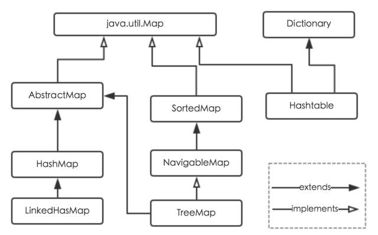
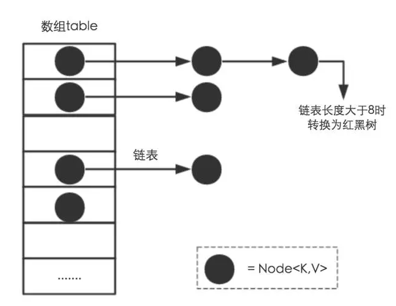
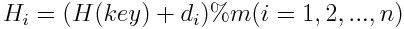
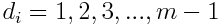
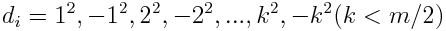
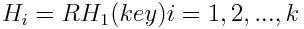
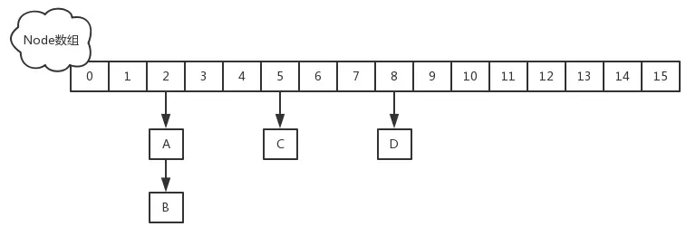

## 数据结构

<!-- TOC -->

- [数据结构](#数据结构)
- [Hash](#hash)
    - [HashTable,HashMap,ConcurrentHashMap,LinkedhashMap和TreeMap](#hashtablehashmapconcurrenthashmaplinkedhashmap和treemap)
    - [HashMap存储结构](#hashmap存储结构)
    - [HashMap的功能方法](#hashmap的功能方法)
    - [hash表查找为什么快?](#hash表查找为什么快)
        - [背景知识](#背景知识)
    - [解决Hash冲突](#解决hash冲突)
        - [**hash算法比较**](#hash算法比较)
    - [ConcurrentHashMap](#concurrenthashmap)
- [树](#树)
    - [B树 B+树 红黑树](#b树-b树-红黑树)
    - [二叉树遍历](#二叉树遍历)
- [链表List](#链表list)
    - [ArrayList和LinkedList比较](#arraylist和linkedlist比较)
        - [总结](#总结)
- [参考](#参考)

<!-- /TOC -->

## Hash
### HashTable,HashMap,ConcurrentHashMap,LinkedhashMap和TreeMap
> HashTable是线程安全的，如果不需要线程安全，则推荐使用HashMap，如果线程高度并发，则推荐使用ConcurrentHashMap。  

<div align="center"></div></br>  

* HashMap  
    它根据键的hashCode值存储数据，大多数情况下可以直接定位到它的值，因而具有很快的访问速度，但遍历顺序却是不确定的。 HashMap最多只允许一条记录的键为null，允许多条记录的值为null。HashMap非线程安全，即任一时刻可以有多个线程同时写HashMap，可能会导致数据的不一致。如果需要满足线程安全，可以用 Collections的synchronizedMap方法使HashMap具有线程安全的能力，或者使用ConcurrentHashMap。  

* HashTable  
    Hashtable是**遗留类**，很多映射的常用功能与HashMap类似，不同的是它承自Dictionary类，并且是线程安全的，任一时间只有一个线程能写Hashtable，并发性不如ConcurrentHashMap，因为ConcurrentHashMap引入了分段锁。Hashtable不建议在新代码中使用，不需要线程安全的场合可以用HashMap替换，需要线程安全的场合可以用ConcurrentHashMap替换。

* LinkedHashMap  
    LinkedHashMap是HashMap的一个子类，保存了记录的插入顺序，在用Iterator遍历LinkedHashMap时，先得到的记录肯定是先插入的，也可以在构造时带参数，按照访问次序排序。

* TreeMap  
    TreeMap实现SortedMap接口，能够把它保存的记录根据键排序，默认是按键值的升序排序，也可以指定排序的比较器，当用Iterator遍历TreeMap时，得到的记录是排过序的。如果使用排序的映射，建议使用TreeMap。在使用TreeMap时，key必须实现Comparable接口或者在构造TreeMap传入自定义的Comparator，否则会在运行时抛出java.lang.ClassCastException类型的异常。非线程安全，当多个线程应如下：
    ```java
    SortedMap m = Collections.synchronizedSortedMap(new TreeMap(...))
    ```

名称 | 是否线程安全 | 数据结构 | 父类 | 继承接口 
---|---|---|---|---|
HashTable | 是 | | Dictionary | Map
HashMap | 否 | 数组、链表和红黑树(JDK1.8加入) | AbstractMap | Map
ConcurrentHashMap | 是 | | AbstractMap | ConcurrentMap
TreeMap | 否 | 红黑树 | AbstractMap | NavigableMap

### HashMap存储结构
HashMap是数组+链表+红黑树（JDK1.8增加了红黑树部分）实现的,如下图：  
<div align="center"></div></br>  

* Node类  
    Node[] table, 即Hash桶数组。Node是HashMap中的一个内部类,实现了Map.Entry接口,本质就是一个键值映射, 上图中黑色圆点就是一个Node
    ```java
    transient Node<K,V>[] table;
    ```

    ```java
     /**
     * Basic hash bin node, used for most entries.  (See below for
     * TreeNode subclass, and in LinkedHashMap for its Entry subclass.)
     */
    static class Node<K,V> implements Map.Entry<K,V> {
        final int hash;
        final K key;
        V value;
        Node<K,V> next;

        Node(int hash, K key, V value, Node<K,V> next) {
            this.hash = hash;
            this.key = key;
            this.value = value;
            this.next = next;
        }

        public final K getKey()        { return key; }
        public final V getValue()      { return value; }
        public final String toString() { return key + "=" + value; }

        public final int hashCode() {
            return Objects.hashCode(key) ^ Objects.hashCode(value);
        }

        public final V setValue(V newValue) {
            V oldValue = value;
            value = newValue;
            return oldValue;
        }

        public final boolean equals(Object o) {
            if (o == this)
                return true;
            if (o instanceof Map.Entry) {
                Map.Entry<?,?> e = (Map.Entry<?,?>)o;
                if (Objects.equals(key, e.getKey()) &&
                    Objects.equals(value, e.getValue()))
                    return true;
            }
            return false;
        }
    }
    ```

* 存储  
    HashMap使用哈希表来存储.哈希表为解决冲突,可以采用开放地址法和链表法, 这里HashMap使用的**链表法**。  
    如果哈希桶数组很大，即使较差的Hash算法也会比较分散，如果哈希桶数组数组很小，即使好的Hash算法也会出现较多碰撞，所以就需要在**空间成本和时间成本**之间权衡，其实就是在根据实际情况确定哈希桶数组的大小，并在此基础上设计好的hash算法减少Hash碰撞。那么通过什么方式来控制map使得Hash碰撞的概率又小，哈希桶数组（Node[] table）占用空间又少呢？答案就是好的Hash算法和扩容机制。


### HashMap的功能方法
* hash()  
    Hash算法本质上就三步：取key的hashCode值、高位运算、取模运算。
    ```java
    //方法一
    static final int hash(Object key) {
        int h;
        // h = key.hashCode() 为第一步 取hashCode值
        // h ^ (h >>> 16)  为第二步 高位参与运算
        return (key == null) ? 0 : (h = key.hashCode()) ^ (h >>> 16);
    }
    //方法二：
    static int indexFor(int h, int length) {  //jdk1.7的源码，  jdk1.8没有这个方法，但是实现原理一样的
     return h & (length-1);  //第三步 取模运算
    }
    ```
    对于任意给定的对象，只要它的hashCode()返回值相同，那么程序调用方法一所计算得到的Hash码值总是相同的。我们首先想到的就是把hash值对数组长度取模运算，这样一来，元素的分布相对来说是比较均匀的。但是，模运算的消耗还是比较大的，在HashMap中是这样做的：调用方法二来计算该对象应该保存在table数组的哪个索引处。  
    这个方法非常巧妙，它通过h & (table.length -1)来得到该对象的保存位，而HashMap底层数组的长度总是2的n次方，这是HashMap在速度上的优化。当length总是2的n次方时，h& (length-1)运算等价于对length取模，也就是h%length，但是&比%具有更高的效率。  
    在JDK1.8的实现中，优化了高位运算的算法，通过hashCode()的高16位异或低16位实现的：(h = k.hashCode()) ^ (h >>> 16)，主要是从速度、功效、质量来考虑的，这么做可以在数组table的length比较小的时候，也能保证考虑到高低Bit都参与到Hash的计算中，同时不会有太大的开销。  
    
* put() 
    <div align="center"></div> 
    

* resize()


### hash表查找为什么快?
#### 背景知识
* 数组是一个简单的线性序列，这使得元素访问非常快速。

### 解决Hash冲突
* [链表法](https://www.cs.usfca.edu/~galles/visualization/OpenHash.html)  
将所有hash地址为i的元素构成一个称为同义词链的单链表，并将单链表的头指针存在hash表的第i个元素中。因为查找、插入和删除主要在同义词链中进行，所以链表法比较适合经常进行插入和删除的情况。
* [开放地址法(再散列法)](https://www.cs.usfca.edu/~galles/visualization/ClosedHash.html)  
    当关键字key的hash地址p=H(key)出现冲突时，以p为基础，产生另一个hash地址p1，如果p1仍然冲突，再以p为基础，产生另一个hash地址p2，... ，知道产生不冲突的hash地址pi，通用再散列函数形式：  
    <div align="center"></div>  
    其中H(key)为hash函数，m为表长，di称为增量序列。增量序列的取值方式不同，相应的再散列方式不同。主要以下三种：  

    * 线性探测再散列  
        <div align="center"></div>  
        冲突发生时，顺序查看表中下一单元，直到找出一个空单元或查遍全表。  

    * 二次探测再散列  
        <div align="center"></div>  
        冲突发生时，在表的左右进行跳跃式探测，比较灵活。

    * 伪随机探测再散列
        di=伪随机序列。  
        具体实现时，建立一个伪随机数发生器，如i=(i+p)%m，并给定一个随机数做起点。  
        例如，已知哈希表长度m=11，哈希函数为：H（key）= key  %  11，则H（47）=3，H（26）=4，H（60）=5，假设下一个关键字为69，则H（69）=3，与47冲突。  
        如果用线性探测再散列处理冲突，下一个哈希地址为H1=（3 + 1）% 11 = 4，仍然冲突，再找下一个哈希地址为H2=（3 + 2）% 11 = 5，还是冲突，继续找下一个哈希地址为H3=（3 + 3）% 11 = 6，此时不再冲突，将69填入5号单元。  
        如果用二次探测再散列处理冲突，下一个哈希地址为H1=（3 + 12）% 11 = 4，仍然冲突，再找下一个哈希地址为H2=（3 - 12）% 11 = 2，此时不再冲突，将69填入2号单元。  
        如果用伪随机探测再散列处理冲突，且伪随机数序列为：2，5，9，……..，则下一个哈希地址为H1=（3 + 2）% 11 = 5，仍然冲突，再找下一个哈希地址为H2=（3 + 5）% 11 = 8，此时不再冲突，将69填入8号单元。  
* 再哈希法  
    同时构造多个不同的哈希函数：
    <div align="center"></div>  
    当哈希地址Hi=RH1（key）发生冲突时，再计算Hi=RH2（key），……，直到冲突不再产生。这种方法不易产生聚集，但增加了计算时间。


#### **hash算法比较**
* 开放散列（open hashing）/ 拉链法（针对桶链结构）
    * 优点
        * 对于记录总数频繁可变的情况，处理的比较好（也就是避免了动态调整的开销）  
        * 由于记录存储在结点中，而结点是动态分配，不会造成内存的浪费，所以尤其适合那种记录本身尺寸（size）很大的情况，因为此时指针的开销可以忽略不计了  
        * 删除记录时，比较方便，直接通过指针操作即可
    * 缺点
        * 存储的记录是随机分布在内存中的，这样在查询记录时，相比结构紧凑的数据类型（比如数组），哈希表的跳转访问会带来额外的时间开销  
        * 如果所有的 key-value 对是可以提前预知，并之后不会发生变化时（即不允许插入和删除），可以人为创建一个不会产生冲突的完美哈希函数（perfect hash function），此时封闭散列的性能将远高于开放散列  
        * 由于使用指针，记录不容易进行序列化（serialize）操作

* 封闭散列（closed hashing）/ 开放定址法
    * 优点
        * 记录更容易进行序列化（serialize）操作  
        * 如果记录总数可以预知，可以创建完美哈希函数，此时处理数据的效率是非常高的
    * 缺点
        * 存储记录的数目不能超过桶数组的长度，如果超过就需要扩容，而扩容会导致某次操作的时间成本飙升，这在实时或者交互式应用中可能会是一个严重的缺陷  
        * 使用探测序列，有可能其计算的时间成本过高，导致哈希表的处理性能降低  
        * 由于记录是存放在桶数组中的，而桶数组必然存在空槽，所以当记录本身尺寸（size）很大并且记录总数规模很大时，空槽占用的空间会导致明显的内存浪费  
        * 删除记录时，比较麻烦。比如需要删除记录a，记录b是在a之后插入桶数组的，但是和记录a有冲突，是通过探测序列再次跳转找到的地址，所以如果直接删除a，a的位置变为空槽，而空槽是查询记录失败的终止条件，这样会导致记录b在a的位置重新插入数据前不可见，所以不能直接删除a，而是设置删除标记。这就需要额外的空间和操作。

### ConcurrentHashMap
JDK1.8的实现已经摒弃了Segment的概念，而是直接用Node数组+链表+红黑树的数据结构来实现，并发控制使用 __Synchronized__ 和 __CAS__ ([Compare and swap](https://blog.csdn.net/u010412719/article/details/52053390))来操作，整个看起来就像是优化过且线程安全的HashMap，虽然在JDK1.8中还能看到Segment的数据结构，但是已经简化了属性，只是为了兼容旧版本。
__CAS__ 有3个操作数，分别为内存值V、旧的期望值A和新值B。当且仅当期望值A和内存值V相同时，处理器用新值B更新V的值，否则什么都不做。

<div align="center"></div>  

1. JDK1.8的实现降低锁的粒度，JDK1.7版本锁的粒度是基于Segment的，包含多个HashEntry，而JDK1.8锁的粒度就是HashEntry（首节点）
2. JDK1.8版本的数据结构变得更加简单，使得操作也更加清晰流畅，因为已经使用synchronized来进行同步，所以不需要分段锁的概念，也就不需要Segment这种数据结构了，由于粒度的降低，实现的复杂度也增加了
3. JDK1.8使用红黑树来优化链表，基于长度很长的链表的遍历是一个很漫长的过程，而红黑树的遍历效率是很快的，代替一定阈值的链表，这样形成一个最佳拍档
4. JDK1.8为什么使用内置锁synchronized来代替重入锁ReentrantLock，我觉得有以下几点：
    * 因为粒度降低了，在相对而言的低粒度加锁方式，synchronized并不比ReentrantLock差，在粗粒度加锁中ReentrantLock可能通过Condition来控制各个低粒度的边界，更加的灵活，而在低粒度中，Condition的优势就没有了
    * JVM的开发团队从来都没有放弃synchronized，而且基于JVM的synchronized优化空间更大，使用内嵌的关键字比使用API更加自然
    * 在大量的数据操作下，对于JVM的内存压力，基于API的ReentrantLock会开销更多的内存，虽然不是瓶颈，但是也是一个选择依据


## 树

### B树 B+树 红黑树


### 二叉树遍历
<div align="center"></div>  

* 前序遍历：ABDECF
    1. 访问根节点
    2. 前序遍历左子树
    3. 前序遍历右子树

* 中序遍历：DBEAFC
    1. 中序遍历左子树
    2. 访问根节点
    3. 中序遍历右子树

* 后序遍历：DEBFCA
    1. 后序遍历左子树
    2. 后序遍历右子树
    3. 访问根节点

## 链表List

> “简单不先于复杂，而是在复杂之后.” —— Alan Perlis

### ArrayList和LinkedList比较
ArrayList和LinkedList都是实现了List接口的类，他们都是元素的容器，用于存放对象的引用；

他们都可以对存放的元素进行增删改查的操作，还可以进行排序。

但是，他们还是有区别的。

除了实现对List接口的实现，他们还实现了其他的接口，由此造就了他们之间的差异；

* ArrayList
内部使用数组的形式实现了存储，实现了RandomAccess接口，利用数组的下面进行元素的访问，因此对元素的随机访问速度非常快。
因为是数组，所以ArrayList在初始化的时候，有初始大小10，插入新元素的时候，会判断是否需要扩容，扩容的步长是0.5倍原容量，扩容方式是利用数组的复制，因此有一定的开销；
另外，ArrayList在进行元素插入的时候，需要移动插入位置之后的所有元素，位置越靠前，需要位移的元素越多，开销越大，相反，插入位置越靠后的话，开销就越小了，如果在最后面进行插入，那就不需要进行位移；

* LinkedList
内部使用双向链表的结构实现存储，LinkedList有一个内部类作为存放元素的单元，里面有三个属性，用来存放元素本身以及前后2个单元的引用，另外LinkedList内部还有一个header属性，用来标识起始位置，LinkedList的第一个单元和最后一个单元都会指向header，因此形成了一个双向的链表结构。
LinkedList是采用双向链表实现的。所以它也具有链表的特点，每一个元素（结点）的地址不连续，通过引用找到当前结点的上一个结点和下一个结点，即插入和删除效率较高，只需要常数时间，而get和set则较为低效。
LinkedList的方法和使用和ArrayList大致相同，由于LinkedList是链表实现的，所以额外提供了在头部和尾部添加/删除元素的方法，也没有ArrayList扩容的问题了。另外，ArrayList和LinkedList都可以实现栈、队列等数据结构，但LinkedList本身实现了队列的接口，所以更推荐用LinkedList来实现队列和栈。


#### 总结
名称 | 优点 | 缺点 | 
-- | -- | -- | 
ArrayList | 基于数组，查找快 | 插入和删除越靠前的元素越耗费资源，插入数据超过大小需要resize | 
LinkedList | 插入和删除很快，没有resize的问题 | 基于双向链表结构，元素物理存储不是有序的，所以查找慢(get和set)。 |
## 参考
* 《Java编程思想》(第四版)
* [Java 8系列之重新认识HashMap](https://tech.meituan.com/java-hashmap.html)
* [集合类HashMap，HashTable，ConcurrentHashMap区别？](https://juejin.im/post/5add97a46fb9a07aa212f4c0)
* [Java基础 ArrayList与LinkedList区别](https://www.jianshu.com/p/30a8195f0b81)