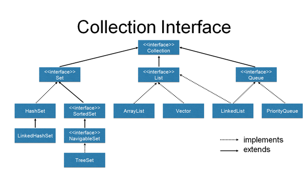

## 与java有关的面试题目

<!-- TOC -->

- [与java有关的面试题目](#与java有关的面试题目)
- [JVM相关](#jvm相关)
    - [能不能自己写个类叫java.lang.System？](#能不能自己写个类叫javalangsystem)
    - [什么情况下会产生Minor GC?](#什么情况下会产生minor-gc)
    - [什么情况下会产生Full GC?](#什么情况下会产生full-gc)
    - [JDK1.8 用的什么GC,有什么改进？](#jdk18-用的什么gc有什么改进)
    - [finalize() 什么时候被调用？作用是什么？](#finalize-什么时候被调用作用是什么)
    - [讲对象置为null，该对象是不是会立即被回收？](#讲对象置为null该对象是不是会立即被回收)
- [Java基础](#java基础)
    - [接口和抽象类的区别](#接口和抽象类的区别)
    - [sychronized方法和代码块](#sychronized方法和代码块)
    - [String, StringBuffer, StringBuilder](#string-stringbuffer-stringbuilder)
        - [String](#string)
        - [StringBuilder](#stringbuilder)
        - [StringBuffer](#stringbuffer)
        - [常见面试题](#常见面试题)
    - [Iterator和ListIterator的区别是什么？](#iterator和listiterator的区别是什么)
    - [Enumeration和Iterator](#enumeration和iterator)
    - [快速失败(fast-failed)和快速安全(fast-safe)](#快速失败fast-failed和快速安全fast-safe)
    - [Comparable和Comparator](#comparable和comparator)
    - [HashMap和HashTable却别](#hashmap和hashtable却别)
    - [java两种异常](#java两种异常)
        - [unchecked && checked](#unchecked--checked)
        - [Exception && Error](#exception--error)
        - [throw &&throws](#throw-throws)
        - [处理完异常后Exception对象会怎样？](#处理完异常后exception对象会怎样)
        - [finally finalize()区别](#finally-finalize区别)
        - [try-catch-finally-return执行顺序](#try-catch-finally-return执行顺序)
- [操作系统](#操作系统)
    - [进程和线程的却别](#进程和线程的却别)
    - [死锁](#死锁)
    - [如何确保N个线程可以访问N个资源同时又不导致死锁？](#如何确保n个线程可以访问n个资源同时又不导致死锁)
    - [java.util.Collection](#javautilcollection)

<!-- /TOC -->

## JVM相关
### 能不能自己写个类叫java.lang.System？

* 答案：
    ~~通常不可以，但可以采取另类方法达到这个需求。~~ 
* 解释：
    ~~为了不让我们写System类，类加载采用委托机制，这样可以保证爸爸们优先，爸爸们能找到的类，儿子就没有机会加载。而System类是 __Bootstrap__ 加载器加载的，就算自己重写，也总是使用Java系统提供的System，自己写的System类根本没有机会得到加载。~~
* 方法
    ~~我们可以自己定义一个类加载器来达到这个目的，为了避免双亲委托机制，这个类加载器也必须是特殊的。由于系统自带的三个类加载器都加载特定目录下的类，如果我们自己的类加载器放在一个特殊的目录，那么系统的加载器就无法加载，也就是最终还是由我们自己的加载器加载。~~

* 答案：不可以,不能自己写以"java."开头的类，其要么不能加载进内存，要么即使你用自定义的类加载器去强行加载，也会收到一个SecurityException。
* 解释：
    类加载器是有层次的，一般是：
    自定义类加载器 >> 应用程序类加载器(System ClassLoader) >> 扩展类加载器(Extention ClassLoader) >> 启动类加载器(Bootstrap ClassLoader)

    详细介绍请看[JVM](jvm.md#类加载器)

    **双亲委托机制**：如果一个类加载器收到了类加载的请求，它首先不会自己尝试去加载这个类，而是把这个请求委派给父类加载器，每一个层次的类加载器都是加此，因此所有的加载请求最终到达顶层的启动类加载器，只有当父类加载器反馈自己无法完成加载请求时（指它的搜索范围没有找到所需的类），子类加载器才会尝试自己去加载。
    


### 什么情况下会产生Minor GC?
Eden区满时
### 什么情况下会产生Full GC?
详细请看[Java虚拟机](jvm.md)中JVM内存结构的java堆
<div align="center"></div></br> 

* System.gc() 
    建议JVM Full GC，但是不一定，具体什么时候gc是由JVM决定的，能不用尽量不用。
* 老年代空间不足
    * 原因
        老年代空间只有在新生代对象转入及创建为大对象、大数组时才会出现不足的现象，当执行Full GC后空间仍然不足，则抛出如下错误：
        ```shell
        java.lang.OutOfMemoryError: Java heap space 
        ```
    * 措施
        为避免以上两种状况引起的Full GC，调优时应尽量做到让对象在Minor GC阶段被回收、让对象在新生代多存活一段时间及不要创建过大的对象及数组。
* ~~永久区空间不足~~
    * 原因
        Permanet Generation中存放的为一些class的信息、常量、静态变量等数据，当系统中要加载的类、反射的类和调用的方法较多时，Permanet Generation可能会被占满，在未配置为采用CMS GC的情况下也会执行Full GC。如果经过Full GC仍然回收不了，那么JVM会抛出如下错误信息：
        ```shell
        java.lang.OutOfMemoryError: PermGen space 
        ```
    * 措施
        为避免Perm Gen占满造成Full GC现象，可采用的方法为增大Perm Gen空间或转为使用CMS GC。
* CMS GC时出现promotion failed和concurrent mode failure
    * 介绍
        对于采用CMS进行老年代GC的程序而言，尤其要注意GC日志中是否有promotion failed和concurrent mode failure两种状况，当这两种状况出现时可能会触发Full GC。
    * 原因
        promotion failed是在进行Minor GC时，survivor space放不下、对象只能放入老年代，而此时老年代也放不下造成的；
        concurrent mode failure是在执行CMS GC的过程中同时有对象要放入老年代，而此时老年代空间不足造成的（有时候“空间不足”是CMS GC时当前的浮动垃圾过多导致暂时性的空间不足触发Full GC）。
    * 措施
        增大survivor space、老年代空间或调低触发并发GC的比率
    
* 统计得到的Minor GC晋升到旧生代的平均大小大于旧生代的剩余空间
    这是一个较为复杂的触发情况，Hotspot为了避免由于新生代对象晋升到旧生代导致旧生代空间不足的现象，在进行Minor GC时，做了一个判断，如果之前统计所得到的Minor GC晋升到旧生代的平均大小大于旧生代的剩余空间，那么就直接触发Full GC。

### JDK1.8 用的什么GC,有什么改进？
有经验的同学会发现，对永久代的调优过程非常困难，永久代的大小很难确定，其中涉及到太多因素，如类的总数、常量池大小和方法数量等，而且永久代的数据可能会随着每一次Full GC而发生移动。
而在JDK8中，类的元数据保存在本地内存中，元空间的最大可分配空间就是系统可用内存空间，可以避免永久代的内存溢出问题，不过需要监控内存的消耗情况，一旦发生内存泄漏，会占用大量的本地内存。

* 优势
    permSize：原来的jar包及你自己项目的class存放的内存空间，这部分空间是固定的，启动参数里面-permSize确定，如果你的jar包很多，经常会遇到permSize溢出，且每个项目都会占用自己的permGen空间改成metaSpaces，各个项目会共享同样的class内存空间，比如两个项目都用了fast-json开源包，在mentaSpaces里面只存一份class，提高内存利用率，且更利于垃圾回收
<div align="center"></div></br> 
<div align="center"></div></br> 

### finalize() 什么时候被调用？作用是什么？
垃圾回收器(garbage collector)决定回收某对象时，就会运行该对象的finalize()方法 但是在Java中很不幸，如果内存总是充足的，那么垃圾回收可能永远不会进行，也就是说filalize()可能永远不被执行，显然指望它做收尾工作是靠不住的。 那么finalize()究竟是做什么的呢？它最主要的用途是回收特殊渠道申请的内存。Java程序有垃圾回收器，所以一般情况下内存问题不用程序员操心。但有一种JNI(Java Native Interface)调用non-Java程序（C或C++），finalize()的工作就是回收这部分的内存。

### 讲对象置为null，该对象是不是会立即被回收？
不会，在下一个垃圾回收周期中，这个对象将是可被回收的。

## Java基础
### 接口和抽象类的区别
* 接口不能实例化，抽象类可以
* 一个类可以继承(implements)多个接口，但只能继承(extends)一个类
* 接口中声明的变量默认为final，抽象类中的可以不是final
* 接口中的方法都是public，抽象类的方法可以是private, protected或者public
* 接口中方法都是abstract, 抽象类的可以为abstract也可以不是
* 抽象类可以在不提供方法实现的情况下实现接口

### sychronized方法和代码块
* 同步方法
    通过this找到当前对象,将当前对象上锁
* 同步代码块
    synchronized（object）{代码内容}。可以指定任意一个对象,更加细粒度。

### String, StringBuffer, StringBuilder
#### String 
* String类是final类
* 对String对象的任何改变都不影响到原对象，相关的任何change
操作都会生成新的对象

#### StringBuilder
```java
public class Main {
         
    public static void main(String[] args) {
        String string = "";
        for(int i=0;i<10000;i++){
            string += "hello";
        }
    }
}
```
对于String += "hello",会将原有的string变量指向的对象内容取出与"hello"作字符串相加操作再存进另一个新的String对象当中，再让string变量指向新生成的对象。

上述代码会生成10000个对象，造成内存浪费。所以JVM会将上述代码优化为以下,只生成一个对象：
```java
public class Main {
         
    public static void main(String[] args) {
        StringBuilder stringBuilder = new StringBuilder();
        for(int i=0;i<10000;i++){
            stringBuilder.append("hello");
        }
    }
}
```
#### StringBuffer
相比较于StringBuilder，加了synchronize 线程安全。


#### 常见面试题
1. 下面这段代码的输出结果是什么？
    ```java
    String a = "hello2"; 　　
    String b = "hello" + 2; 
    System.out.println((a == b));
    ```
    输出结果为：true。原因很简单，"hello"+2在编译期间就已经被优化成"hello2"，因此在运行期间，变量a和变量b指向的是同一个对象。

2. 下面这段代码的输出结果是什么？
    ```java
    String a = "hello2"; 　  
    String b = "hello";       
    String c = b + 2;       
    System.out.println((a == c));
    ```
    输出结果为:false。由于有符号引用的存在，所以  String c = b + 2;不会在编译期间被优化，不会把b+2当做字面常量来处理的，因此这种方式生成的对象事实上是保存在堆上的。因此a和c指向的并不是同一个对象。

3. 下面这段代码的输出结果是什么？
    ```java
    String a = "hello2";   　 
    final String b = "hello";       
    String c = b + 2;       
    System.out.println((a == c));
    ```
    输出结果为：true。对于被final修饰的变量，会在class文件常量池中保存一个副本，也就是说不会通过连接而进行访问，对final变量的访问在编译期间都会直接被替代为真实的值。那么String c = b + 2;在编译期间就会被优化成：String c = "hello" + 2
4. 下面代码运行结果：
```java
public class Main {
    public static void main(String[] args) {
        String a = "hello2";
        final String b = getHello();
        String c = b + 2;
        System.out.println((a == c));
    }
     
    public static String getHello() {
        return "hello";
    }
}
```
输出结果为false。这里面虽然将b用final修饰了，但是由于其赋值是通过方法调用返回的，那么它的值只能在运行期间确定，因此a和c指向的不是同一个对象。

5. 下面代码运行结果
```java
public class Main {
    public static void main(String[] args) {
        String a = "hello";
        String b =  new String("hello");
        String c =  new String("hello");
        String d = b.intern();
         
        System.out.println(a==b);
        System.out.println(b==c);
        System.out.println(b==d);
        System.out.println(a==d);
    }
}
```
```shell
false
false
false
true
```
这里面涉及到的是String.intern方法的使用。在String类中，intern方法是一个本地方法，在JAVA SE6之前，intern方法会在运行时常量池中查找是否存在内容相同的字符串，如果存在则返回指向该字符串的引用，如果不存在，则会将该字符串入池，并返回一个指向该字符串的引用。因此，a和d指向的是同一个对象。

6. String str = new String("abc")创建了多少个对象？
有争议，涉及到两个对象"abc"常量和str对象。

7. 下面这段代码1）和2）的区别是什么？
```java
public class Main {
    public static void main(String[] args) {
        String str1 = "I";
        //str1 += "love"+"java";        1
        str1 = str1+"love"+"java";      //2
         
    }
}
```
代码1效率比代码2要高，因为代码1会在编译过程中优化为str1 += "lovajava",代码2不会。

### Iterator和ListIterator的区别是什么？
* Iterator可用来遍历Set和List集合，但是ListIterator只能用来遍历List。
* Iterator对集合只能是前向遍历，ListIterator既可以前向也可以后向。
* ListIterator实现了Iterator接口，并包含其他的功能，比如：增加元素，替换元素，获取前一个和后一个元素的索引，等等。 

### Enumeration和Iterator
Enumeration速度是Iterator的2倍，占用内存更小，但是Iterator比Enumeration更安全，别的线程无法修改Iterator遍历的对象，同时Iterator允许遍历对象修改底层内部的数据，Enumeration不行。

### 快速失败(fast-failed)和快速安全(fast-safe)
* fail-fast
    * 表现
    再用迭代器遍历集合中的对象时，如果遍历过程中对集合中对象的结构进行了修改(增加、删除)，则会跑出ConcurrentModifyExecption。
    * 原因
    迭代器在遍历的时候，会使用modCount的变量，当遍历过程中对象结构发生变化就会改变modCount的值，当迭代器使用hasNext()/next()遍历下一个对象的时候，会比较expectedModCount与modCount的值，如果不匹配，就会跑出异常。
    * 注意
    这里异常的抛出条件是检测到 modCount！=expectedmodCount 这个条件。如果集合发生变化时修改modCount值刚好又设置为了expectedmodCount值，则异常不会抛出。因此，不能依赖于这个异常是否抛出而进行并发操作的编程，这个异常只建议用于检测并发修改的bug。
    * 场景
    java.util包下的集合类都是快速失败的，不能在多线程下发生并发修改（迭代过程中被修改）。
* fail-safe
    * 表现
    采用安全失败机制的集合容器，在遍历时不是直接在集合元素上访问的，而是先生成集合对象的拷贝,在拷贝的集合上遍历。
    * 原理
    由于在遍历时对原集合进行了拷贝，所以修改原集合的值并不会检测到,所以不会触发ConcurrentModifyExecption。
    * 缺点
    基于拷贝内容的优点是避免了Concurrent Modification Exception，但同样地，迭代器并不能访问到修改后的内容，即：迭代器遍历的是开始遍历那一刻拿到的集合拷贝，在遍历期间原集合发生的修改迭代器是不知道的。
    所以ConcurrentHashMap是弱一致性的。
    * 场景 
    java.util.concurrent包下的容器都是安全失败，可以在多线程下并发使用，并发修改。

### Comparable和Comparator
参数 | Comparable | Comparator
-- | -- | --
排序逻辑 | 排序逻辑必须在待排序对象的类中，故称之为自然排序 | 排序逻辑在另一个实现
实现 | 实现Comparable接口 | 实现Comparator接口
排序方法 | int compareTo(Object o1) | 	int compare(Object o1,Object o2)
触发排序 | Collection.sort(List) | Collection.sort(List, Comparator)
接口所在包 | java.util.Comparable | java.util.Comparator

### HashMap和HashTable却别
* HashMap允许key或值为null，HashTable不行
* HashTable线程安全
* HashTable实现了对键的列举(Enumeration)

### java两种异常
#### unchecked && checked
* 未检查异常(Runtime Exception && )
运行异常的特点是Java编译器不去检查它，也就是说，当程序中可能出现这类异常时，即使没有用try...catch语句捕获它，也没有用throws字句声明抛出它，还是会编译通过。
* 受检查异常(Checked Exception)
除了RuntimeException和Error外，其他异常都属于受检查异常，这种异常的特点是要么用try...catch捕获处理，要么用throws语句声明抛出，否则编译不会通过。

#### Exception && Error
* 相同点
    都是继承自Throwable, RuntimeException继承自Exception
* Exception
    * Runtime Exception
    其特点是Java编译器不去检查它，也就是说，当程序中可能出现这类异常时，即使没有用try……catch捕获，也没有用throws抛出，还是会编译通过，如除数为零的ArithmeticException、错误的类型转换、数组越界访问和试图访问空指针等。处理RuntimeException的原则是：如果出现RuntimeException，那么一定是程序员的错误。
    * Checked Exception
    Exception类表示程序可以处理的异常，可以捕获且可能恢复。遇到这类异常，应该尽可能处理异常，使程序恢复运行，而不应该随意终止异常。
* Error
    __Error类一般是指与虚拟机相关的问题__，如系统崩溃，虚拟机错误，内存空间不足，方法调用栈溢出等。如java.lang.StackOverFlowError和Java.lang.OutOfMemoryError。对于这类错误，Java编译器不去检查他们。对于这类错误的导致的应用程序中断，仅靠程序本身无法恢复和预防，遇到这样的错误，建议让程序终止。

#### throw &&throws
* throw 是用来抛出任意异常的，你可以抛出任意 Throwable，包括自定义的异常类对象；
* throws总是出现在一个函数头中，用来标明该成员函数可能抛出的各种异常。如果方法抛出了异常，那么调用这个方法的时候就需要处理这个异常。

#### 处理完异常后Exception对象会怎样？
在下一次GC的时候被回收掉

#### finally finalize()区别
* finally和try catch一起，不管是否抛出异常finally都会执行
* finnalize()
垃圾回收器(garbage collector)决定回收某对象时，就会运行该对象的finalize()方法 但是在Java中很不幸，如果内存总是充足的，那么垃圾回收可能永远不会进行，也就是说filalize()可能永远不被执行，显然指望它做收尾工作是靠不住的。 那么finalize()究竟是做什么的呢？它最主要的用途是回收特殊渠道申请的内存。Java程序有垃圾回收器，所以一般情况下内存问题不用程序员操心。但有一种JNI(Java Native Interface)调用non-Java程序（C或C++），finalize()的工作就是回收这部分的内存。

#### try-catch-finally-return执行顺序
1. 不管是否有异常产生，finally块中代码都会执行；
2. 当try和catch中有return语句时，finally块仍然会执行；
3. finally是在return后面的表达式运算后执行的，所以函数返回值是在finally执行前确定的。无论finally中的代码怎么样，返回的值都不会改变，仍然是之前return语句中保存的值；
4. finally中最好不要包含return，否则程序会提前退出，返回值不是try或catch中保存的返回值。

* 情况1：
    try{} catch(){}finally{} return; 
    按正常顺序执行。

* 情况2：
    try{ return; }catch(){} finally{} return; 
    程序执行try块中return之前（包括return语句中的表达式运算）代码； 
    再执行finally块，最后执行try中return; 
    finally块后面的return语句不再执行。

* 情况3：
    try{ } catch(){return;} finally{} return; 
    程序先执行try，如果遇到异常执行catch块， 
    有异常： 
    则执行catch中return之前（包括return语句中的表达式运算）代码，再执行finally语句中全部代码， 
    最后执行catch块中return. finally块后面的return语句不再执行。 
    无异常： 
    执行完try再finally再执行最后的return语句.

* 情况4：
    try{ return; }catch(){} finally{return;} 
    程序执行try块中return之前（包括return语句中的表达式运算）代码； 
    再执行finally块，因为finally块中有return所以提前退出。

* 情况5：
    try{} catch(){return;}finally{return;} 
    程序执行catch块中return之前（包括return语句中的表达式运算）代码； 
    再执行finally块，因为finally块中有return所以提前退出。

* 情况6：
    try{ return;}catch(){return;} finally{return;} 
    程序执行try块中return之前（包括return语句中的表达式运算）代码； 
    有异常：执行catch块中return之前（包括return语句中的表达式运算）代码； 
    则再执行finally块，因为finally块中有return所以提前退出。 
    无异常：则再执行finally块，因为finally块中有return所以提前退出。

* 分析
    在try语句中，在执行return语句时，要返回的结果已经准备好了，就在此时，程序转到finally执行了。
    在转去之前，try中先把要返回的结果存放到不同于x的局部变量中去，执行完finally之后，在从中取出返回结果，
    因此，即使finally中对变量x进行了改变，但是不会影响返回结果。
    它应该使用栈保存返回值。
## 操作系统
### 进程和线程的却别
* 地址空间和其他资源：
    进程是相互独立的应用，进程可以有多个线程，进程内的线程在其他进程中不可见
* 通信：
    进程间通信IPC，线程间可以通过全局变量来通信---需要进程同步和互斥手段保持数据一致性。
* 调度和切换
    线程的上下文切换比进程快得多
* 多线程OS中，进程是不可执行的实体。

### 死锁
死锁是指多个进程因竞争资源而造成的一种僵局（互相等待），若无外力作用，这些进程都将无法向前推进。
* 互斥条件
    一段时间内一个资源只能被一个进程所占有，如果有其他进程请求就只能等待。
* 不可剥夺：
    一个进程获得的资源在为释放之前，不能被其他进程强行占有。
* 请求和保持条件
    进程已经持有了一个资源，此时还请求另外一个被其他进程占有的资源，就会进入阻塞状态，已有的资源也不会以释放。
* 循环等待
    存在一种进程资源的循环等待链，链中每一个进程已获得的资源同时被 链中下一个进程所请求。

### 如何确保N个线程可以访问N个资源同时又不导致死锁？
使用多线程的时候，一种非常简单的避免死锁的方式就是：指定获取锁的顺序，并强制线程按照指定的顺序获取锁。因此，如果所有的线程都是以同样的顺序加锁和释放锁，就不会出现死锁了。

### java.util.Collection
<div align="center"></div></br> 

<div align="center"></div></br> 

