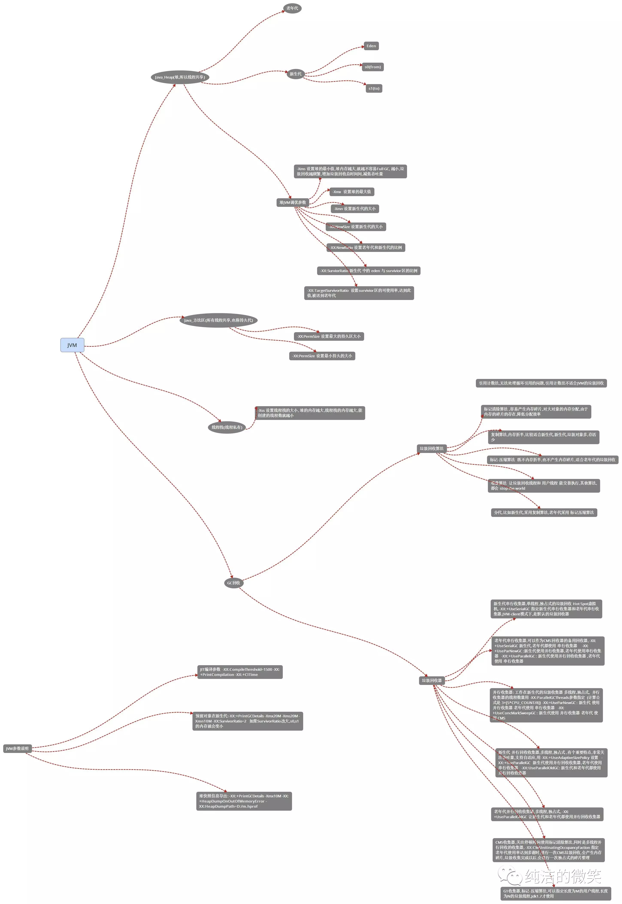

# Java虚拟机

## JVM总体梳理
JVM体系总体分为四大块：
* 类的加载机制
* jvm内存结构
* GC算法 垃圾回收
* GC分析 命令调优

思维导图
<div align="center"></div></br> 

## 类的加载机制
主要关注点：
* 什么是类的加载
* 类的生命周期
* 类加载器
* 双亲委派模型

### 什么是类的加载
类的加载指的是将类的.class文件中的二进制数据读入到内存中，将其放在运行时数据区的方法区内，然后在堆区创建一个java.lang.Class对象，用来封装类在方法区内的数据结构。类的加载的最终产品是位于堆区中的Class对象，Class对象封装了类在方法区内的数据结构，并且向Java程序员提供了访问方法区内的数据结构的接口。

### 类的生命周期
类的生命周期包括这几个部分，加载、连接、初始化、使用和卸载，其中前三部是类的加载的过程,如下图:
<div align="center"></div></br> 

* 加载（Loading）  
查找并加载类的二进制数据，在Java堆中也创建一个java.lang.Class类的对象
* 连接    
    * 验证（Verification）  
    文件格式、元数据、字节码、符号引用验证
    * 准备（Preparation）  
    为类的静态变量分配内存，并将其初始化为默认值  
    * 解析（Resolution）  
    把类中的符号引用转换为直接引用
* 初始化（Initialization）
为类的静态变量赋予正确的初始值
* 使用（Using）  
new出对象程序中使用
* 卸载（Unloading）
执行垃圾回收    
#### 几个小问题
* JVM初始化步骤
    1. 假如这个类还没有被加载和连接，则程序先加载并连接该类
    2. 假如该类的直接父类还没有被初始化，则先初始化其直接父类
    3. 假如类中有初始化语句，则系统依次执行这些初始化语句
* 类初始化时机
    * 创建类的实例，也就是new的方式
    * 访问某个类或接口的静态变量，或者对该静态变量赋值
    * 调用类的静态方法
    * 反射（如Class.forName(“com.shengsiyuan.Test”)）
    * 初始化某个类的子类，则其父类也会被初始化
    * Java虚拟机启动时被标明为启动类的类（Java Test），直接使用java.exe命令来运行某个主类
 
* 哪几种情况下，Java虚拟机将结束生命周期？
    * 执行了System.exit()方法
    * 程序正常执行结束
    * 程序在执行过程中遇到了异常或错误而异常终止
    * 由于操作系统出现错误而导致Java虚拟机进程终止

以上问题答案参考这篇文章[jvm系列(一):java类的加载机制](http://www.cnblogs.com/ityouknow/p/5603287.html)

### 类加载器
<div align="center"> </div></br> 

* __启动类加载器__(Bootstrap ClassLoader)
负责加载存放在JDK\jre\lib(JDK代表JDK的安装目录，下同)下，或被-Xbootclasspath参数指定的路径中的，并且能被虚拟机识别的类库
* __扩展类加载器__(Extension ClassLoader)
该加载器由sun.misc.Launcher$ExtClassLoader实现，它负责加载DK\jre\lib\ext目录中，或者由java.ext.dirs系统变量指定的路径中的所有类库（如javax.*开头的类），开发者可以直接使用扩展类加载器。
* __应用程序类加载器__(Application ClassLoader)
该类加载器由sun.misc.Launcher$AppClassLoader来实现，它负责加载用户类路径（ClassPath）所指定的类，开发者可以直接使用该类加载器

### 类加载机制
* 全盘负责，当一个类加载器负责加载某个Class时，该Class所依赖的和引用的其他Class也将由该类加载器负责载入，除非显示使用另外一个类加载器来载入
* 父类委托，先让父类加载器试图加载该类，只有在父类加载器无法加载该类时才尝试从自己的类路径中加载该类
* 缓存机制，缓存机制将会保证所有加载过的Class都会被缓存，当程序中需要使用某个Class时，类加载器先从缓存区寻找该Class，只有缓存区不存在，系统才会读取该类对应的二进制数据，并将其转换成Class对象，存入缓存区。这就是为什么修改了Class后，必须重启JVM，程序的修改才会生效

## JVM内存结构
主要关注点：
* jvm内存结构都是什么
* 对象分配规则

### jvm内存结构
<div align="center"></div></br> 

> 方法区和堆是所有线程共享的内存区域；而java栈、本地方法栈和程序计数器是运行是线程私有的内存区域。

* Java堆（Heap）
    是Java虚拟机所管理的内存中最大的一块。Java堆是被所有线程共享的一块内存区域，在虚拟机启动时创建。此内存区域的唯一目的就是存放对象实例，__几乎所有的对象实例都在这里分配内存__。
    垃圾收集的主要区域（"GC 堆"）。现代的垃圾收集器基本都是采用分代收集算法，主要思想是针对不同的对象采取不同的垃圾回收算法。虚拟机把 Java 堆分成以下三块：
    * 新生代（Young Generation）
    * 老年代（Old Generation）
    * 永久代（Permanent Generation）
    当一个对象被创建时，它首先进入新生代，之后有可能被转移到老年代中。
    新生代存放着大量的生命很短的对象，因此新生代在三个区域中垃圾回收的频率最高。为了更高效地进行垃圾回收，把新生代继续划分成以下三个空间：
    * Eden（伊甸园）
    * From Survivor（幸存者）
    * To Survivor
    <div align="center"></div></br> 
    Java 堆不需要连续内存，并且可以动态增加其内存，增加失败会抛出 OutOfMemoryError 异常。  

    可以通过 -Xms 和 -Xmx 两个虚拟机参数来指定一个程序的 Java 堆内存大小，第一个参数设置初始值，第二个参数设置最大值。
    ```shell
    java -Xms=1M -Xmx=2M HackTheJava
    ```
* 方法区（Method Area）,方法区（Method Area）与Java堆一样，是各个线程共享的内存区域，它用于存储已被虚拟机加载的类信息、常量、静态变量、即时编译器编译后的代码等数据。
和 Java 堆一样不需要连续的内存，并且可以动态扩展，动态扩展失败一样会抛出 OutOfMemoryError 异常。
对这块区域进行垃圾回收的主要目标是对常量池的回收和对类的卸载，但是一般比较难实现。
JDK 1.7 之前，HotSpot 虚拟机把它当成永久代来进行垃圾回收，JDK 1.8 之后，取消了永久代，用 metaspace（元数据）区替代。
* 程序计数器（Program Counter Register）,程序计数器（Program Counter Register）是一块较小的内存空间，它的作用可以看做是当前线程所执行的字节码的行号指示器。
* 虚拟机栈（JVM Stacks）,与程序计数器一样，Java虚拟机栈（Java Virtual   Machine Stacks）也是线程私有的，它的生命周期与线程相同。虚拟机栈描述的是Java方法执行的内存模型：每个方法被执行的时候都会同时创建一个栈帧（Stack Frame）用于存储局部变量表、操作栈、动态链接、方法出口等信息。每一个方法被调用直至执行完成的过程，就对应着一个栈帧在虚拟机栈中从入栈到出栈的过程。
    <div align="center"></div></br>

    可以通过 -Xss 这个虚拟机参数来指定一个程序的 Java 虚拟机栈内存大小：
    ```shell
    java -Xss=512M HackTheJava
    ```
    该区域可能抛出以下异常：
    * 当线程请求的栈深度超过最大值，会抛出 StackOverflowError 异常；
    * 栈进行动态扩展时如果无法申请到足够内存，会抛出 OutOfMemoryError 异常。
* 本地方法栈（Native Method Stacks）,本地方法栈（Native Method Stacks）与虚拟机栈所发挥的作用是非常相似的，其区别不过是虚拟机栈为虚拟机执行Java方法（也就是字节码）服务，而本地方法栈则是为虚拟机使用到的Native方法服务,不是用 Java 实现。
    <div align="center"></div></br>

### 对象分配规则
* 对象优先分配在Eden区，如果Eden区没有足够的空间时，虚拟机执行一次Minor GC。
* 大对象直接进入老年代（大对象是指需要大量连续内存空间的对象）。这样做的目的是避免在Eden区和两个Survivor区之间发生大量的内存拷贝（新生代采用复制算法收集内存）。
* 长期存活的对象进入老年代。虚拟机为每个对象定义了一个年龄计数器，如果对象经过了1次Minor GC那么对象会进入Survivor区，之后每经过一次Minor GC那么对象的年龄加1，知道达到阀值对象进入老年区。
* 动态判断对象的年龄。如果Survivor区中相同年龄的所有对象大小的总和大于Survivor空间的一半，年龄大于或等于该年龄的对象可以直接进入老年代。
* 空间分配担保。每次进行Minor GC时，JVM会计算Survivor区移至老年区的对象的平均大小，如果这个值大于老年区的剩余值大小则进行一次Full GC，如果小于检查HandlePromotionFailure设置，如果true则只进行Monitor GC,如果false则进行Full GC。 

> 如何通过参数来控制个各个内存区域参考此文章：jvm系列(二):[JVM内存结构](http://www.cnblogs.com/ityouknow/p/5610232.html)


## GC算法 垃圾回收
主要关注点：
* 对象存活判断
* GC算法
* 垃圾回收器
### 对象存活判断
判断对象是否存活一般有两种方式：
* 引用计数：每个对象有一个引用计数属性，新增一个引用时计数加1，引用释放时计数减1，计数为0时可以回收。此方法简单，无法解决对象相互循环引用的问题。
    ```java
    //两个对象出现循环引用的情况下，此时引用计数器永远不为 0，导致无法对它们进行回收
    public class ReferenceCountingGC {
        public Object instance = null;

        public static void main(String[] args) {
            ReferenceCountingGC objectA = new ReferenceCountingGC();
            ReferenceCountingGC objectB = new ReferenceCountingGC();
            objectA.instance = objectB;
            objectB.instance = objectA;
        }
    }
    ```

* 可达性分析（Reachability Analysis）：从GC Roots开始向下搜索，搜索所走过的路径称为引用链。当一个对象到GC Roots没有任何引用链相连时，则证明此对象是不可用的，不可达对象。
    <div align="center"></div></br>

    Java 虚拟机使用该算法来判断对象是否可被回收，在 Java 中 GC Roots 一般包含以下内容：
    * 虚拟机栈中引用的对象
    * 本地方法栈中引用的对象
    * 方法区中类静态属性引用的对象
    * 方法区中的常量引用的对象
* 引用类型
    无论是通过引用计算算法判断对象的引用数量，还是通过可达性分析算法判断对象是否可达，判定对象是否可被回收都与引用有关。
    Java 具有四种强度不同的引用类型。
    * 强引用
        被强引用关联的对象不会被垃圾收集器回收。
        使用 new 一个新对象的方式来创建强引用。
        ```java
        Object obj = new Object();
        ```
    * 软引用
        被软引用关联的对象，只有在内存不够的情况下才会被回收。
        使用 SoftReference 类来创建软引用。
        ```java
        Object obj = new Object();
        SoftReference<Object> sf = new SoftReference<Object>(obj);
        obj = null;  // 使对象只被软引用关联
        ```
    * 弱引用
        被弱引用关联的对象一定会被垃圾收集器回收，也就是说它只能存活到下一次垃圾收集发生之前。
        使用 WeakReference 类来实现弱引用。 
        ```java
        Object obj = new Object();
        WeakReference<Object> wf = new WeakReference<Object>(obj);
        obj = null;
        ```
        WeakHashMap 的 Entry 继承自 WeakReference，主要用来实现缓存。
        ```java
        private static class Entry<K,V> extends WeakReference<Object> implements Map.Entry<K,V>
        ```
        Tomcat 中的 ConcurrentCache 就使用了 WeakHashMap 来实现缓存功能。ConcurrentCache 采取的是分代缓存，经常使用的对象放入 eden 中，而不常用的对象放入 longterm。eden 使用 ConcurrentHashMap 实现，longterm 使用 WeakHashMap，保证了不常使用的对象容易被回收。
        ```java
        public final class ConcurrentCache<K, V> {
        private final int size;
        private final Map<K, V> eden;
        private final Map<K, V> longterm;
        public ConcurrentCache(int size) {
                this.size = size;
                this.eden = new ConcurrentHashMap<>(size);
                this.longterm = new WeakHashMap<>(size);
            }

            public V get(K k) {
                V v = this.eden.get(k);
                if (v == null) {
                    v = this.longterm.get(k);
                    if (v != null)
                        this.eden.put(k, v);
                    }
                return v;
            }

            public void put(K k, V v) {
                if (this.eden.size() >= size) {
                    this.longterm.putAll(this.eden);
                    this.eden.clear();
                }
                this.eden.put(k, v);
            }
        }
        ```
    * 虚引用
        又称为幽灵引用或者幻影引用。一个对象是否有虚引用的存在，完全不会对其生存时间构成影响，也无法通过虚引用取得一个对象实例。
        为一个对象设置虚引用关联的唯一目的就是能在这个对象被收集器回收时收到一个系统通知。
        使用 PhantomReference 来实现虚引用。
        ```java
        Object obj = new Object();
        PhantomReference<Object> pf = new PhantomReference<Object>(obj);
        obj = null;
        ```
### GC算法
GC最基础的算法有三种：标记 -清除算法、复制算法、标记-压缩算法，我们常用的垃圾回收器一般都采用分代收集算法。
* __标记-清除算法__（Mark-Sweep）
    如它的名字一样，算法分为“标记”和“清除”两个阶段：首先标记出所有需要回收的对象，在标记完成后统一回收掉所有被标记的对象。
    <div align="center"></div></br>

    不足：
    * 标记和清除过程效率都不高；
    * 会产生大量不连续的内存碎片，导致无法给大对象分配内存。
* __复制算法__（Copying）
    “复制”的收集算法，它将可用内存按容量划分为大小相等的两块，每次只使用其中的一块。当这一块的内存用完了，就将还存活着的对象复制到另外一块上面，然后再把已使用过的内存空间一次清理掉。
    <div align="center"></div></br>

    主要不足是只使用了内存的一半。

* __标记-整理算法__
    标记过程仍然与“标记-清除”算法一样，但后续步骤不是直接对可回收对象进行清理，而是让所有存活的对象都向一端移动，然后直接清理掉端边界以外的内存
    <div align="center"></div></br>

* __分代收集算法__(Generational Collection)
    一般将 Java 堆分为新生代和老年代。
    * 新生代使用：复制算法
    * 老年代使用：标记 - 清理 或者 标记 - 整理 算法

### 垃圾回收器
* Serial收集器
    <div align="center"></div></br>

    Serial 翻译为串行，也就是说它以串行的方式执行。
    它是单线程的收集器，只会使用一个线程进行垃圾收集工作。
    它的优点是简单高效，对于单个 CPU 环境来说，由于没有线程交互的开销，因此拥有最高的单线程收集效率。
    它是 Client 模式下的默认新生代收集器，因为在用户的桌面应用场景下，分配给虚拟机管理的内存一般来说不会很大。Serial 收集器收集几十兆甚至一两百兆的新生代停顿时间可以控制在一百多毫秒以内，只要不是太频繁，这点停顿是可以接受的。
* ParNew收集器
    <div align="center"></div></br>

    它是 Serial 收集器的多线程版本。

    是 Server 模式下的虚拟机首选新生代收集器，除了性能原因外，主要是因为除了 Serial 收集器，只有它能与 CMS 收集器配合工作。

    默认开启的线程数量与 CPU 数量相同，可以使用 -XX:ParallelGCThreads 参数来设置线程数。
* Parallel收集器，Parallel Scavenge收集器类似ParNew收集器，Parallel收集器更关注系统的吞吐量。
    
* Parallel Old 收集器，Parallel Old是Parallel Scavenge收集器的老年代版本，使用多线程和“标记－整理”算法
* CMS收集器，CMS（Concurrent Mark Sweep）收集器是一种以获取最短回收停顿时间为目标的收集器。
* G1收集器，G1 (Garbage-First)是一款面向服务器的垃圾收集器,主要针对配备多颗处理器及大容量内存的机器. 以极高概率满足GC停顿时间要求的同时,还具备高吞吐量性能特征
# 参考
* 《深入理解Java虚拟机》
* [jvm系列(八):jvm知识点总览](http://www.ityouknow.com/java/2017/03/01/jvm-overview.html)
* [java类的加载机制](http://www.cnblogs.com/ityouknow/p/5603287.html)