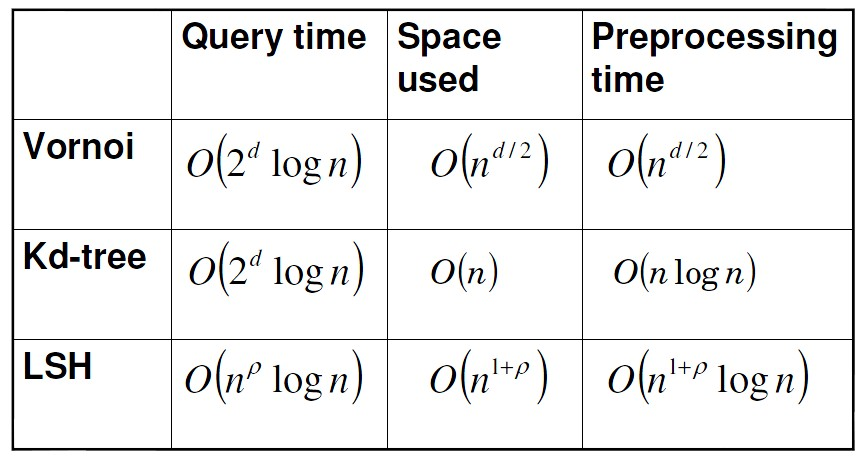

# Apache Lucene

* Apache Lucene
* 基于Lucene的以图搜图引擎
    * LSH算法

## Apache Lucene

## 基于Lucene的以图搜图引擎
局部敏感哈希——Locality Sensitive Hash是一种常见的用于处理高维向量的索引办法。LSH算法分两种：SimHash和MinHash。
* simhash的原理是减少搜索空间，用汉明距离替代余弦距离
* minHash的原理是降维。通过hash映射函数，将特征元素的个数降下来。

采用random bits sampling的方式,步骤如下：
* 将待索引的多维整型向量转化为0或1的字符串；
* 采用随机选取其中的K位拼接成新的字符串；
* 再采用常规的哈希函数（例如MD5）等算法获取带索引向量的LSH Code。

这样的Hash Code有一个特点，就是Hamming Distance相近的两个向量，其冲突的概率越大，即结果相等的可能性越大。

与各种其它的数据结构相比，基于lsh的索引结构的query时间复杂度，可以做到与向量维度无关，有效地克服了维度灾难的问题，因此更适合高维向量的索引。 

## 倒排索引
一般的索引，是文档到单词的映射；而倒排索引，是单词到文档的映射

# 参考
1. [倒排索引原理和实现](https://blog.csdn.net/u011239443/article/details/60604017)