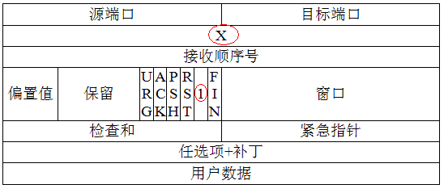
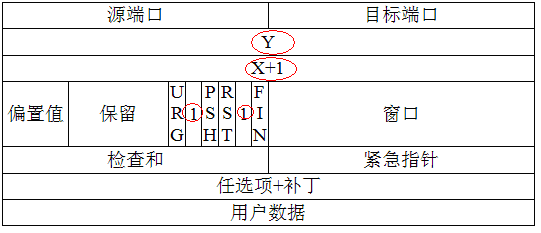
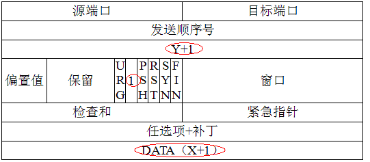

# 计算机网络面经（网上整理）
## 基础部分

1. TCP报头格式
<div align="center"></div>

* 源端口号和目的端口号  
源计算机的端口。源端口号和源计算机IP地址是用来标识报文的返回地址。端口指明接收方计算机上的应用程序接口。TCP报头中的源端口号和目的端口号同IP数据报中的源IP与目的IP唯一确定一条TCP连接。
* 顺序号和确认号  
是TCP可靠传输的关键部分。序号是本报文段发送的数据组的第一个字节的序号。在TCP传送的流中，每一个字节一个序号。e.g.一个报文段的序号为300，此报文段数据部分共有100字节，则下一个报文段的序号为400。所以序号确保了TCP传输的有序性。确认号，即ACK，指明下一个期待收到的字节序号，表明该序号之前的所有数据已经正确无误的收到。确认号只有当ACK标志为1时才有效。比如建立连接时，SYN报文的ACK标志位为0。
* 数据偏移/头部长度  
4bits。由于首部可能含有可选项内容，因此TCP报头的长度是不确定的，报头不包含任何任选字段则长度为20字节，4位首部长度字段所能表示的最大值为1111，转化为10进制为15，15*32/8 = 60，故报头最大长度为60字节。首部长度也叫数据偏移，是因为首部长度实际上指示了数据区在报文段中的起始偏移值。
* 保留位  
为将来定义新的用途保留，现在一般置0
* 控制位  
URG  ACK  PSH  RST  SYN  FIN，共6个，每一个标志位表示一个控制功能。  
    * URG  
    紧急指针标志，为1时表示紧急指针有效，为0则忽略紧急指针。
    * ACK  
    确认序号标志，为1时表示确认号有效，为0表示报文中不含确认信息，忽略确认号字段。
    * PSH  
    push标志，为1表示是带有push标志的数据，指示接收方在接收到该报文段以后，应尽快将这个报文段交给应用程序，而不是在缓冲区排队。
    * RST  
    重置连接标志，用于重置由于主机崩溃或其他原因而出现错误的连接。或者用于拒绝非法的报文段和拒绝连接请求。
    * SYN  
    同步序号，用于建立连接过程，在连接请求中，SYN=1和ACK=0表示该数据段没有使用捎带的确认域，而连接应答捎带一个确认，即SYN=1和ACK=1。
    * FIN  
    finish标志，用于释放连接，为1时表示发送方已经没有数据发送了，即关闭本方数据流。
* 窗口  
滑动窗口大小，用来告知发送端接受端的缓存大小，以此控制发送端发送数据的速率，从而达到流量控制。窗口大小时一个16bit字段，因而窗口大小最大为65535。
* 校验和  
奇偶校验，此校验和是对整个的 TCP 报文段，包括 TCP 头部和 TCP 数据，以 16 位字进行计算所得。由发送端计算和存储，并由接收端进行验证。
* 紧急指针  
只有当 URG 标志置 1 时紧急指针才有效。紧急指针是一个正的偏移量，和顺序号字段中的值相加表示紧急数据最后一个字节的序号。 TCP 的紧急方式是发送端向另一端发送紧急数据的一种方式。
* 可选项
最常见的可选字段是最长报文大小，又称为MSS（Maximum Segment Size），每个连接方通常都在通信的第一个报文段（为建立连接而设置SYN标志为1的那个段）中指明这个选项，它表示本端所能接受的最大报文段的长度。选项长度不一定是32位的整数倍，所以要加填充位，即在这个字段中加入额外的零，以保证TCP头是32的整数倍。
* 数据部分  
TCP 报文段中的数据部分是可选的。在一个连接建立和一个连接终止时，双方交换的报文段仅有 TCP 首部。如果一方没有数据要发送，也使用没有任何数据的首部来确认收到的数据。在处理超时的许多情况中，也会发送不带任何数据的报文段。


2. UDP报头格式
<div align="center"></div>

* 源端口号和目的端口号  
如上和TCP的相同。
* UDP长度  
UDP报文的字节长度（包括首部和数据）
* UDP校验和
检验UDP首部和数据部分的正确性

3. TCP/UDP区别（不仅是宏观上的，最好能根据各自的机制讲解清楚）
* 基本区别  
    1. 基于连接与无连接
    2. TCP要求系统资源较多，UDP较少； 
    3. UDP程序结构较简单 
    4. 流模式（TCP）与数据报模式(UDP); 
    5. TCP保证数据正确性，UDP可能丢包 
    6. TCP保证数据顺序，UDP不保证 
* UDP应用场景  
    1. 面向数据报方式
    2. 网络数据大多为短消息 
    3. 拥有大量Client
    4. 对数据安全性无特殊要求
    5. 网络负担非常重，但对响应速度要求高
* 具体编程时的区别  
    1. socket()的参数不同 
    2. UDP Server不需要调用listen和accept 
    3. UDP收发数据用sendto/recvfrom函数 
    4. TCP：地址信息在connect/accept时确定 
    5. UDP：在sendto/recvfrom函数中每次均 需指定地址信息 
    6. UDP：shutdown函数无效

4. HTTP状态码（最好结合使用场景，比如在缓存命中时使用哪个）  
 
状态码 | 含义
-- | --|
100 | 客户端应当继续发送请求。这个临时响应是用来通知客户端它的部分请求已经被服务器接收，且仍未被拒绝。客户端应当继续发送请求的剩余部分，或者如果请求已经完成，忽略这个响应。服务器必须在请求完成后向客户端发送一个最终响应。
101 | 服务器已经理解了客户端的请求，并将通过Upgrade 消息头通知客户端采用不同的协议来完成这个请求。在发送完这个响应最后的空行后，服务器将会切换到在Upgrade 消息头中定义的那些协议。 　　只有在切换新的协议更有好处的时候才应该采取类似措施。例如，切换到新的HTTP 版本比旧版本更有优势，或者切换到一个实时且同步的协议以传送利用此类特性的资源。
102 | 由WebDAV（RFC 2518）扩展的状态码，代表处理将被继续执行。
200 | 请求已成功，请求所希望的响应头或数据体将随此响应返回。
201 | 请求已经被实现，而且有一个新的资源已经依据请求的需要而建立，且其 URI 已经随Location 头信息返回。假如需要的资源无法及时建立的话，应当返回 '202 Accepted'。
202 | 服务器已接受请求，但尚未处理。正如它可能被拒绝一样，最终该请求可能会也可能不会被执行。在异步操作的场合下，没有比发送这个状态码更方便的做法了。 　　返回202状态码的响应的目的是允许服务器接受其他过程的请求（例如某个每天只执行一次的基于批处理的操作），而不必让客户端一直保持与服务器的连接直到批处理操作全部完成。在接受请求处理并返回202状态码的响应应当在返回的实体中包含一些指示处理当前状态的信息，以及指向处理状态监视器或状态预测的指针，以便用户能够估计操作是否已经完成。
203 | 服务器已成功处理了请求，但返回的实体头部元信息不是在原始服务器上有效的确定集合，而是来自本地或者第三方的拷贝。当前的信息可能是原始版本的子集或者超集。例如，包含资源的元数据可能导致原始服务器知道元信息的超集。使用此状态码不是必须的，而且只有在响应不使用此状态码便会返回200 OK的情况下才是合适的。
204 | 服务器成功处理了请求，但不需要返回任何实体内容，并且希望返回更新了的元信息。响应可能通过实体头部的形式，返回新的或更新后的元信息。如果存在这些头部信息，则应当与所请求的变量相呼应。如果客户端是浏览器的话，那么用户浏览器应保留发送了该请求的页面，而不产生任何文档视图上的变化，即使按照规范新的或更新后的元信息应当被应用到用户浏览器活动视图中的文档。由于204响应被禁止包含任何消息体，因此它始终以消息头后的第一个空行结尾。
205 | 服务器成功处理了请求，且没有返回任何内容。但是与204响应不同，返回此状态码的响应要求请求者重置文档视图。该响应主要是被用于接受用户输入后，立即重置表单，以便用户能够轻松地开始另一次输入。与204响应一样，该响应也被禁止包含任何消息体，且以消息头后的第一个空行结束。
206 | 服务器已经成功处理了部分GET请求。类似于FlashGet 或者迅雷这类的 HTTP 下载工具都是使用此类响应实现断点续传或者将一个大文档分解为多个下载段同时下载。该请求必须包含 Range 头信息来指示客户端希望得到的内容范围，并且可能包含 If-Range 来作为请求条件。响应必须包含如下的头部域： Content-Range 用以指示本次响应中返回的内容的范围；如果是 Content-Type 为multipart/byteranges的多段下载，则每一multipart 段中都应包含 Content-Range域用以指示本段的内容范围。假如响应中包含Content-Length，那么它的数值必须匹配它返回的内容范围的真实字节数。Date ETag 和/或 Content-Location，假如同样的请求本应该返回200响应。Expires, Cache-Control，和/或Vary，假如其值可能与之前相同变量的其他响应对应的值不同的话。假如本响应请求使用了If-Range 强缓存验证，那么本次响应不应该包含其他实体头；假如本响应的请求使用了If-Range 弱缓存验证，那么本次响应禁止包含其他实体头；这避免了缓存的实体内容和更新了的实体头信息之间的不一致。否则，本响应就应当包含所有本应该返回200响应中应当返回的所有实体头部域。假如 ETag 或 Last-Modified 头部不能精确匹配的话，则客户端缓存应禁止将206响应返回的内容与之前任何缓存过的内容组合在一起。任何不支持 Range 以及 Content-Range 头的缓存都禁止缓存206响应返回的内容。
207 | 由WebDAV(RFC 2518)扩展的状态码，代表之后的消息体将是一个XML消息，并且可能依照之前子请求数量的不同，包含一系列独立的响应代码。
300 | 被请求的资源有一系列可供选择的回馈信息，每个都有自己特定的地址和浏览器驱动的商议信息。用户或浏览器能够自行选择一个首选的地址进行重定向。除非这是一个 HEAD 请求，否则该响应应当包括一个资源特性及地址的列表的实体，以便用户或浏览器从中选择最合适的重定向地址。这个实体的格式由 Content-Type 定义的格式所决定。浏览器可能根据响应的格式以及浏览器自身能力，自动作出最合适的选择。当然，RFC 2616规范并没有规定这样的自动选择该如何进行。如果服务器本身已经有了首选的回馈选择，那么在 Location 中应当指明这个回馈的 URI；浏览器可能会将这个 Location 值作为自动重定向的地址。此外，除非额外指定，否则这个响应也是可缓存的。
301 | 被请求的资源已永久移动到新位置，并且将来任何对此资源的引用都应该使用本响应返回的若干个 URI 之一。如果可能，拥有链接编辑功能的客户端应当自动把请求的地址修改为从服务器反馈回来的地址。除非额外指定，否则这个响应也是可缓存的。 新的永久性的 URI 应当在响应的 Location 域中返回。除非这是一个 HEAD 请求，否则响应的实体中应当包含指向新的 URI 的超链接及简短说明。 如果这不是一个 GET 或者 HEAD 请求，因此浏览器禁止自动进行重定向，除非得到用户的确认，因为请求的条件可能因此发生变化。注意：对于某些使用 HTTP/1.0 协议的浏览器，当它们发送的 POST 请求得到了一个301响应的话，接下来的重定向请求将会变成 GET 方式。
302 | 请求的资源现在临时从不同的 URI 响应请求。由于这样的重定向是临时的，客户端应当继续向原有地址发送以后的请求。只有在Cache-Control或Expires中进行了指定的情况下，这个响应才是可缓存的。 　　新的临时性的 URI 应当在响应的 Location 域中返回。除非这是一个 HEAD 请求，否则响应的实体中应当包含指向新的 URI 的超链接及简短说明。 　　如果这不是一个 GET 或者 HEAD 请求，那么浏览器禁止自动进行重定向，除非得到用户的确认，因为请求的条件可能因此发生变化。 　　注意：虽然RFC 1945和RFC 2068规范不允许客户端在重定向时改变请求的方法，但是很多现存的浏览器将302响应视作为303响应，并且使用 GET 方式访问在 Location 中规定的 URI，而无视原先请求的方法。状态码303和307被添加了进来，用以明确服务器期待客户端进行何种反应。
303 | 对应当前请求的响应可以在另一个 URI 上被找到，而且客户端应当采用 GET 的方式访问那个资源。这个方法的存在主要是为了允许由脚本激活的POST请求输出重定向到一个新的资源。这个新的 URI 不是原始资源的替代引用。同时，303响应禁止被缓存。当然，第二个请求（重定向）可能被缓存。 　　新的 URI 应当在响应的 Location 域中返回。除非这是一个 HEAD 请求，否则响应的实体中应当包含指向新的 URI 的超链接及简短说明。 　　注意：许多 HTTP/1.1 版以前的 浏览器不能正确理解303状态。如果需要考虑与这些浏览器之间的互动，302状态码应该可以胜任，因为大多数的浏览器处理302响应时的方式恰恰就是上述规范要求客户端处理303响应时应当做的。
304 | 如果客户端发送了一个带条件的 GET 请求且该请求已被允许，而文档的内容（自上次访问以来或者根据请求的条件）并没有改变，则服务器应当返回这个状态码。304响应禁止包含消息体，因此始终以消息头后的第一个空行结尾。 　　该响应必须包含以下的头信息： 　　Date，除非这个服务器没有时钟。假如没有时钟的服务器也遵守这些规则，那么代理服务器以及客户端可以自行将 Date 字段添加到接收到的响应头中去（正如RFC 2068中规定的一样），缓存机制将会正常工作。 　　ETag 和/或 Content-Location，假如同样的请求本应返回200响应。 　　Expires, Cache-Control，和/或Vary，假如其值可能与之前相同变量的其他响应对应的值不同的话。 　　假如本响应请求使用了强缓存验证，那么本次响应不应该包含其他实体头；否则（例如，某个带条件的 GET 请求使用了弱缓存验证），本次响应禁止包含其他实体头；这避免了缓存了的实体内容和更新了的实体头信息之间的不一致。 　　假如某个304响应指明了当前某个实体没有缓存，那么缓存系统必须忽视这个响应，并且重复发送不包含限制条件的请求。 　　假如接收到一个要求更新某个缓存条目的304响应，那么缓存系统必须更新整个条目以反映所有在响应中被更新的字段的值。
305 | 被请求的资源必须通过指定的代理才能被访问。Location 域中将给出指定的代理所在的 URI 信息，接收者需要重复发送一个单独的请求，通过这个代理才能访问相应资源。只有原始服务器才能建立305响应。 　　注意：RFC 2068中没有明确305响应是为了重定向一个单独的请求，而且只能被原始服务器建立。忽视这些限制可能导致严重的安全后果。
306 | 在最新版的规范中，306状态码已经不再被使用。
307 | 请求的资源现在临时从不同的URI 响应请求。由于这样的重定向是临时的，客户端应当继续向原有地址发送以后的请求。只有在Cache-Control或Expires中进行了指定的情况下，这个响应才是可缓存的。 　　新的临时性的URI 应当在响应的 Location 域中返回。除非这是一个HEAD 请求，否则响应的实体中应当包含指向新的URI 的超链接及简短说明。因为部分浏览器不能识别307响应，因此需要添加上述必要信息以便用户能够理解并向新的 URI 发出访问请求。 　　如果这不是一个GET 或者 HEAD 请求，那么浏览器禁止自动进行重定向，除非得到用户的确认，因为请求的条件可能因此发生变化。
400 |   1. 语义有误，当前请求无法被服务器理解。除非进行修改，否则客户端不应该重复提交这个请求。 2. 请求参数有误。
401 | 当前请求需要用户验证。该响应必须包含一个适用于被请求资源的 WWW-Authenticate 信息头用以询问用户信息。客户端可以重复提交一个包含恰当的 Authorization 头信息的请求。如果当前请求已经包含了 Authorization 证书，那么401响应代表着服务器验证已经拒绝了那些证书。如果401响应包含了与前一个响应相同的身份验证询问，且浏览器已经至少尝试了一次验证，那么浏览器应当向用户展示响应中包含的实体信息，因为这个实体信息中可能包含了相关诊断信息。参见RFC 2617。
402 | 该状态码是为了将来可能的需求而预留的。
403 | 服务器已经理解请求，但是拒绝执行它。与401响应不同的是，身份验证并不能提供任何帮助，而且这个请求也不应该被重复提交。如果这不是一个 HEAD 请求，而且服务器希望能够讲清楚为何请求不能被执行，那么就应该在实体内描述拒绝的原因。当然服务器也可以返回一个404响应，假如它不希望让客户端获得任何信息。
404 | 请求失败，请求所希望得到的资源未被在服务器上发现。没有信息能够告诉用户这个状况到底是暂时的还是永久的。假如服务器知道情况的话，应当使用410状态码来告知旧资源因为某些内部的配置机制问题，已经永久的不可用，而且没有任何可以跳转的地址。404这个状态码被广泛应用于当服务器不想揭示到底为何请求被拒绝或者没有其他适合的响应可用的情况下。
405 | 请求行中指定的请求方法不能被用于请求相应的资源。该响应必须返回一个Allow 头信息用以表示出当前资源能够接受的请求方法的列表。 　　鉴于 PUT，DELETE 方法会对服务器上的资源进行写操作，因而绝大部分的网页服务器都不支持或者在默认配置下不允许上述请求方法，对于此类请求均会返回405错误。
406 | 请求的资源的内容特性无法满足请求头中的条件，因而无法生成响应实体。除非这是一个 HEAD 请求，否则该响应就应当返回一个包含可以让用户或者浏览器从中选择最合适的实体特性以及地址列表的实体。实体的格式由 Content-Type 头中定义的媒体类型决定。浏览器可以根据格式及自身能力自行作出最佳选择。但是，规范中并没有定义任何作出此类自动选择的标准。
407 | 与401响应类似，只不过客户端必须在代理服务器上进行身份验证。代理服务器必须返回一个 Proxy-Authenticate 用以进行身份询问。客户端可以返回一个 Proxy-Authorization 信息头用以验证。参见RFC 2617。
408 | 请求超时。客户端没有在服务器预备等待的时间内完成一个请求的发送。客户端可以随时再次提交这一请求而无需进行任何更改。
409 | 由于和被请求的资源的当前状态之间存在冲突，请求无法完成。这个代码只允许用在这样的情况下才能被使用：用户被认为能够解决冲突，并且会重新提交新的请求。该响应应当包含足够的信息以便用户发现冲突的源头。 　　冲突通常发生于对 PUT 请求的处理中。例如，在采用版本检查的环境下，某次 PUT 提交的对特定资源的修改请求所附带的版本信息与之前的某个（第三方）请求向冲突，那么此时服务器就应该返回一个409错误，告知用户请求无法完成。此时，响应实体中很可能会包含两个冲突版本之间的差异比较，以便用户重新提交归并以后的新版本。
410 | 被请求的资源在服务器上已经不再可用，而且没有任何已知的转发地址。这样的状况应当被认为是永久性的。如果可能，拥有链接编辑功能的客户端应当在获得用户许可后删除所有指向这个地址的引用。如果服务器不知道或者无法确定这个状况是否是永久的，那么就应该使用404状态码。除非额外说明，否则这个响应是可缓存的。 　　410响应的目的主要是帮助网站管理员维护网站，通知用户该资源已经不再可用，并且服务器拥有者希望所有指向这个资源的远端连接也被删除。这类事件在限时、增值服务中很普遍。同样，410响应也被用于通知客户端在当前服务器站点上，原本属于某个个人的资源已经不再可用。当然，是否需要把所有永久不可用的资源标记为'410 Gone'，以及是否需要保持此标记多长时间，完全取决于服务器拥有者。
411 | 服务器拒绝在没有定义 Content-Length 头的情况下接受请求。在添加了表明请求消息体长度的有效 Content-Length 头之后，客户端可以再次提交该请求。
412 | 服务器在验证在请求的头字段中给出先决条件时，没能满足其中的一个或多个。这个状态码允许客户端在获取资源时在请求的元信息（请求头字段数据）中设置先决条件，以此避免该请求方法被应用到其希望的内容以外的资源上。
413 | 服务器拒绝处理当前请求，因为该请求提交的实体数据大小超过了服务器愿意或者能够处理的范围。此种情况下，服务器可以关闭连接以免客户端继续发送此请求。 　　如果这个状况是临时的，服务器应当返回一个 Retry-After 的响应头，以告知客户端可以在多少时间以后重新尝试。
414 | 请求的URI 长度超过了服务器能够解释的长度，因此服务器拒绝对该请求提供服务。这比较少见，通常的情况包括： 　　本应使用POST方法的表单提交变成了GET方法，导致查询字符串（Query String）过长。 　　重定向URI “黑洞”，例如每次重定向把旧的 URI 作为新的 URI 的一部分，导致在若干次重定向后 URI 超长。 　　客户端正在尝试利用某些服务器中存在的安全漏洞攻击服务器。这类服务器使用固定长度的缓冲读取或操作请求的 URI，当 GET 后的参数超过某个数值后，可能会产生缓冲区溢出，导致任意代码被执行[1]。没有此类漏洞的服务器，应当返回414状态码。
415 | 对于当前请求的方法和所请求的资源，请求中提交的实体并不是服务器中所支持的格式，因此请求被拒绝。
416 | 如果请求中包含了 Range 请求头，并且 Range 中指定的任何数据范围都与当前资源的可用范围不重合，同时请求中又没有定义 If-Range 请求头，那么服务器就应当返回416状态码。 　　假如 Range 使用的是字节范围，那么这种情况就是指请求指定的所有数据范围的首字节位置都超过了当前资源的长度。服务器也应当在返回416状态码的同时，包含一个 Content-Range 实体头，用以指明当前资源的长度。这个响应也被禁止使用 multipart/byteranges 作为其 Content-Type。
417 | 在请求头 Expect 中指定的预期内容无法被服务器满足，或者这个服务器是一个代理服务器，它有明显的证据证明在当前路由的下一个节点上，Expect 的内容无法被满足。
421 | 从当前客户端所在的IP地址到服务器的连接数超过了服务器许可的最大范围。通常，这里的IP地址指的是从服务器上看到的客户端地址（比如用户的网关或者代理服务器地址）。在这种情况下，连接数的计算可能涉及到不止一个终端用户。
422 | 请求格式正确，但是由于含有语义错误，无法响应。（RFC 4918 WebDAV）
423 | Locked 　　当前资源被锁定。（RFC 4918 WebDAV）
424 | 由于之前的某个请求发生的错误，导致当前请求失败，例如 PROPPATCH。（RFC 4918 WebDAV）
425 | 在WebDav Advanced Collections 草案中定义，但是未出现在《WebDAV 顺序集协议》（RFC 3658）中。
426 | 客户端应当切换到TLS/1.0。（RFC 2817）
449 | 由微软扩展，代表请求应当在执行完适当的操作后进行重试。
500 | 服务器遇到了一个未曾预料的状况，导致了它无法完成对请求的处理。一般来说，这个问题都会在服务器的程序码出错时出现。
501 | 服务器不支持当前请求所需要的某个功能。当服务器无法识别请求的方法，并且无法支持其对任何资源的请求。
502 | 作为网关或者代理工作的服务器尝试执行请求时，从上游服务器接收到无效的响应。
503 | 由于临时的服务器维护或者过载，服务器当前无法处理请求。这个状况是临时的，并且将在一段时间以后恢复。如果能够预计延迟时间，那么响应中可以包含一个 Retry-After 头用以标明这个延迟时间。如果没有给出这个 Retry-After 信息，那么客户端应当以处理500响应的方式处理它。 　　注意：503状态码的存在并不意味着服务器在过载的时候必须使用它。某些服务器只不过是希望拒绝客户端的连接。
504 | 作为网关或者代理工作的服务器尝试执行请求时，未能及时从上游服务器（URI标识出的服务器，例如HTTP、FTP、LDAP）或者辅助服务器（例如DNS）收到响应。 　　注意：某些代理服务器在DNS查询超时时会返回400或者500错误
505 | 服务器不支持，或者拒绝支持在请求中使用的 HTTP 版本。这暗示着服务器不能或不愿使用与客户端相同的版本。响应中应当包含一个描述了为何版本不被支持以及服务器支持哪些协议的实体。
506 | 由《透明内容协商协议》（RFC 2295）扩展，代表服务器存在内部配置错误：被请求的协商变元资源被配置为在透明内容协商中使用自己，因此在一个协商处理中不是一个合适的重点。
507 | 服务器无法存储完成请求所必须的内容。这个状况被认为是临时的。WebDAV (RFC 4918)
509 | 服务器达到带宽限制。这不是一个官方的状态码，但是仍被广泛使用。
510 | 获取资源所需要的策略并没有没满足。（RFC 2774）

5. HTTP协议（一些报头字段的作用，如cace-control、keep-alive）
* 公共头部

    字段 | 说明
    -- | --
    Remote Address | 请求的远程地址
    Request URL | 请求的域名
    Request Method | 页面请求方式：GET/POST
    Status Code | 请求的返回状态(见上面第4条-HTTP状态码)

* 请求头  

    字段 | 说明
    -- | --
    Accept | 表示浏览器支持的MIME的类型
    Accept-Encoding | 浏览器支持的压缩类型
    Accept-Language | 浏览器支持的语言类型，并且优先支持靠前的语言类型
    Cache-Control | 指定请求和响应遵循的缓存机制
    Connection | 当浏览器与服务器通信时对于长连接如何进行处理：close/keep-alive
    Cookie | 向服务器返回cookie，这些cookie是之前服务器发送给浏览器的
    Host | 请求的服务器URL
    Referer | 该页面来源URL
    User-Agent | 用户客户端的一些重要信息

* 返回头  

    字段 | 说明
    -- | --
    Cache-Control | 告诉浏览器或其他客户，什么环境下可以安全的缓存文档
    Connection | 当client和server通信时对于长连接如何进行处理
    Content-Encoding | 数据在传输过程中所使用的压缩编码方式
    Content-Type | 数据的类型
    Date | 数据向服务器发送的时间
    Expires | 应该在什么时候认为文档已经过期，从而不再缓存它
    Server | 服务器名字。Servlet一般不设置这个值，而是由web服务器自己设置。
    Set-Cookie | 设置和页面关联的cookie
    Transfer-Encoding | 数据传输的方式

* 几个字段的说明
    * Accept  
    Accept表示浏览器支持的 MIME 类型；  

    类型 | 说明
    -- | --
    Text | 用于标准化地表示的文本信息，文本消息可以是多种字符集和或者多种格式的
    text/html | html文档
    Application | 传输应用程序数据和二进制数据
    application/xhtml+xml | xhtml文档
    application/xml | xml文档

    * Cache-Control  
    请求时的缓存指令包括：no-cache, no-store, max-age, max-stale, min-fresh, only-if-cached。
　　响应消息中的指令包括：public, private, no-cache, no-store, no-transform, must-revalidate, proxy-revalidate, max-age。

    指令 | 含义
    -- | --
    public | 响应可被任何缓存区缓存
    private | 指示对于单个用户的整个或部分响应消息，不能被共享缓存处理。这允许服务器仅仅描述当前用户的部分响应消息，此响应消息对于其他用户的请求无效
    no-cache | 指示请求或响应消息不能缓存
    no-store | 用于防止重要的信息被无意的发布。在请求消息中发送将使得请求和响应消息都不使用缓存
    max-age | 指示客户机可以接收生存期不大于指定时间（以秒为单位）的响应
    min-fresh | 指示客户机可以接收响应时间小于当前时间加上指定时间的响应
    max-stale | 指示客户机可以接收超出超时期间的响应消息。如果指定max-stale消息的值，那么客户机可以接收超出超时期指定值之内的响应消息

    * keep-alive  
    非KeepAlive模式时，每个请求/应答客户和服务器都要新建一个连接，完成之后立即断开连接（HTTP协议为无连接的协议）；当使用Keep-Alive模式（又称持久连接、连接重用）时，Keep-Alive功能使客户端到服务器端的连接持续有效，当出现对服务器的后继请求时，Keep-Alive功能避免了建立或者重新建立连接。

6. OSI协议、TCP/IP协议以及每层对应的协议。
<div align="center"></div>

* 五层协议
    * 应用层  
    为特定应用程序提供数据传输服务，例如 HTTP、DNS 等。数据单位为报文。
    * 运输层  
    提供的是进程间的通用数据传输服务。由于应用层协议很多，定义通用的运输层协议就可以支持不断增多的应用层协议。运输层包括两种协议：传输控制协议 TCP，提供面向连接、可靠的数据传输服务，数据单位为报文段；用户数据报协议 UDP，提供无连接、尽最大努力的数据传输服务，数据单位为用户数据报。TCP 主要提供完整性服务，UDP 主要提供及时性服务。
    * 网络层  
    为主机间提供数据传输服务，而运输层协议是为主机中的进程提供服务。网络层把运输层传递下来的报文段或者用户数据报封装成分组。
    * 数据链路层  
    网络层针对的还是主机之间的数据传输服务，而主机之间可以有很多链路，链路层协议就是为同一链路的节点提供服务。数据链路层把网络层传来的分组封装成帧。
    * 物理层  
    考虑的是怎样在传输媒体上传输数据比特流，而不是指具体的传输媒体。物理层的作用是尽可能屏蔽传输媒体和通信手段的差异，使数据链路层感觉不到这些差异。

* 七层协议
    * 表示层  
    数据压缩、加密以及数据描述。这使得应用程序不必担心在各台主机中表示/存储的内部格式不同的问题。
    * 会话层  
    建立及管理会话

* TCP/IP  
它只有四层，相当于五层协议中数据链路层和物理层合并为网络接口层。
现在的 TCP/IP 体系结构不严格遵循 OSI 分层概念，应用层可能会直接使用 IP 层或者网络接口层。
<div align="center"></div>

7. SESSION机制、cookie机制
    ### cookie  
    Cookie其实还可以用在一些方便用户的场景下，设想你某次登陆过一个网站，下次登录的时候不想再次输入账号了，怎么办？这个信息可以写到Cookie里面，访问网站的时候，网站页面的脚本可以读取这个信息，就自动帮你把用户名给填了，能够方便一下用户。这也是Cookie名称的由来，给用户的一点甜头。
    1. 顾名思义，Cookie 确实非常小，它的大小限制为4KB左右

    2. 主要用途是保存登录信息和标记用户(比如购物车)等，不过随着localStorage的出现，现在购物车的工作Cookie承担的较少了

    3. 一般由服务器生成，可设置失效时间。如果在浏览器端生成Cookie，默认是关闭浏览器后失效

    4. 每次都会携带在HTTP头中，如果使用cookie保存过多数据会带来性能问题

    5. 原生API不如storage友好，需要自己封装函数

    #### cookie最典型的的应用场景
    * 判断用户是否登陆过网站，以便下次登录时能够直接登录。如果我们删除cookie，则每次登录必须从新填写登录的相关信息。
    * 另一个重要的应用是“购物车”中类的处理和设计。用户可能在一段时间内在同一家网站的不同页面选择不同的商品，可以将这些信息都写入cookie，在最后付款时从cookie中提取这些信息，当然这里面有了安全和性能问题需要我们考虑了。

    ### session
    由于 __HTTP协议是无状态的协议__，所以服务端需要记录用户的状态时，就需要用某种机制来识具体的用户，这个机制就是Session.典型的场景比如购物车，当你点击下单按钮时，由于HTTP协议无状态，所以并不知道是哪个用户操作的，所以服务端要为特定的用户创建了特定的Session，用用于标识这个用户，并且跟踪用户，这样才知道购物车里面有几本书。这个Session是保存在服务端的，有一个唯一标识。在服务端保存Session的方法很多， __内存、数据库、文件__ 都有。集群的时候也要考虑Session的转移，在大型的网站，一般会有专门的Session服务器集群，用来保存用户会话，这个时候 Session 信息都是放在内存的，使用一些缓存服务比如Memcached之类的来放 Session。思考一下服务端如何识别特定的客户？这个时候Cookie就登场了。每次HTTP请求的时候，客户端都会发送相应的Cookie信息到服务端。实际上大多数的应用都是用 Cookie 来实现Session跟踪的，第一次创建Session的时候，服务端会在HTTP协议中告诉客户端，需要在 Cookie 里面记录一个Session ID，以后每次请求把这个会话ID发送到服务器，我就知道你是谁了。有人问，如果客户端的浏览器禁用了 Cookie 怎么办？一般这种情况下，会使用一种叫做URL重写的技术来进行会话跟踪，即每次HTTP交互，URL后面都会被附加上一个诸如 sid=xxxxx 这样的参数，服务端据此来识别用户。

    #### 与cookied的关系和区别
    1. Session是在服务端保存的一个数据结构，用来跟踪用户的状态，这个数据可以保存在集群、数据库、文件中，Cookie是客户端保存用户信息的一种机制，用来记录用户的一些信息，也是实现Session的一种方式。

    2. Cookie的安全性一般，他人可通过分析存放在本地的Cookie并进行Cookie欺骗。在安全性第一的前提下，选择Session更优。重要交互信息比如权限等就要放在Session中，一般的信息记录放Cookie就好了。

    3. 单个Cookie保存的数据不能超过4K，很多浏览器都限制一个站点最多保存20个Cookie。

    4. 当访问增多时，Session会较大地占用服务器的性能。考虑到减轻服务器性能方面，应当适时使用Cookie。

    5. Session的运行依赖Session ID，而Session ID是存在 Cookie 中的。也就是说，如果浏览器禁用了Cookie,Session也会失效（但是可以通过其它方式实现，比如在url中传递Session ID,即sid=xxxx）。

    ### 总结
    * Session是在服务端保存的一个数据结构，用来跟踪用户的状态，这个数据可以保存在集群、数据库、文件中；
    * Cookie是客户端保存用户信息的一种机制，用来记录用户的一些信息，也是实现Session的一种方式。

8. TCP三次握手、四次挥手（这个问题真的要回答吐了，不过真的是面试官最喜欢问的，建议每天手撸一遍，而且不只是每次请求的过程，各种FIN_WAIT、TIME_WAIT状态也要掌握）。
* 三次握手  
    <div align="center"></div> 
    <div align="center"></div> 
    所谓三次握手(Three-way Handshake)，是指建立一个TCP连接时，需要客户端和服务器总共发送3个包。三次握手的目的是连接服务器指定端口，建立TCP连接,并同步连接双方的序列号和确认号并交换 TCP 窗口大小信息.在socket编程中，客户端执行connect()时。将触发三次握手 

    * 第一次握手  
    客户端发送一个TCP的SYN标志位置1的包指明客户打算连接的服务器的端口，以及初始序号X,保存在包头的序列号(Sequence Number)字段里。
    <div align="center"></div> 

    * 第二次握手  
    服务器发回确认包(ACK)应答。即SYN标志位和ACK标志位均为1同时，将确认序号(Acknowledgement Number)设置为客户的I S N加1以.即X+1。
    <div align="center"></div> 

    * 第三次握手  
    客户端再次发送确认包(ACK)SYN标志位为0,ACK标志位为1.并且把服务器发来ACK的序号字段+1,放在确定字段中发送给对方.并且在数据段放写ISN的+1
    <div align="center"></div> 

    * 为什么是三次握手  
        * 第一次握手
        client发送一个包给server，client无法确认server是否存在或者提供服务。
        * 第二次握手
        client发送一个包给server，可能由于网络原因server很久才收到这个包，收到包之后立即返回ACK确认包给client，但是client由于超时将该包丢弃了，此时，server会一直等待client发送包，但是client因为超时而没有继续发包，会浪费server资源。
        * 第三次握手
        client收到server的确认包后，在给server发送一个确认包，server验证数据正确后则确定连接成功。如果server超时没收到包，则发送RST报文段，进入CLOSED状态。这样做的目的是为了防止SYN洪泛攻击
    * SYN攻击
        在三次握手过程中，服务器发送SYN-ACK之后，收到客户端的ACK之前的TCP连接称为半连接(half-open connect).此时服务器处于Syn_RECV状态.当收到ACK后，服务器转入ESTABLISHED状态.Syn攻击就是 攻击客户端 在短时间内伪造大量不存在的IP地址，向服务器不断地发送syn包，服务器回复确认包，并等待客户的确认，由于源地址是不存在的，服务器需要不断的重发直 至超时，这些伪造的SYN包将长时间占用未连接队列，正常的SYN请求被丢弃，目标系统运行缓慢，严重者引起网络堵塞甚至系统瘫痪。Syn攻击是一个典型的DDOS攻击。检测SYN攻击非常的方便，当你在服务器上看到大量的半连接状态时，特别是源IP地址是随机的，基本上可以断定这是一次SYN攻击.在Linux下可以如下命令检测是否被Syn攻击
        ```shell
        netstat -n -p TCP | grep SYN_RECV一般较新的TCP/IP协议栈都对
        ```
        这一过程进行修正来防范Syn攻击，修改tcp协议实现。但是不能完全防范syn攻击。主要方法有:
        * SynAttackProtect保护机制
        * SYN cookies技术
        * 增加最大半连接
        * 缩短超时时间等

* 四次挥手
    <div align="center"></div>
    <div align="center"></div>

    time_wait，它是主动关闭的一方在回复完对方的挥手后进入的一个长期状态，这个状态标准的持续时间是4分钟，4分钟后才会进入到closed状态，释放套接字资源。不过在具体实现上这个时间是可以调整的。

    * 为什么是四次挥手
    当client向server发送FIN报文后仅仅表示client不发送包了，但是还可以接受包，server这边发送给client的包可能还没发送完或者发送完了，有一部分还在路上，所以server发送完后，在主动发送FIN报文，告诉client我已经发送完了，连接可以断开了，client在接收到FIN之后验证,表示我也收完了，可以关闭连接了，然后返回给server ACK确认包。

9. 打开网页到页面显示之间的过程（涵盖了各个方面，DNS解析过程，Nginx请求转发、连接建立和保持过程、浏览器内容渲染过程，考虑的越详细越好）。
    * 具体过程  
        1. 浏览器的地址栏输入URL并按下回车。
        2. 浏览器查找当前URL是否存在缓存，并比较缓存是否过期。
        3. DNS解析URL对应的IP。
        4. 根据IP建立TCP连接（三次握手）。
        5. HTTP发起请求。
        6. 服务器处理请求，浏览器接收HTTP响应。
        7. 渲染页面，构建DOM树。
        8. 关闭TCP连接（四次挥手）。
    

10. http和https区别，https在请求时额外的过程，https是如何保证数据安全的
11. IP地址子网划分
12. POST和GET区别
13. DNS解析过程

## 深入部分 
1. TCP如何保证数据的可靠传输的（这个问题可以引申出很多子问题，拥塞控制慢开始、拥塞避免、快重传、滑动窗口协议、停止等待协议、超时重传机制，最好都能掌握） 
2. 地址解析协议ARP 
3. 交换机和路由器的区别

# 参考文章
1. [撩下Cookie和Session](https://juejin.im/post/5add981bf265da0b722abb72)
2. [跟着动画来学习TCP三次握手和四次挥手](https://juejin.im/post/5b29d2c4e51d4558b80b1d8c)
3. [TCP的三次握手四次挥手](https://juejin.im/post/5a0444d45188255ea95b66bc)
4. [可靠的TCP连接为何是三次握手](https://juejin.im/post/5b1e9c65f265da6e26099bf3)
5. [从输入域名到最后呈现经历的过程](https://juejin.im/post/5abdc4a86fb9a028bf056b5d)