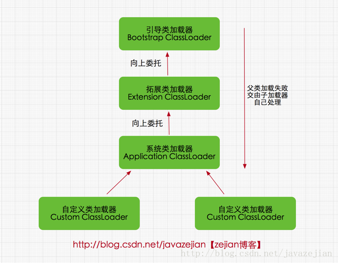

# 关键字
## 基本类型
char byte short int long double float boolean 

类型 | char | byte | short | int | long | double | float | boolean |
-- | -- |-- | -- | -- | -- | -- | -- | -- | 
长度(字节) | 2(Unicode) | 1 | 2 | 4 | 4 | 8 | 4 | 1 |

### 面试题目总结
1. 类型转换
    ```java
    short a = 1;
    a += 1; // 不报错，因为编译器会进行转换处理
    a = a + 1;  // 报错，a + 1运算过程中会把a强制转换为int类型，结果也为int类型，赋值给a会出先类型转换错误
    float f = 3.4 // 错误，3.4 是double类型，需要强转或者3.4f
    ```
    char byte short 在运算过程中都会被强制转换为int类型

2. java中char能够存储汉字吗?
能。java中char类型存储的是Unicode字符，但是生僻的汉字可能无法存储。
3. 基本类型和包装类型

4. switch能够作用在byte,long,String上？
switch可以作用的类型为char,int,short,byte以及对应的包装类型，String,enum等。其中char,short,byte会转换为int

5. 能否不进行强制转换将double转换为long？
不能。double范围更广。

6. double
```java
if(3 * 0.1 == 3.0) { // false,double会损失精度，可以用BigDicimal类型进行浮点数判断

}
BigDecimal value = BigDecimal.valueOf(0.1);
value = value.multiply(3);
int result = value.compareTo(BigDecimal.valueOf(0.3)); //result = 0
```

## 字符串
String StringBuffer StringBuilder

## 集合
Array Collection 
### 链表
List ArrayList LinkedList Vector 

类型 | 底层 | 容量满后的增长机制 | 优势 | 劣势| 线程安全 |
-- | -- | -- | -- | -- | -- |
ArrayList | 数组 | 50% | 查询遍历快 | 删除插入慢 | 否 |
LinkedList | 链表 | 容量无限制 | 删除插入块 | 查询遍历慢 | 否 |
Vector | 数组 | 100% | 同ArrayList | 同ArrayList | 是 | 

#### 面试问题
1. 如何实现线程安全的List？
* Collections.sychonizedList(List<> list)
读慢写块
* CopyOnWriteArrayList()
写特别慢读快
2. List排序
Collections.sort();
3. Collections.asList() 返回的List可以被修改吗？
不能 是final类型的,不能add和扩容

### 堆
Set HashSet TreeSet LinkedHashSet heap
类别 | 底层数据结构 | 插入顺序 | 值顺序 | 
-- | -- | -- | -- |
HashSet | HashMap | 无序 | 无序 | 
TreeSet | TreeMap | 无序 | Comparableor Comparator |
LinkedHashSet | HashMap | 有序 | 无序 | 

### Map
Map HashMap TreeMap LinkedHashMap ConcurrentHashMap 
* 面试题
    1. HashMap，ConcurrentHashMap底层原理
    2. HashMap负载因子(load_factor)、容量(capacity)、求index
        * 加载因子默认0.75，当插入数据超过capacity * load_factor，resize()，capacity翻倍
    3. HashMap容量为什么要为2的幂
        ```java
        /** 
        * Returns index for hash code h. 
        */  
        static int indexFor(int h, int length) {  
            return h & (length-1);  
        }  
        ```
        用位运算代替取余(%),效率更高，牺牲了部分空间。如果不是2的幂，会进行resize操作。

    4. HashMap hash())原理
    做了一次“扰动”操作
    int类型的范围是-2^31~2^31,HashMap初始容量才16，内存是放不下这么大的数组的，所以不能全取
    ```java
    static final int hashCode(Object key) {
        int h;
        return (key == null) ? 0 : (h = key.hashCode()) ^ (h >>> 16);
    }
    ```
    ```java
    int index = (capacity - 1) & hashCode(key);
    ```
### 栈
stack
### 队列
queue LinkedList ConcurrentLinkedList PriorityQueue ArrayBlockingQueue LinkedBlockingQueue SynchronousQueue Dequeue

## 多线程
synchronized volatile run start thread 
* synchronized 
    1. 在语言层次上是怎么实现的？
    利用javap可以将class文件反编译可以看到，synchronized修饰方法是会生成ACC_SYNCHRONIZED 标记，修饰代码块时会生成monitorenter,monitorexit标记。每一个java类的对象，JVM都会安排一个object monitor去监视该对象，如果一个线程执行到了synchronized修饰的地方，monitor的结构体中会记录下该线程的id，将表示当前对象已经有线程访问，并且给改代码块上锁，其它线程访问的时候，发现已经有线程在使用，就不会允许访问。最后当前线程执行经过monitorexit，monitor会释放该锁。

    2. 如何保证线程安全？
    原子性、可见性、有序性

## 序列化
transient
## 多态
implements extends this super 
### 面试题
* 接口相对于抽象类的优势在哪里？
    1. 现有的类很容易被更新，直接定义一个接口然后implements就行了
    2. 可以实现混合类型(mixin)。比如Comparable，继承Comparable的类就可以进行排序。支持类添加任选的功能可以被混合到类型的主要功能中
    3. 构造非层次结构的类型框架，比如有三个接口分别实现了三个工能，有些类可能需要其中的一个，两个或三个，如果用抽象类实现，就要实现2^N种情况，这称为组合爆炸。

## 类
public private protected default static final const

## 异常
throw throws try catch finally 

## 反射
instanceof
### instanceof 底层实现
1. 映射到JVM的instanceof操作
## 其他
enum break continue 
* enum 

# 计算机基础知识
## 数据结构
1. 队列、栈、链表
* 队列
    * 方法
        * add 队列满则抛出异常
        * put 队列满则阻塞
        * offer 队列满则返回false
        * peek 空则返回null
        * take 空则阻塞

    * 非阻塞
        * LinkedList
        * ConcurrentLinkedQueue

    * 阻塞
        * LinkedBlockingQueue
        newSingleThreadExecutor()和newFixedThreadExecutor()
        * ArrayBlockingQueue
        * LinkedBlockDequeue
        双向
        * PriorityQueue
        优先队列
        * DelayQueue
        经过一定时间才能够出队列
        * SynchronousQueue
        无缓冲队列, newCacheThreadExecutor()

* 栈
    * 方法
        * push
        * pop
        * peek

* 链表
    * ArrayList
    * LinkedList
    * Vector

2. 什么是树（平衡树,排序树,B树,B+树,R树,红黑树）、堆（大根堆、小根堆）、图（有向图、无向图、拓扑）
    1. B树
        * 每个节点对多有m个子节点
        * 除根节点外，其他节点至少有ceil(m/2)个节点（ceil为取上限函数）
        * 根节点至少有两棵子树(除非B树只有一个节点)
        * 所有的叶节点都在同一层
        * 每个节点有j个子节点，存储j-1个关键字,关键字按照递增顺序排列

    

3. 栈和队列的相同和不同之处 
    * 相同
        * 都是线性结构
        * 插入和删除时间空间复杂度相同
        * 操作都限定在首尾
    * 不同
        * 删除元素位置不同
        * 引用场景不同(栈：函数调用、深度优先搜索遍历等；队列：消息缓冲、广度优先遍历)

4. 栈通常采取的两种数据结构
    * 顺序存储结构
    * 链式存储结构

5. 两个栈实现队列，和两个队列实现栈


## 算法
1. 排序都有哪几种方法？
    * 选择排序
    * 插入排序
    * 冒泡排序
    * 快速排序
    * 归并排序
    * 堆排序
        时间复杂度初始化堆构建过程 O(n)，更改堆元素重建过程 O(nlogn)

    类别 | 选择 | 插入 | 冒泡 | 快速 | 归并 | 堆 |
    -- | -- | -- | -- | -- | -- | -- | 
    时间复杂度 | O(n^2) | O(n^2) | O(n^2) | O(logn) | O(nlogn) | O(nlogn) |
    空间复杂度 | O(1) | O(1)| O(1)| O(nlogn)| O(1) |O(1) |
    稳定性 | 不稳定 | 稳定 | 稳定 | 不稳定 | 稳定 | 不稳定 |

2. 会写常用的排序算法，如快排，归并等。

3. 各种排序算法的时间复杂度和稳定性 ，重点快排。

4. 单链表的遍历和逆序 

5. 深度优先搜索和广度优先搜索
6. 最小生成树
    * Kruskal
        从图中权值最小的路径节点开始，然后是第二小，不能形成环，知道遍历完所有节点。
    * Prim
        从起点开始，查找起点权值最小的路径，然后在查找起点以及最小路径节点中最小权值的节点，如果终点为已经经过的节点则跳过，以此类推，知道遍历图中所有的节点。

7. 常见Hash算法，哈希的原理和代价
    * 常见的hash算法
        MD4, MD5, SHA-A

    * 原理
        * 利用连续内存空间查找数据快的特点
        * 定义一个hash函数，将关键字映射到内存的某个位置
    
    * 代价
        * 空间换时间
        消耗更多的内存
8. 全排列、贪心算法、KMP算法、hash算法

9. 一致性Hash算法
    [详细请见算法部分-一致性hash算法](algorithm/hash.md#一致性hash算法)
    

## 操作系统
1. 虚拟内存管理 
    
2. 换页算法

3. 进程间通信

4. 进程同步：生产者消费者问题、哲学家就餐问题、读者写者问题

5. 死锁的四个必要条件，避免方法

6. Linux的一些基本命令，如ls、tail、chmod等 

## 计算机网络
1. TCP、UDP区别
    * TCP基于连接(三次握手), UDP不需要连接
    * TCP有流量控制机制，UDP尽最大能力发送，不保证包一定会到达目的主机
    * TCP有拥塞避免机制，UDP没有
    * TCP更可靠
    * TCP是基于流的，可以保证包的顺序，UDP不保证顺序

2. HTTP请求和响应的全过程

3. HTTP常见响应码：200、301、302、404、500
    * 200
    请求成功
    * 301
    被请求的资源已永久移动到新位置，并且将来任何对此资源的引用都应该使用本响应返回的若干个 URI 之一。
    * 302
    请求的资源现在临时从不同的 URI 响应请求。由于这样的重定向是临时的，客户端应当继续向原有地址发送以后的请求。
    * 404
    请求失败，请求所希望得到的资源未被在服务器上发现。Not found.
    * 500
    服务器遇到了一个未曾预料的状况，导致了它无法完成对请求的处理。一般来说，这个问题都会在服务器的程序码出错时出现。


    * 分类
        * 1XX
        消息
        * 2XX
        成功
        * 3XX
        重定向
        * 4XX
        请求错误
        * 5XX
        服务器错误

4. get和post的区别
    * get
    参数放在URL中，长度有限制，只能发送unicode字符，有长度限制，长度视浏览器而定。
    * post
    参数放在request body中。
    * 本质上两个请求都是基于TCP的，get发送一个TCP包,包含了header和data，返回200，post需要发两个TCP包，第一个包，包含header，返回100，第二个包包含data，返回200。
5. forward和redirect的区别

6. OSI七层模型

7. TCP/IP四层模型以及原理

8. TCP三次握手和四次挥手

9. 丢包和粘包
    * 丢包
    包在发送过程中丢失
    * 粘包
    多个数据包"粘"在一起。TCP才会发生粘包现象。有可能客户端发送时就已经粘了，也可能在服务端接收的时候粘了。

10. 流量控制和拥塞控制
    * 流量控制
    CWD滑动窗口。在服务器接受不过来的时候，会缩短滑动窗口。
    * 拥塞控制
        * 慢开始
        滑动窗口cwd从1开始指数增长，当超过慢开始门限ssthresh，速度变为+1，当发生网络拥塞的时候执行拥塞避免。
        * 拥塞避免
        ssthresh = cwd/2,重新执行慢开始。 
        * 快重传
        当发送包M1,M2,M3,...,MN重复收到M3，那么就表示服务器没收到M4包，重发M4。
        * 快恢复
        ssthresh=cwd/2,cwd=sstreash,CWD缓慢加1。

11. 子网划分
    * A类
    0-127
    * B类
    128-191
    * C类
    192-223
    * D类
    224-255
    * E类

12. IPV4和IPV6
    * IPV4
    32位，4个字节
    * IPV6
    128位，16个字节

13. HTTPS和HTTP2.0
    * HTTPS
        * SSL/TLS
        * 443端口
        * 数据加密，所以比http要慢
        * SPDY
            * header压缩
            * 多路复用
            * 服务器推送
    * HTTP2.0
        * header压缩
        * 多路复用
        * 服务器推送
        * 二进制

## 数据库
1. 范式

2. 数据库事务和隔离级别
    * ACID 
        * 原子性
        * 一致性
        * 隔离性
        * 持久性
        
3. 

## 海量数据处理
1. 海量日志数据，如何提取出某日访问淘宝次数最多的IP
    * 如果实时性要求比较高的话，用流失计算框架，比如Storm，借助消息队列，Spout实施接收IP信息，下一级bolt使用Field Grouping，保证同样的IP都有同一个bolt线程处理并统计，在下一级的bolt负责实时汇总上一级各个bolt线程统计数据，最终得到结果。如果时间粒度比较细，可以使用滑动窗口。
    * 如果实时性要求不高，提前将前一天的IP数据保存起来，使用Hadoop创建MapReduce任务分开统计。

2. 上亿数据，统计其中出现次数最多的前N个数据
    * 内存足够的情况下,创建一个hash表，统计数据出现次数
    * 内存不足的情况下，分别用hash建立m个堆，堆得大小为N，数据分为m份，分别有m个堆进行处理，最终在将m个堆得结果进行汇总。
    * 用hash可以保证同样的数据会被存到同一个文件中。

3. 5亿个int，找出他们的中位数
    * 如果数组长度为奇数个，那么中间那个是中位数，如果长度为偶数个，那么中间两个和的1/2为中位数。
    * 内存不足
    外排序，在查找中位数
    * 利用桶排序的原理
    int类型范围-2^31-2^31 - 1,每个桶大小为2^16，那么就一共有2^16个。
    * 分治思想

4. 两个文件，各存放50亿条URL，每个URL占64字节。内存限制是4G，找出两个文件中相同的URL
    * 对两个文件分别计算hash(URL) % N,放入N个小文件中，那么可以保证相同的url会放到同一个文件中，同时同样的URL都会被放到各自的第i个文件中。
    * 对小文件数据进行排序，然后去重
    * 分别比较第i个A组小文件和第i个B组小文件
    * 统计每组文件中URL相同的记录

5. 有40亿个不重复的unsigned int的整数，没排过序，现在给一个数，如何快速判断这个数是否在这40亿个数当中。
    
6. 提示：分治、Hash映射、堆排序、双层桶划分、Bloom filter、bitmap、数据库索引、mapreduce

# java基础
## 封装、继承、多态
1. Java中实现多态的机制是什么，动态多态和静态多态的区别
    * 实现多态的机制
    * 动态多态，运行时才能确定，如重写。静态多态，编译时就确定，如重载。

2. 接口和抽象类的区别，如何选择
    * 抽象类的抽象函数可以有默认实现，接口只有方法声明。所以如果添加方法，需要修改继承类。
    * 抽象类除了不能实例化，其他和java类差不多。
    * 抽象类可以继承一个类或多个接口，接口只能继承一个或者多个接口
    * 抽象类更快一些，接口需要找类的方法实现。
    * 
    * 选择
        * 如果多重继承需要接口
        * 如果想要抽象函数有默认实现，就抽象类
        * 基本功能在动态改变，需要抽象类。
3. Java能不能多继承，可不可以多实现
    * 单继承

4. Static Nested Class 和 Inner Class的不同 

5. 重载和重写的区别
    * 重写(override)
        * 子类重写父类的函数，函数名、参数、返回值都需要一样
        * 子类的Exception范围不能比父类大
        * 子类的权限范围不能比父类小
    * 重载(overwrite)
        * 函数名相同，参数、返回值都可以不同
6. 是否可以继承String类 
    * 不能。String是final的
    * 效率和安全
        * 效率
            如果被继承,可能会降低程序性能
        * 安全
            类是final，那么所有函数也是final，编译器会寻找转化为inner的方法，提高效率。

7. 构造器是否可被override?
    不能。构造器不算函数。

8. public,protected,private的区别?
    * public
    对所有包开放
    * protected
    只对同一个包的类和子类开放
    * default
    只对自己和同一个包中的类开放
    * private
    只对自己开放


9. 泛型
    优点：在编译阶段就可以确定元素类型，不需要强制类型转换。

## 集合相关
1. 列举几个Java中Collection类库中的常用类 
    * List
        * ArrayList
        * LinkedList
    * Set
        * HashSet
        * TreeSet
        * LinkedHashSet
    * Map
        * HashMap
        * TreeMap
        * ConcurrentHashMap

2. List、Set、Map是否都继承自Collection接口？存储特点分别是什么？
    * List,Set是，Map不是
    * List
        * 线性
        * 多个值可以为null
        * 保留插入顺序
        * 允许对象重复
    * Set
        * 无序
        * 不能插入null
        * 不允许重复
    * Map
        * 保存的是key value
        

3. ArrayList、LinkedList和Vector之间的区别与联系 

4. HashMap和Hashtable、TreeMap以及ConcurrentHashMap的区别 

5. Collection 和 Collections的区别 
    * Collection
    是集合类的接口
    * Collections
    是java.util中对集合类元素进行操作的工具类

6. 其他的集合类：treeset,linkedhashmap等。
## 异常相关
1. Error和Exception的区别
    * Exception
        * Unchecked Exception(Runtime Exception)
            * java编译器无法检查，无法用try catch 捕获。
            * NullPointerException
            * ClassCastException
            * IndexOutOfBoundsException
        * Checked Exception
            * 并不是程序本身的错误，而是外部环境的问题
            * FileNotFoundException
            * IOException

    * Error
        * Error也是Unchecked的,可以try catch，但是不可恢复。
        * OutOfMemoryError
        * StackOverFlow
        * 
2. 异常的类型，什么是运行时异常
    * Exception
        * RuntimeException(Unchected)
            无法再编译其检查到，在运行时才会报错，不能被try catch处理，百分百是程序员的错误。NullPointerException。
        * CheckedException
            可以被捕获，并作出处理。外部环境的问题。FileNotFoundException。

3. final、finally和finalize的区别
    * final 
        * 修饰类
        类不能被继承，final class的成员函数也是final的。String
        * 修饰函数
        不能被子类修改。
        * 修饰变量
        变量不能被修改。基本类型不能改变值，引用类型可以改变内部变量值，但不能改变引用地址。
    
    * finally
        * 和try catch一起使用，不管有没有捕获到异常都会被调用

    * finalize
        * JVM回收对象前，会调用finalize()方法。但是具有不确定性，如果内存充足，可能永远不会调用这个方法。

4. try-catch-finally中，如果在catch中return了，finally中的代码还会执行么，原理是什么？
    * 会执行
    * 会一直执行完catch return前的所有语句，在执行finally中的代码，结束后再返回catch中的结果。

5. 列举3个以上的RuntimeException
    * NullPointerException
    * ClassCastException
    * IndexoutOfBoundException

6. Java中的异常处理机制的简单原理和应用

## 其他
1. String和StringBuffer、StringBuilder的区别 
    * String
    final class，不能被修改。每次修改都会产生新的对象。
    * StringBuffer
    线程安全。
    * StringBuilder
    非线程安全

2. ==和equals()的区别
    * 基本数据类型
    如果值相等那么返回true，equals()不能比较基本类型
    * 引用类型
    == 比较的是地址，equals()是Object的方法，类需要继承该方法,如果不继承修改，那么底层默认用的是==比较地址，可以继承修改用于比较对象内部的值。

3. hashCode的作用，和equals方法的关系
    * hashCode相等，不一定是同一个对象
    * hashCode不相等，一定不是同一个对象

4. Input/OutputStream和Reader/Writer有什么区别
    * Input/OutputStream
        * 字节流
        * 读取二进制文件
    * Reader/Writer
        * 字符流
        * 读取文本文件

5. 如何在字符流和字节流之间转换？ 
    * 

6. switch可以使用那些数据类型
    * int,byte,char,short以及他们的包装类型，String，enum。
    * 其中byte,char,short会被转换成int进行比较

7. Java的四种引用 
    * 强引用
    生命力最顽强，只有root不可达的引用，才会被回收
    * 软引用
    内存不足的时候会被回收
    * 弱引用
    只能活到一个垃圾回收周期。
    * 虚引用
    与生命周期没关系，当一个对象和虚引用对象关联，和没有关联一样，不受根搜索算法的影响。

8. 序列化与反序列化
    * transient
    被该关键字修饰的变量不会被序列化
    * readResolve()
    单例模式，防止序列化破坏单例模式。
    * readObject()和writeObject()
    自定义序列化和反序列化的过程。

9. 正则表达式

10. int和Integer的区别，什么是自动装箱和自动拆箱
    * int是基本类型，Integer是int的包装类型，是一个类。
    * 自动装箱和拆箱
        ```java
        Integer i = 10; //自动装箱
        int n = i; // 自动拆箱
        ```
        装箱的时候调用的是Integer的valueOf(),拆箱的时候调用的是intValue()

# java高级
## 多线程
1. 进程和线程的区别
    * 进程是系统资源分配的基本单位，线程是CPU计算的基本单位
    * 进程包含一个或多个线程
    * 进程之间通信比较麻烦，需要通过消息队列、管道、FIFO、共享内存、信号量等方式，线程间通信可以通过共享内存。
    * java进程间通信可以通过Socket、RPC、消息队列等技术

2. 并行(Parallelism)和并发(Concurrency)的区别与联系
    * 并行是两个或多个事件在同一时刻发生，并发是两个或多个事件在同一个时间间隔发生
    * 并行是多个事件作用于不同的实体，并发是多个事件作用于同一个实体

3. 同步与异步，阻塞和非阻塞
    * 同步和异步主要关注的是结果获取方式，异步通过回调函数获取结果。
        * 同步：发出请求，一直等待结果返回。
        * 异步：发出请求，直接返回，由接受请求的一方主动通知请求放。
    * 阻塞和非阻塞关注请求方的状态
        * 阻塞：请求方再有结果之前一直 **等待** 。
        * 非阻塞：请求方再有结果之前可以做别的事情，但要 **时不时的查看结果出来了没**。

    老张爱喝茶，废话不说，煮开水。
    出场人物：老张，水壶两把（普通水壶，简称水壶；会响的水壶，简称响水壶）。
    1. 老张把水壶放到火上，立等水开。（同步阻塞）
    老张觉得自己有点傻
    2. 老张把水壶放到火上，去客厅看电视，时不时去厨房看看水开没有。（同步非阻塞）
    老张还是觉得自己有点傻，于是变高端了，买了把会响笛的那种水壶。水开之后，能大声发出嘀~~~~的噪音。
    3. 老张把响水壶放到火上，立等水开。（异步阻塞）
    老张觉得这样傻等意义不大
    4. 老张把响水壶放到火上，去客厅看电视，水壶响之前不再去看它了，响了再去拿壶。（异步非阻塞）
    老张觉得自己聪明了。

    所谓同步异步，只是对于水壶而言。
    普通水壶，同步；响水壶，异步。
    虽然都能干活，但响水壶可以在自己完工之后，提示老张水开了。这是普通水壶所不能及的。同步只能让调用者去轮询自己（情况2中），造成老张效率的低下。
    所谓阻塞非阻塞，仅仅对于老张而言。立等的老张，阻塞；看电视的老张，非阻塞。情况1和情况3中老张就是阻塞的，媳妇喊他都不知道。虽然3中响水壶是异步的，可对于立等的老张没有太大的意义。所以一般异步是配合非阻塞使用的，这样才能发挥异步的效用。
    ——来源网络，作者不明。

4. 多线程的实现方式，有什么区别？
    * Thread
    类
    * Runnable
    无返回值
    * Callable
    有返回值，FutureTask
    * 线程池
    ExecutorService

5. 什么叫守护线程？
    * java线程分为User thread和Daemon thread
    * Daemon thread本质上和User thread没有区别
    * Daemon thread为JVM中所有其他线程提供服务的，只要有一个非守护线程没退出，Daemon就不会推出

6. 如何停止一个线程？
    * stop方法
        stop()强制推出当前线程，不安全，不建议使用。
    * 在run函数中判断isInterrupted(),外部调用interrupt()方法
        ```java
        public class TreadTest extends Thread {
            
            @Override
            public void run() {
                while(!isInterrupted()) {
                    System.out.println("Thread is running");
                }
                System.out.println("Thread is stopped.");
            }
            public static void main(String[] args) {
                ThreadTest test = new ThreadTest();
                test.start();
                test.interrupt();
            }
        }

        ```

    * 定义一个boolean类型的变量表示是否停止，run函数中进行判断
        ```java
        public class TreadTest extends Thread {
            private boolean running = false;
            
            @Override
            public void run() {
                running = true;
                while(running) {
                    System.out.println("Thread is running");
                }
                System.out.println("Thread is stopped.");
            }

            public void stop() {
                this.running = false;
            }

            public static void main(String[] args) {
                ThreadTest test = new ThreadTest();
                test.start();
                test.stop();
            }
        }

        ```
7. 什么是线程安全？
    线程安全发生在有多个线程共同修改某个资源的时候。当某个线程修改了某个变量，其它线程在修改前该变量的值必须是最新的。
    当某个操作由多个线程执行的结果与单个线程执行的结果相同，那么就可以说这个操作是线程安全的。

8. synchronized和lock的区别
    * synchronized是java的关键字，是由JVM实现的；lock是java.util.concurrent中的类，是由JDK实现的。
    * synchronized无法实现公平锁，lock可以实现
    * synchronized代码块结束后自动释放锁，lock需要手动释放
    * lock粒度更细

    * synchronized 用法
        * 修饰方法
        * 修饰静态方法
        * 修饰this
        * 修饰类
        * 修饰变量
            * 静态变量
            * 非静态变量

        * 原则
            * 修饰方法和this是同步的，锁住的是当前对象。
            * 修饰静态方法、类是同步的，锁住的是整个类。
            * 修饰静态变量和非静态变量，只要是同一个对象就同步。
        ```java
        public class SynchronizedTest {
            private final Object obj = new Object();
            private static final String Lock = "lock";
            //加载当前对象上
            //同一个对象的同一个方法是同步的
            public synchronized void syncMethod() {
                
            }

            //加载当前对象上
            //同一个对象的同步方法和同步this是同步的
            public void syncThis() {
                synchronized(this) {

                }
            }

            //类的静态方法和this.Class是同步的
            public synchronized static void syncStaticMethod() {
                            
            }
            public void syncClass() {
                synchronized(this.class) {

                }
            }

            //锁普通变量
            public void syncVariable() {
                synchronized(obj) {

                }
            }

            //锁静态变量
            //该方法与Lock类的其他对象加的锁是同步的
            //与synchronized(Lock.class)也是同步的
            public void syncStaticVariable() {
                synchronized(Lock) {

                }
            }
        }
        ```

9. 当一个线程进入一个对象的一个synchronized方法后，其它线程是否可进入此对象的其它方法?
    可以进入非synchronized的方法

10. 启动一个线程是用run()还是start()? 
    start()

11. wait和sleep的区别
    * 进程状态：新建(new start)，就绪(runnable)，运行(running)，阻塞(blocked)，死亡(dead)
    * wait()作用是暂停当前线程，其他线程调用notify()或者notifyAll()函数后继续执行当前线程
    * wait()是Object方法，sleep()是Thread类的静态方法
    * wait()会释放锁，sleep()不会
    * sleep()需要指定休眠时间(毫秒)参数

12. notify()和notifyAll()的区别
    * notify()只唤醒一个线程，如果有多个线程取决于操作系统
    * notifyAll()唤醒所有线程

13. 线程池的作用
    用户只需要提交任务，具体的任务调度，由线程池操作。
    1. 提高资源利用率
    线程池可以重复利用已经创建好的线程
    2. 提高响应速度
    newFixedThreadPool在线程数没达到上限时，添加一个任务开启一个线程，达到上限后，之前的任务执行完毕，新加的任务不需要创建新的线程就可以直接执行。
    3. 具有可管理性
    进程池根据当前系统特点对池内线程优化处理，减少创建和销毁线程带来的开销。

    * 应用场景
        1. 任务执行时间段
        2. 任务量大

14. java线程池相关的类
```java
ExecutorService executor = Executors.newFixedThreadPool(10);
executor = Executors.newSingleThreadPool();
executor = Executors.newCachedThreadPool();
executor = Executors.newScheduledThreadPool();
ThreadPoolExecutor
```


## JVM底层技术
1. gc的概念，如果A和B对象循环引用，是否可以被GC？ 
    * 垃圾回收(Gabage Collection)。java创建的对象需要占用堆中的内存，当对象的生命周期结束后，这些对象就成了垃圾，JVM会回收这些垃圾。
    * 可以被回收，回收算法有两种：引用计数法和根搜索法。引用计数法无法解决AB循环引用的问题，根搜索法可以。如果A和B都被root引用，就会被GC。


2. jvm gc如何判断对象是否需要回收，有哪几种方式？
    * 根搜索算法，root判定主要有以下三种：
        * 虚拟机栈中的引用对象
        * 方法区中类静态属性引用的对象
        * 方法区中常量引用的对象
        * 本地方发栈中JNI(native方法)引用的对象

    * 当一个对象没有与任何一个root对象有直接或间接引用，那么就会被回收

    根搜索算法判断对象是否存活与引用有关，引用分为四种：强引用、弱引用、软引用、虚引用。
    * 强引用(Strong Reference) 
    强引用有引用对象指向时永远不会被回收。
    * 软引用(Soft Reference) 
    内存空间不够就会被回收
    * 弱引用(Weak Reference)
    无论内存是否充足都会被回收
    * 虚引用(Phantom Reference)

3. Java中能不能主动触发GC
    ```java
    System.gc()
    Runtime.getRuntime().gc();
    ```
    只是给JVM发送GC请求，但是具体什么时候执行，不确定

4. JVM的内存结构，堆和栈的区别
    * 内存结构
        * 堆
        * 栈
        * 程序计数器
        * 本地方法区
        * 方法区
    
    * 堆和栈的区别
        * 物理地址
        堆的地址不是连续的，所以有GC算法(标记清除、标记整理、复制等)。
        栈的地址是连续的，性能快
        * 存放内容
        堆存放对象和数组，主要面向数据存储，在运行时才确认，大小不固定。
        栈存放局部变量、操作数栈、返回结果，关注的是方法的执行，在编译时就已经确定大小，一个对象的引用只占4字节
        * 可见度
        堆对于整个程序都是可见的，栈是线程私有的。

5. JVM堆的分代
    * 新生代
    存放生命周期比较短的对象
    * 老年代
    长期存活的对象放到老年代
    * 永久代(1.8移除)


6. Java中的内存溢出是什么，和内存泄露有什么关系?
    * 内存溢出(out of memory)
    是指程序在申请内存时，没有足够的内存分配，会报出out of memory的异常
    * 内存泄漏(memory leak)
    程序申请内存之后，无法释放占用的内存，时间长了，最终会导致out of memory

7. Java的类加载机制，什么是双亲委派?
    * 类加载器
        * bootstrap
        $JAVA_HOME/bin目录下的包名为java.*,javax.*和sun.*的包
        * extension
        $JAVA_HOME/lib/ext目录下的包
        * Application
        环境变量中引用的包, -classpath -cp 或者manifest的classpath属性定义
    
8. ClassLoader的类加载方式
    <div align="center"></div>


## IO
1. NIO、AIO和BIO 之间的区别
    * BIO(同步阻塞IO, Blocking IO)
    数据的读取和写入工作必须在一个线程内等待其完成。类比于烧开水，有一排水壶，要一直在水壶前等待(同步),并盯着水壶有没有开(阻塞)，只有当第一个水壶开了才能继续查看下一个水壶。
    * NIO(同步非阻塞IO, New IO)
    需要不断的去轮询所有任务，是否完成。
    * AIO(异步非阻塞IO, Asynchronous IO)
    不需要去轮询，当任务完成后，系统会进行通知。
2. IO和NIO常用用法

## 其他
1. hashcode有哪些算法
    * MD4, MD5, SHA-1
    * 文件校验、数字签名

2. 反射的基本概念，反射是否可以调用私有方法
    * 在程序运行过程中动态加载某个类，并且调用类的方法或者创建实例
    * 可以，利用反射破坏单例模式

3. Java中范型的概念
    泛型主要针对集合类框架，在没有泛型之前，集合中元素类型不一样，都需要定义不同的集合类。

4. JVM启动参数，-Xms和 -Xmx
    * -Xms指堆分配内存的最小值
    * -Xmx指堆分配内存的最大值

5. 代理机制的实现

6. String s = new String("s")，创建了几个对象。
    * 一个或者两个。
    * 如果常量池中没有"s"的char数组，那么会在常量池中创建该数组对象，同时创建一个String对象到堆中。
    * 如果常量池已经村子啊"s"的char数组，那么就只创建一个s对象在堆中。

# 设计模式
1. 谈一下自己了解或者熟悉的设计模式
    * 构建型
        * 单例模式
        * 工厂方法和抽象工厂
        * 构建者模式
        * 原型模式
    * 行为型
        * 责任链模式
        * 命令模式
        * 迭代器模式
        * 观察者模式
    * 结构型
        * 享元模式
            String
        * 桥接模式
        * 

2. Singleton的几种实现方式，实现一个线程安全的单例。

    ```java
    public enum EnumSingleton {
        INSTANCE;
        public void doSomething() {
        }
    }
    ```
    ```java
    public class ThreadSafeSingleton {
        private ThreadSafeSingleton instance;
        private ThreadSafeSingleton(){}
        public ThreadSafeSingleton getInstance() {
            if(instance == null) {
                synchronized(ThreadSafeSingleton.class) {
                    if(instance == null) {
                        instance = new ThreadSafeSingleton();
                    }
                }
            }
            return instance;
        }
    }
    ```
    ```java
    public class InnerStaticClassSingleton {
        private InnerStaticClassSingleton(){}
        private static class SingletonManager {
            private static final InnerstaticClassSingleton instance = new InnerStaticClassSingleton();
        }
        public InnerstaticClassSingleton getInstance() {
            return SingletonManager.instance;
        }
    }
    ```

3. 工厂模式和抽象工厂模式之间的区别 
    * 工厂模式
    通过一个工厂类来生成对应的对象，当需要添加新产品的时候需要修改代码。
    * 抽象工厂
    实现工厂的抽象接口
    实现新功能，只需要继承接口，实现新功能就可以了，不用修改旧的工厂类。

# 知识的综合能力
1. 请介绍一下一个http请求的全过程，描述的越全面越好

2. 当你在浏览器地址栏输入www.taobao.com，敲下回车之后都发生了什么

 